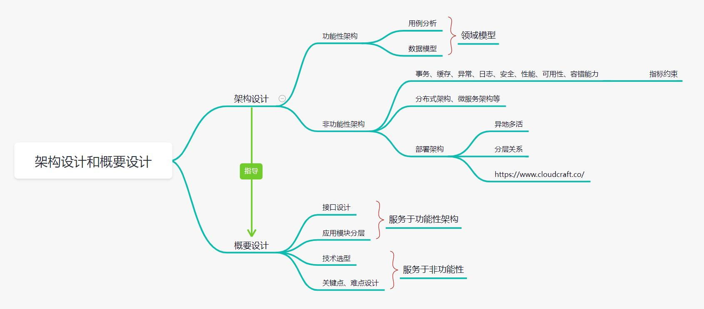

# 规划指导

> 作者: 大厂一组
>
> 更新: 2022-08-01

## 概述

软件设计属于软件工程学内容，简单来说有三方面的工作：

- **问题定义**，搞清楚要解决什么问题？
- **总体方案**，搞清楚总体实现方案是什么？
- **详细设计**，搞清楚每个模块细节怎么做？

暂且把他们分为两个阶段：

- **需求阶段**，主要是问题定义，需要进行需求调研、需求分析以及系统设计，产出功能性架构、业务流程、场景用例、需求计划以及说明文档。
- **设计阶段**，包括总体方案和详细设计，基于需求阶段的产出物，总体方案主要是确定软件系统的总体布局（顶层设计）、模块关系、外部关系、技术路线等，详细设计主要是基于总体方案进一步实现细节，是最终代码程序的蓝图，确定模块算法、数据结构、接口实现、属性、参数等。

## 一、需求阶段  

### 功能性架构

`待补充`，体现功能逻辑关系层级、模块依赖等。

### 业务流程

`待补充`，体现产品主线、过程节点、前置条件以及执行方式等。

### 场景用例

`待补充`，体现产品最终交互，明确业务目标等。

### 需求计划

`待补充`，细化产品功能等。

### 说明文档

`待补充`，需求阶段细节补充说明等。

## 二、设计阶段

在软件系统的 **设计阶段**，架构设计、概要设计和详细设计阐述了一个系统的设计和实现过程。

- 系统分解为层次、层次内的模块以及相互的接口
- 模块分解为对象、对象的接口以及实现这些对象接口的方法

但每个阶段都有自己独特的一部分。

### 架构设计

架构设计包括了功能性架构和技术架构设计两个部分的内容，功能性架构解决业务流程和功能问题，而技术架构解决非功能性需求等问题。两种架构都包括了动态和静态两个方面的内容，对于功能性架构中动态部分为业务流程驱动全局用例，用例驱动的用例实现等；对于技术架构中动态部分为架构运行机制，而静态部分为框架，分层等方面的内容。

架构设计重点在于将系统分层并产生层次内的模块、阐明模块之间的关系。

主要工作是根据架构分析和设计思想产生系统的架构图，并对架构图进行描述，说明分层的原因、层次的职责，并根据架构图绘制系统的物理部署图，描述系统的部署体系。根据架构图进行模块的划分并阐明模块划分的理由，绘制模块物理图以及模块依赖图。

### 概要设计

概要设计重点在于将模块分解为对象并阐明对象之间的关系，引用架构设计说明书中的模块图，并阐述对于模块进行设计的大致思路。

主要工作是根据该模块的职责对模块进行概要设计(分解模块为对象、描述对象的职责以及声明对象之间的接口)，绘制模块的对象图、对象间的依赖图以及模块主要功能的序列图，分别加以描述并相应的描述模块异常的处理方法。如果需要并描述数据视图。

### 详细设计

详细设计重点在于对模块进行实现，将模块的对象分解为属性和方法，并阐述如何实现。

主要工作视根据模块概要设计详细描述对于模块内对象的实现，包括对象的职责、属性、方法、对象内功能的流程图、对象关联的类、对象的异常。(需要绘制的主要为类图)

### 小结

- 架构设计，解决系统核心用例以及关键性需求的设计，形成抽象的基础结构，划分模块、形成模块接口。
- 概要设计，解决模块以及模块接口的实现，形成模块中核心对象以及对象的接口定义。
- 详细设计，解决模块中具体对象的实现以及对象接口的实现。

## 三、补充

### 架构设计和概要设计关系概览

 

### 图例说明

- 架构图
- 类图
- ER图
- 流程图/活动图
- 流程图
- 拓扑图
- 状态图
- 时序图/顺序图

## 参考

- [阿里云 - 架构设计和概要设计](https://developer.aliyun.com/article/496454)

- [知乎 - 产品经理｜产品设计流程方法归纳](https://zhuanlan.zhihu.com/p/527136244)

- [CSDN - 需求、概要、详细设计怎么做，做那些？](https://blog.csdn.net/u012272367/article/details/114640131)

- [CSDN - 关于系统设计中架构、概要、详细设计的使用说明](https://blog.csdn.net/liugj99/article/details/83238648)

- [百度百家号 - 通过C4模型快速构建软件架构](https://baijiahao.baidu.com/s?id=1709771910703520926)