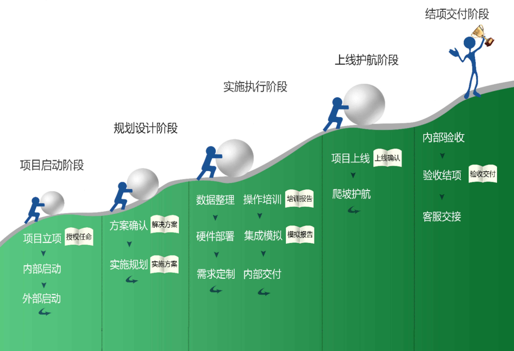
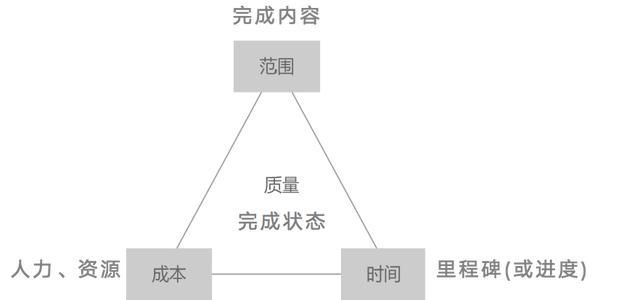

# 里程碑

> 作者: 大厂研究员
>
> 更新: 2022-08-04

## 项目里程碑

|序号    |阶段     |事项         |进度    |开始时间    |完成时间    | 交付标准     |
|-------|---------|-------------|-------|------------|------------|------------|
|1      |启动     |立项         |✔️     | 2022-07-23 | 2022-07-23 | 项目沟通|
|       |         |            |✔️     | 2022-07-23 | 2022-07-23 | 项目组确认|
|2      |启动     |启动会       |✔️     | 2022-07-23 | 2022-07-23 | 项目确认|
|       |         |            |✔️     | 2022-07-23 | 2022-07-23 | 组成员确认|
|       |         |            |✔️     | 2022-07-23 | 2022-07-23 | 阶段目标沟通|
|3      |规划设计 |解决方案确认  |🚧     | 2022-07-23 | 2022-08-13 | [产品架构](/zh-cn/02-production-architecture-diagram) 确认|
|       |        |             |🚧    | 2022-07-23 | 2022-08-13 | [需求计划](/zh-cn/02-product-plan.md) 确认|
|       |        |             |🚧    | 2022-07-23 | 2022-08-13 | [技术架构](/zh-cn/03-tech-architecture-diagram) 确认|
|       |        |             |❌    | 2022-08-13 | —— | [概要设计](/zh-cn/03-outline-design.md) 确认|
|       |        |             |❌    | 2022-08-13 | —— | [详细设计](/zh-cn/03-detailed-design.md) 确认|
|       |        |             |❌    | 2022-08-13 | —— | [服务器选型方案](/zh-cn/03-server-selection.md) 确认|
|4      |实施执行 |硬件部署      |❌    |  ——  | ——  | 服务器部署方案确认|
|5      |实施执行 |需求定制-研发 |❌     | ——  | ——  | 研发标准确认 |
|       |         |            |❌     |  ——  | ——  | 周报计划确认 |
|       |         |            |❌     |  ——  | ——  | 风险评估计划确认 |
|6      |实施执行 |模拟测试      |❌     |  ——  | ——  | 测试方案确认 |
|7      |实施执行 |系统培训      |❌     |  ——  | ——  | 操作手册确认|
|       |        |             |❌     |  ——  | ——  | 培训方案确认|
|       |        |             |❌     |  ——  | ——  | 培训人员确认|
|       |        |             |❌     |  ——  | ——  | 培训报告确认|
|       |        |             |❌     |  ——  | ——  | 培训考核方案确认|
|8      |实施执行 |系统模拟练习  |❌     |  ——  | ——  | 模拟方案确认 |
|       |        |             |❌     |  ——  | ——  | 模拟问题记录 |
|9      |上线护航 |上线预案      |❌     |  ——  | ——  | 交付方案确认 |
|       |        |             |❌     |  ——  | ——  | 交付报告确认 |
|       |        |             |❌     |  ——  | ——  | 上线评估确认 |
|       |        |             |❌     |  ——  | ——  | 上线预案确认 |
|10     |上线护航 |系统上线准备  |❌     |  ——  | ——  | 硬件复核 |
|       |        |             |❌     |  ——  | ——  | 部署环境复核|
|       |        |             |❌     |  ——  | ——  | 期初数据准备确认 |
|11     |上线护航 |系统上线      |❌     |  ——  | ——  | 系统上线报告|
|       |        |             |❌     |  ——  | ——  | 上线问题记录|
|12     |上线护航 |爬坡护航      |❌     |  ——  | ——  | 上线人日方案|
|       |        |             |❌     |  ——  | ——  | 问题记录|
|       |        |             |❌     |  ——  | ——  | 补丁计划|
|13     |结项交付 |项目验收      |❌     |  ——  | ——  | 项目验收报告| 
|       |        |             |❌     |  ——  | ——  | 项目总结|
|       |        |             |❌     |  ——  | ——  | 客服交付|

## 附录

1. 实施标准

2. 项目管理四要素

