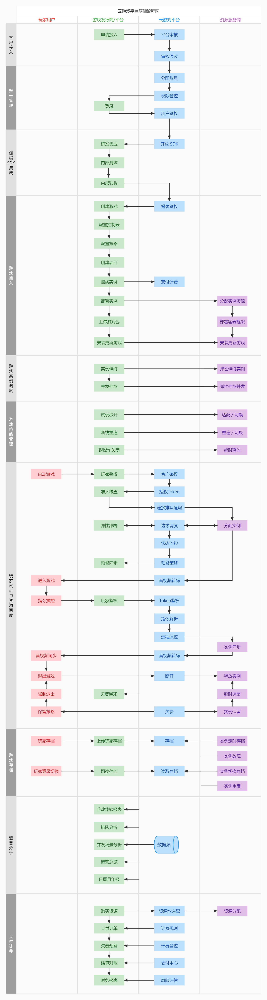
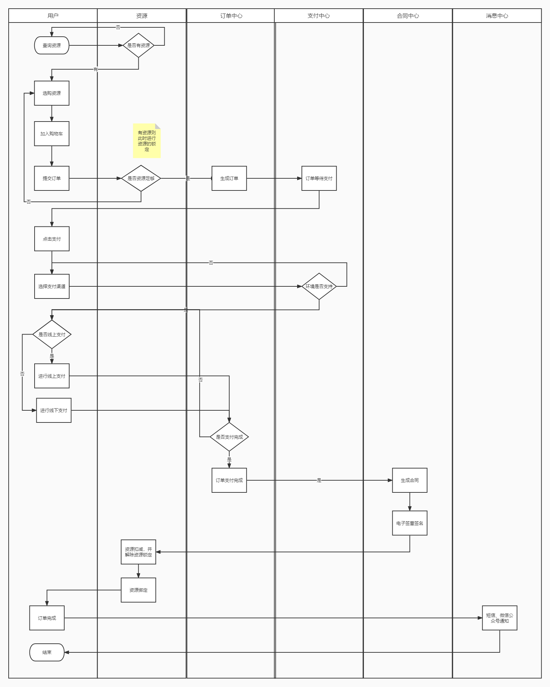

# 业务流程

> 创建：大厂一组
>
> 更新: 2022-07-25

## 云游戏平台整体流程

详见 [ProcessOn - 云游戏平台基础流程图V0.1](https://www.processon.com/view/link/62dfa2431e08535944dac2e6)

!> 预览效果不佳，具体请打开以上详细链接

## 运营中心流程

### 账号管理

详见 [ProcessOn - 云游戏平台运营中心之账号管理流程图](https://www.processon.com/view/link/62e3a54be401fd0727abb34c)

!> 预览效果不佳，具体请打开以上详细链接

### 支付计费

#### 支付计费模块业务主流程图-购买资源

### 数据分析

`待补充`

## 内容中心流程

`待补充`

## 管控中心流程

`待补充`

## 延伸流程

### 游戏微端整体业务流程

参考 [腾讯云 - 游戏微端](https://cloud.tencent.com/document/product/1162/66701)

