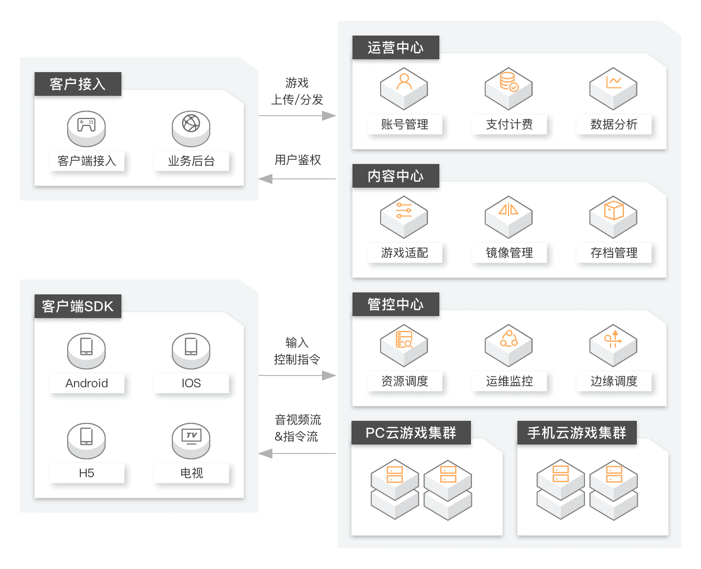

# 问题背景

> 作者: 潘深练
>
> 更新: 2022-07-24

## 前言

### 云游戏平台

[云游戏 PaaS 平台](https://www.aliyun.com/product/industryengine/cloudgamingplatform) 是为游戏云化量身打造的一站式服务平台，具备游戏快速适配、资源弹性伸缩、全局智能调度、可视化数据运营和完善的平台运维能力。平台支持海量游戏稳定运行，量身打造的容器技术和协议确保游戏体验，多样化的SDK支持各类终端APP开发。满足用户联机互动、即点即用、微端试玩等创新需求。

#### 能力

- 游戏适配
- 资源伸缩
- 全局调度
- 数据运营
- 平台运维

## 问题与挑战

### 终端成本高

玩家购买高端主机设备来适应游戏不断提升的硬件要求，极大程度地加重了玩家成本

### 游戏包越来越大，下载安装成本高

游戏画面越来越精细的同时也带来了不断膨胀的游戏包体，给游戏存储与推广都带来了更大的压力和成本

### 游戏无法在多种终端间自由切换

各类终端（PC、主机、手机）上的游戏内容往往是无法共享的，玩家的体验方式也被锁定在了单一的环境里

### 外挂和破解程序多

由于游戏在本地运行，往往会给外挂或破解软件留下可乘之机，而云端运行的游戏可以避免绝大多数此类威胁

## 应用场景

### 游戏内容商，游戏渠道

- 便捷试玩，提高推广效率
- 跨端体验，覆盖更多场景
- 即点即玩，免除游戏下载
- 免除外挂干扰，创造公平竞技环境

### 运营商

- 5G核心体验场景，手机畅玩主机大作
- 流量杀手，用户数据流量使用大幅提升
- 为家庭端带来主机级游戏体验及3A作品

👉 [更多应用场景](https://help.aliyun.com/document_detail/176364.htm)

## 解决方案技术架构及优势

### 解决方案优势

- 之于用户
    - 低延迟高画质
        - 支持1080P、4K画质，60帧率；智能码率控制，流畅不卡顿
    - 低配设备跨平台随意玩高配游戏
        - 无需高配置电脑，PC、手机、电视等多终端随时随地畅玩 3A 级游戏大作
    - 防外挂
        - 游戏完全在云端运行，不用再担心外挂，减少客户端开发成本
    - 轻量客户端
        - 下载轻量级的游戏客户端，即点即玩，免下载安装，告别庞大的游戏客户端，减少用户流失
- 之于游戏运营商
    - 快速接入、平稳上线
        - 帮助客户快速上线运营
    - 丰富的云资源，优化成本
        - 全国高性能服务节点与高效调度策略，多维度降低成本

## 参考

- [阿里云 - 云游戏平台](https://www.aliyun.com/product/industryengine/cloudgamingplatform)
- [阿里云 - 云游戏平台 - 产品文档](https://help.aliyun.com/document_detail/176360.html)