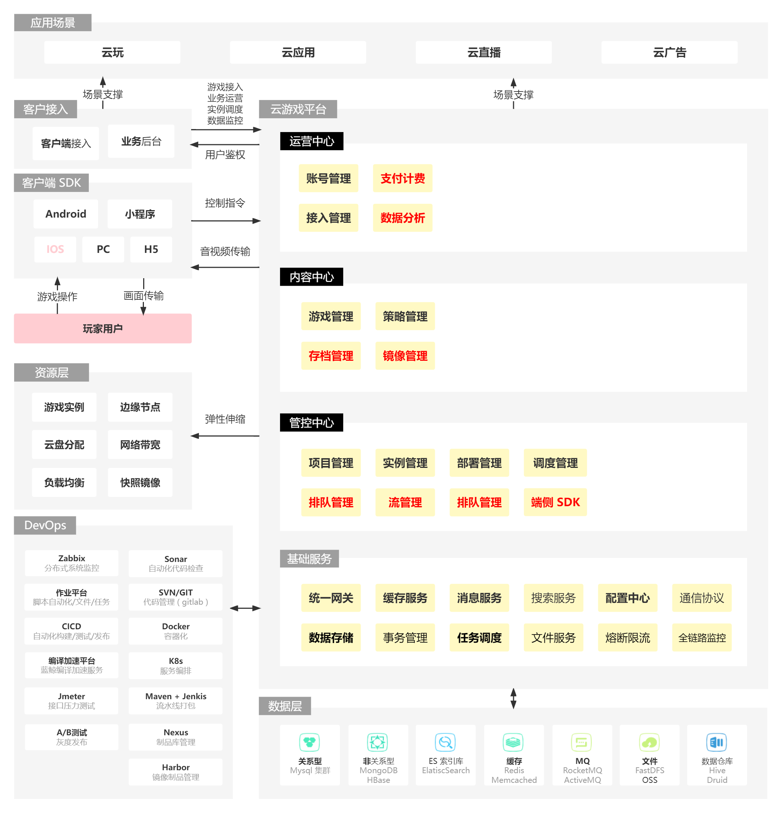
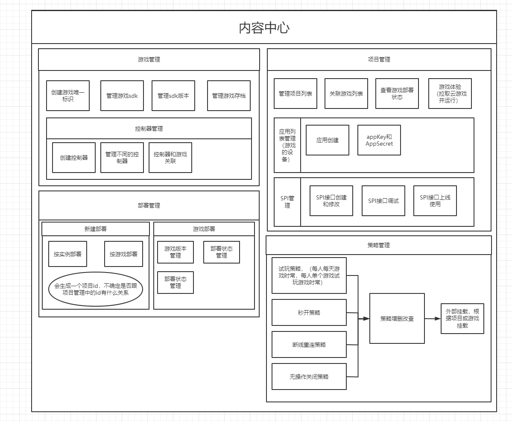
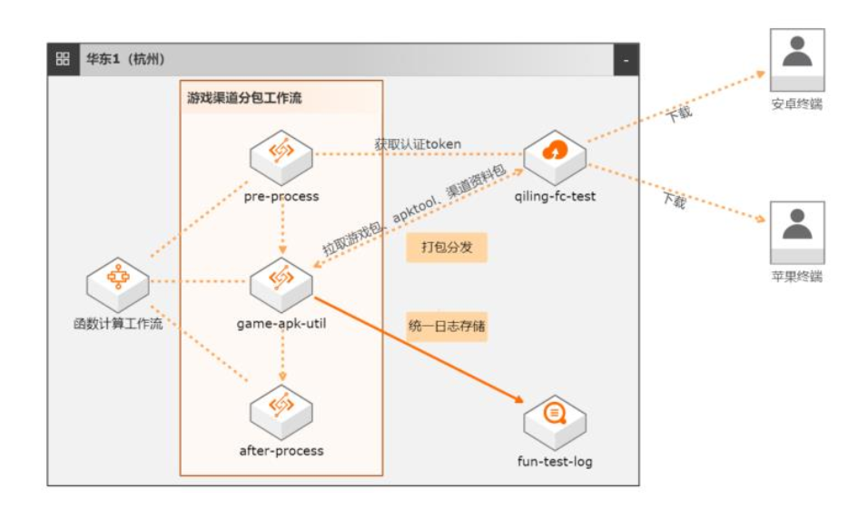
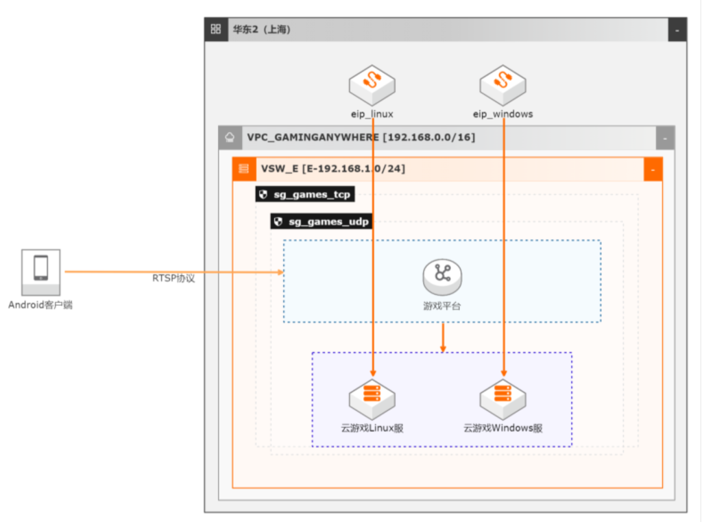
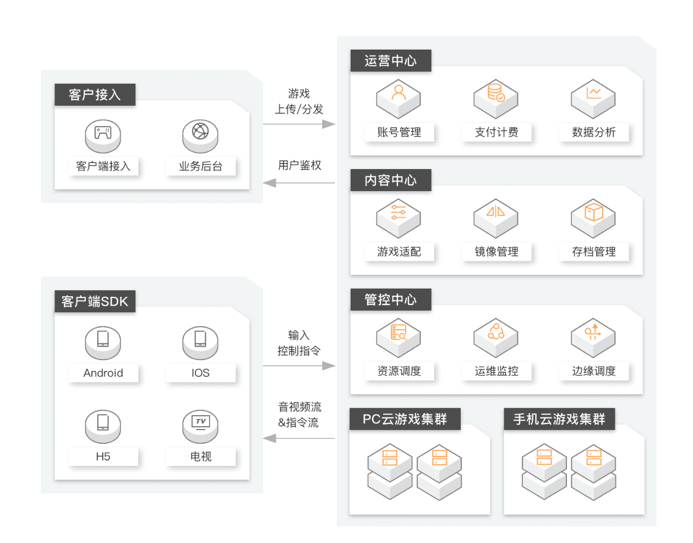
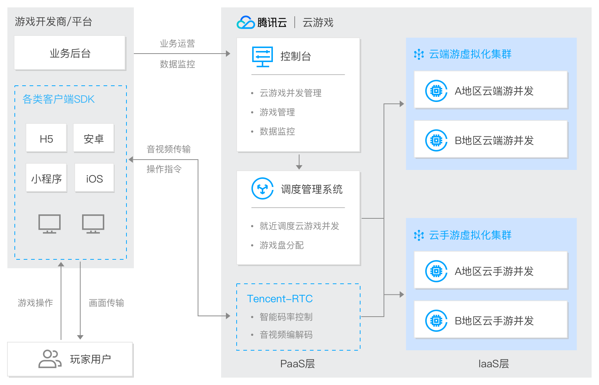
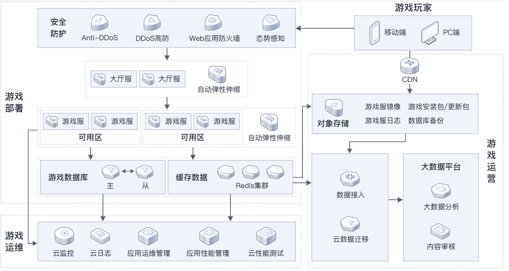
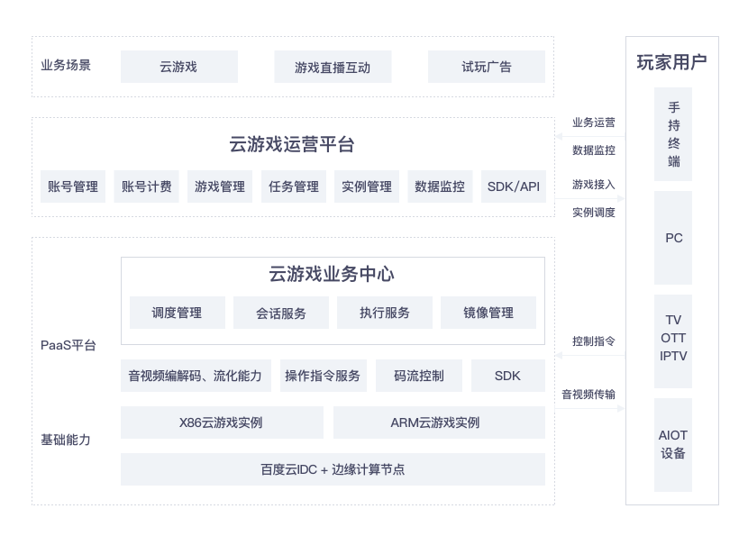

# 功能性架构设计

> 作者: 大厂一组
>
> 更新: 2022-07-25

## 云游戏平台产品架构概览

详见 [ProcessOn - 云游戏平台功能性架构](https://www.processon.com/view/link/62de672e1efad42d76a068a1)

!> 图片预览效果不佳，具体请打开以上详细链接

云游戏平台涵盖三大功能，分别是运营中心、内容中心和管控中心，主要功能模块如下：

- **运营中心**：定位于游戏的运营管理，帮助您完成账号权限管理和运营资源管理。
    - **主要挑战**：安全机制、鉴权、数据分析

- **内容中心**：定位于游戏内容的运行支持，帮助您完成游戏测试、算力评估、存档和版本管理等，支持开发者快速开发游戏，加速游戏发布。
    - **主要挑战**：对象存储、性能、业务复杂性

- **管控中心**：定位于游戏调度管理和游戏运维监控，通过认证、调度和运维管理，帮助您快捷接入云游戏PaaS服务，保障您的业务发展范围内都能得到优质服务，提高业务扩张能力。
    - **主要挑战**：性能、调度策略、基础设施 

## 基础架构

### 运营中心

#### 账号管理

`待补充`

#### 支付计费

#### 数据分析

### 内容中心

### 管控中心

`待补充`

### 游戏打包业务架构参考

参考 [阿里云 - 基于函数计算的游戏打包](https://bp.aliyun.com/detail/187)，方案优势：

- 自动化
- 免运维
- 并行化
- 低成本

### 轻量级GPU部署云游戏架构参考

参考 [阿里云 - 轻量级GPU部署云游戏最佳实践](https://bp.aliyun.com/detail/76)，方案优势：

- 更小的 GPU 规格降低成本
- 支持业务在线迁移
- QoS 保障用户 GPU 资源不被抢占
- 同时支持 AI 计算与图形图像计算

## 参考资料

### 阿里云云游戏平台架构

- [详见 | 阿里云云游戏平台架构](https://www.aliyun.com/product/industryengine/cloudgamingplatform)

### 腾讯云云游戏平台架构

- [详见 | 腾讯云云游戏平台架构](https://cloud.tencent.com/product/gs)

### 华为云云游戏平台架构

- [详见 | 华为云云游戏平台架构](https://www.huaweicloud.com/solution/gamecloud/)

### 百度智能云云游戏平台架构

- [详见 | 百度智能云云游戏平台架构](https://cloud.baidu.com/solution/game/cloudgame.html)

