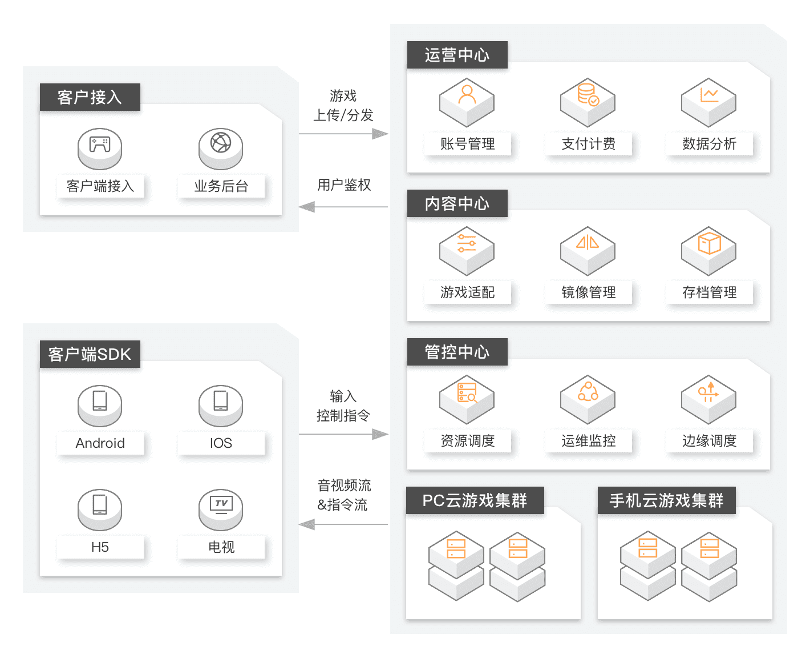

# 系统架构图

> 作者: 潘深练
>
> 更新: 2022-07-24

## 前言

云游戏平台模仿阿里云-[云游戏 PaaS 平台](https://www.aliyun.com/product/industryengine/cloudgamingplatform) 搭建，涵盖三大功能，分别是运营中心、内容中心和管控中心，主要功能模块如下：

- **运营中心**：定位于游戏的运营管理，帮助您完成账号权限管理和运营资源管理。
    - **主要挑战**：安全机制、鉴权、数据分析

- **内容中心**：定位于游戏内容的运行支持，帮助您完成游戏测试、算力评估、存档和版本管理等，支持开发者快速开发游戏，加速游戏发布。
    - **主要挑战**：对象存储、性能、业务复杂性

- **管控中心**：定位于游戏调度管理和游戏运维监控，通过认证、调度和运维管理，帮助您快捷接入云游戏PaaS服务，保障您的业务发展范围内都能得到优质服务，提高业务扩张能力。
    - **主要挑战**：性能、调度策略、基础设施

## 系统架构

## 产品需求计划

详见[腾讯文档 - 云游戏平台产品需求计划](https://docs.qq.com/sheet/DV25td0JHUEVFYk5T)

## 参考