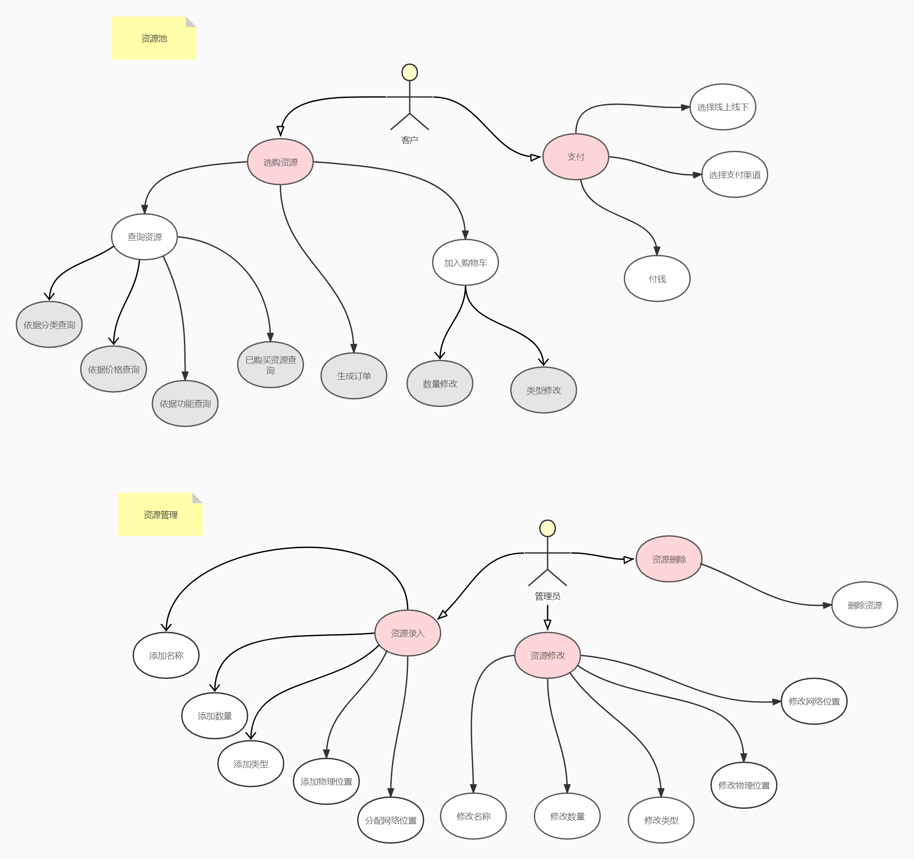
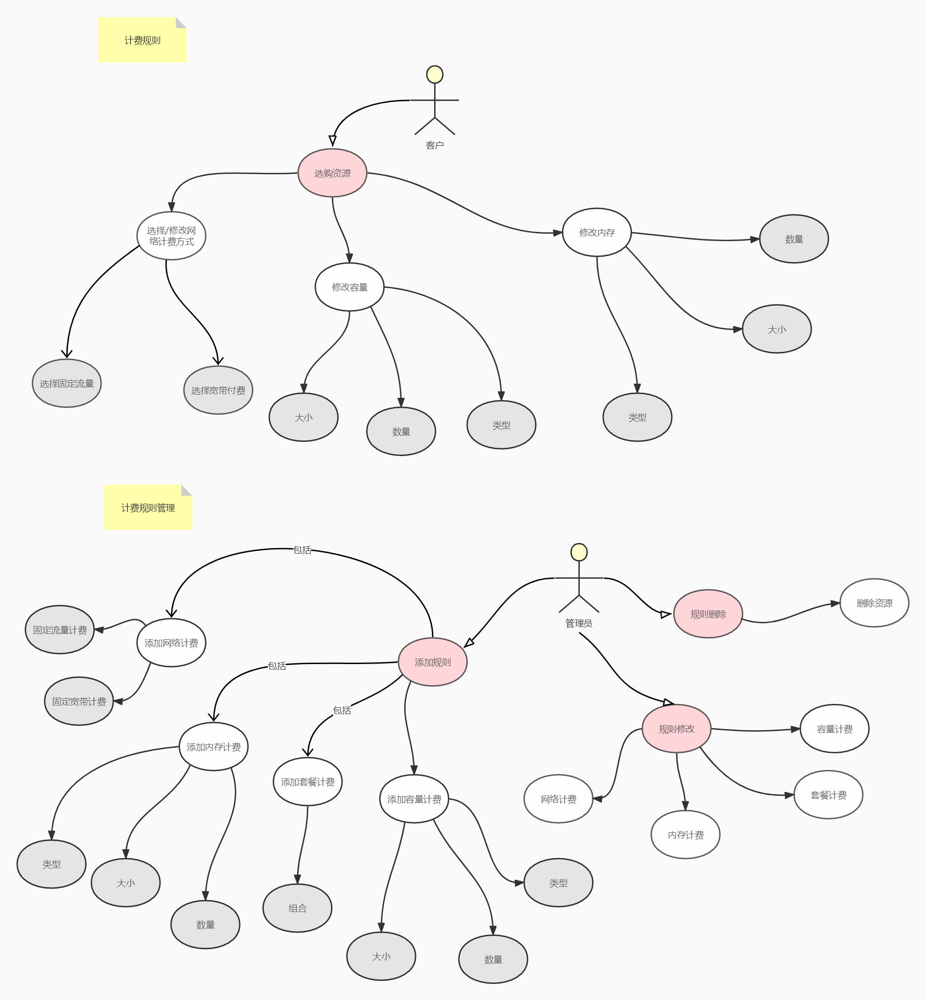
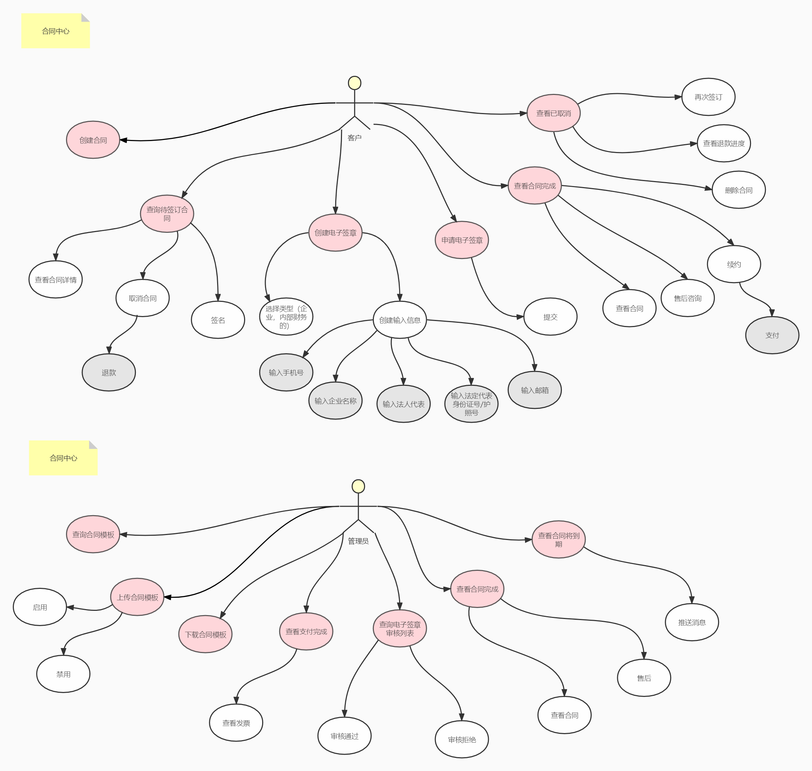
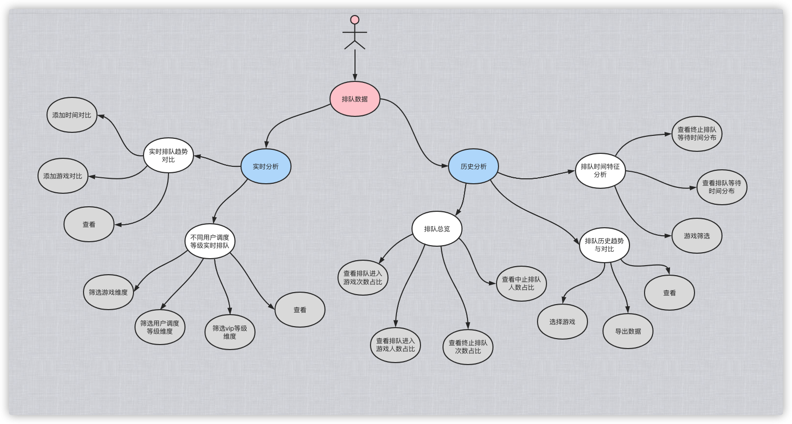
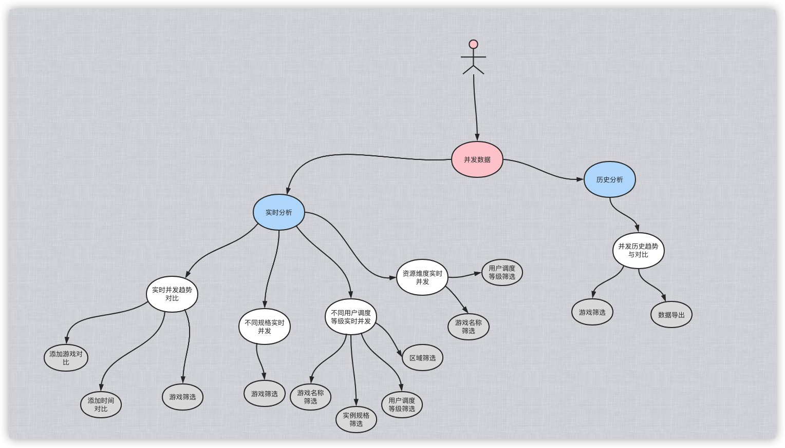
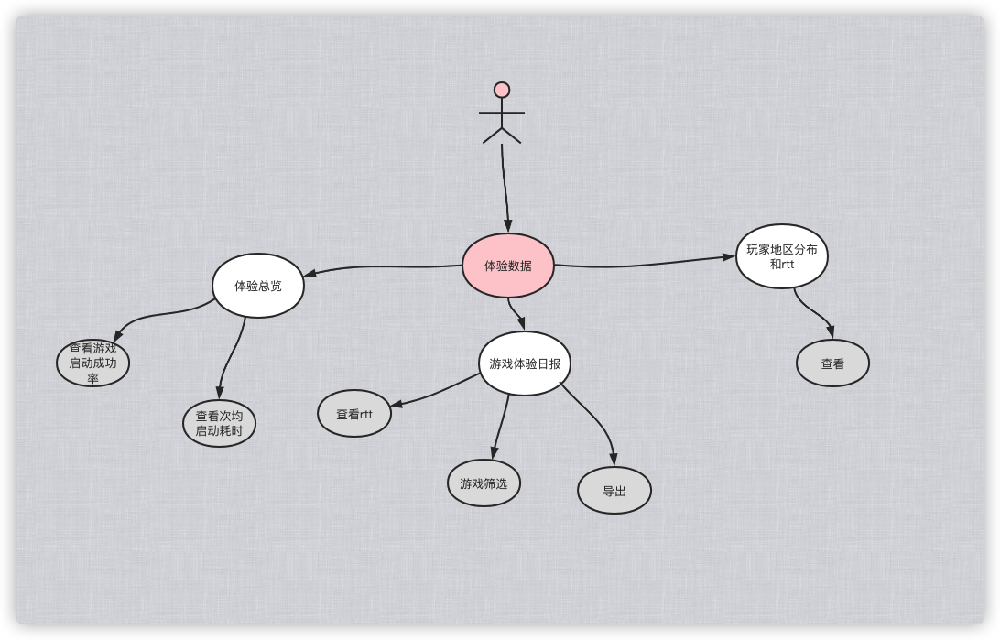
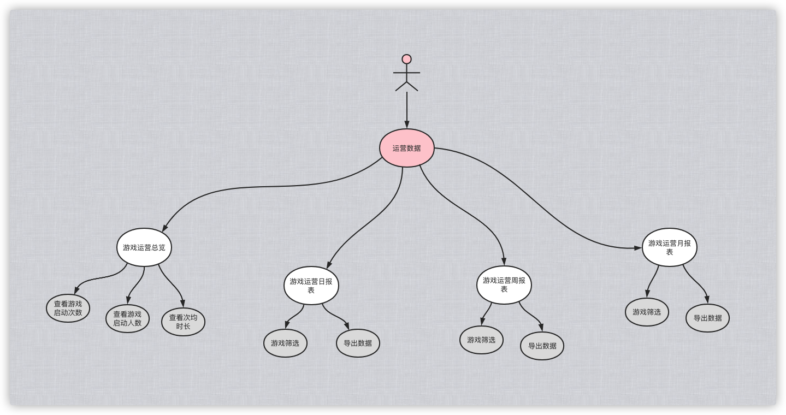

# 场景用例

> 作者: 大厂一组
>
> 更新: 2022-07-25

## 运营中心用例

### 账号管理

详见 [ProcessOn - 运营中心--账号管理--用例图](https://www.processon.com/view/link/62e8fef90e3e740772bc35bf)

!> 预览效果不佳，具体请打开以上详细链接

### 支付计费

#### 资源池

#### 计费规则

#### 订单中心

#### 合同中心

### 数据分析

排队数据

并发数据

体验数据

运营数据

## 内容中心用例

`待补充`

## 管控中心用例

`待补充`