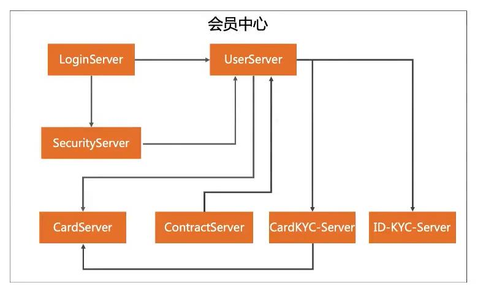
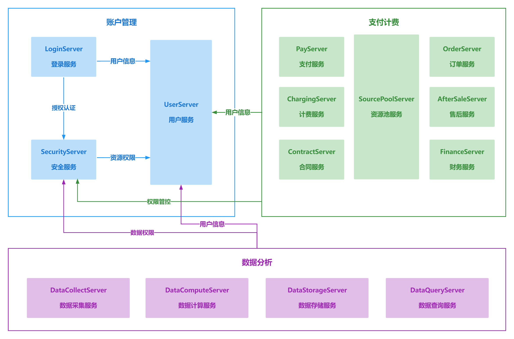

# 应用架构设计

> 作者: 大厂研究员
>
> 更新: 2022-08-18

## 概述

### 📖 定义

描述后端系统有哪些应用组成。

### 🌏 使用场景

1. 项目开发、测试；
2. 部署发布；
3. 子域架构设计；
4. 面试、晋升。

### 🎨 画图技巧

1. 通过不同 **颜色** 来标识不同角色；
2. 通过 **连接线** 来表示关系；
3. 按照典型业务处理逻辑排列。

### 👉 应用架构示例（一般可以按照微服务拆分应用）

## 运营中心-应用架构

详见 [ProcessOn - 运营中心应用架构](https://www.processon.com/view/link/62fe59101efad47d124118d1)

!> 图片预览效果不佳，具体请打开以上详细链接

## 内容中心-应用架构

`待补充`

## 管控中心-应用架构

`待补充`