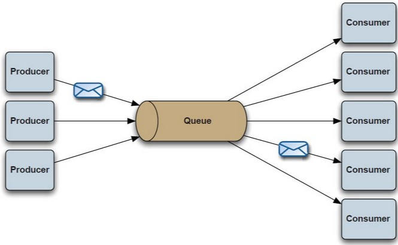
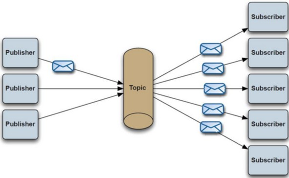
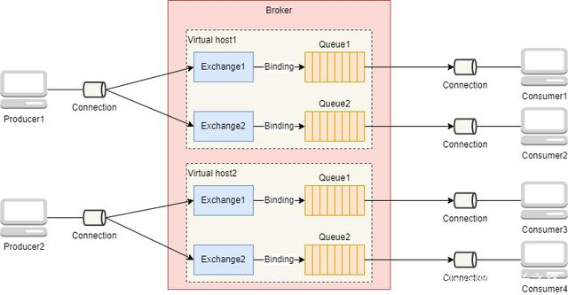
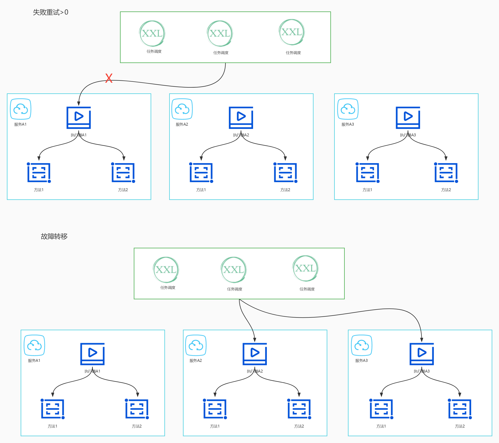
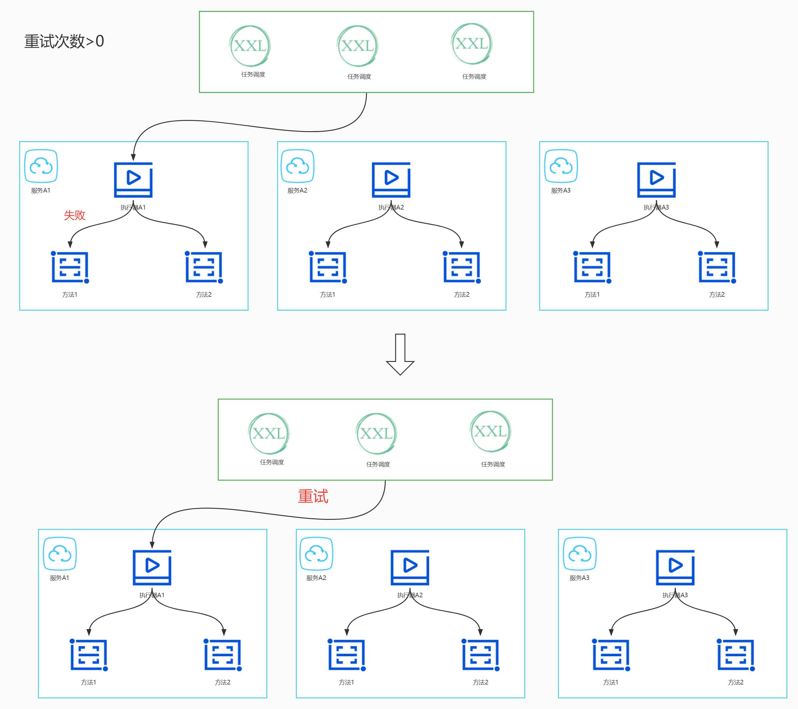

# 部署架构设计

> 作者: 大厂研究员
>
> 更新: 2022-08-18

## 概述

### 📖 定义

描述后端系统具体如何部署，对应 4+1 视图的物理视图。参考 [《阿里云 - 运用RUP 4+1视图方法进行软件架构设计》](https://developer.aliyun.com/article/458980)

### 🌏 使用场景

1. 总体架构设计；
2. 运维规划和优化；
3. 面试、晋升。

### 🎨 画图技巧

1. 使用 **图标** 代替区块。

### 🛠️ 工具推荐

1. [ProcessOn - 制图共享工具](https://www.processon.com/)
2. [Cloudcraft - 部署架构图设计工具](https://www.cloudcraft.co/)

### 👉 部署示例

## 云游戏平台部署架构

详见 [ProcessOn - 云游戏平台部署架构](https://www.processon.com/view/link/62ff5d350e3e7437cac1c423)

!> 图片预览效果不佳，具体请打开以上详细链接

## 流量网关（Nginx）

`待补充`

## 业务网关（网关中心）

### 常见网关对比

> 目前常见的开源网关大致上按照语言分类有如下几类:

| 语言           | 网关                               | 
| ---------------| --------------------------------- |
| Nginx + lua    | [OpenResty](http://openresty.org/)、[Kong](https://konghq.com/)、[Orange](http://orange.sumory.com/) 等 |
| Java           | [Zuul1/Zuul2](https://github.com/Netflix/zuul)、[Spring Cloud Gateway](https://spring.io/projects/spring-cloud-gateway/)、[Apache ShenYu](https://shenyu.apache.org/)、[Kaazing KWG](https://kaazing.com)、[gravitee](https://www.gravitee.io/) 等    |
| Go             | Janus、fagongzi、Grpc-gateway 等 |
| C++            | Envoy 等                         |
| .net           | Ocelot 等                        |
| NodeJS         | Express Gateway、Micro Gateway 等|

> 按照使用数量、成熟度等来划分，主流的有 4 个：

- **OpenResty** 
    - Nginx + Lua
- **Kong/Orange** 
    - Nginx + Lua + OpenResty
- **Zuul/Zuul2** 
    - Java（Servlet/Netty Server）
- **Spring Cloud Gateway**
    - Java（WebFlux）

> 互联网企业常见的方案有基于 Openresty 的 Kong、Orange，基于 Java 的 Zuul 系列、SpringCloudGateWay ，以及基于 Go 的 Tyk

| 维度         | OpenResty         | Kong                               | Orange                    |  Zuul 1         | Zuul 2         | SpringCloudGateway                 | 
| ---------    | ----------------- | -----------------------------------| ------------------------- | ----------------| ---------------| ---------------------------------- | 
| **效率**     |  高                | 高                                 | 高                        |  低             | 一般            | 一般，传闻 RPS 是 Zuul2 的 1.6 倍   | 
| **开发语言** |  Lua               | Lua                                | Lua                       |  Java           | Java           | Java                               | 
| **技术栈**   |  Nginx + Lua       | Nginx + Lua + OpenResty            | Nginx + Lua + OpenResty   |  Springboot     | Springboot     | Springboot                         | 
| **存储**     |  Redis、Memcached  | Cassandra、PostgreSQL              | MySQL                     |  MySQL 等       |  MySQL 等       | MySQL 等                          | 
| **服务注册** |  Consul、ETCD      | Consul、ETCD                       | Consul、ETCD              |  Nacos、Consul   | Nacos、Consul  | Nacos、Consul                      | 
| **配置中心** |  Consul、ETCD      | Consul、ETCD                       | Consul、ETCD              |  Nacos、Consul   | Nacos、Consul  | Nacos、Consul                      | 
| **管理界面** |  开源              |  第三方开源                         | 开源                      |  内置            | 内置           |  无                                | 
| **社区**     |  成熟              | 相对成熟，用户问题汇总，社区，插件开源| 少，个人开发者             |  成熟            | 开源不久，资料少 | 社区成熟，资源较少                  | 
| **代码**     |  开源              | 开源，更新频繁                      | 开源                      |  开源            | 开源            |  开源                              | 
| **学习成本** |  简易，需进行lua开发| 简易，简易，需进行lua开发            | 较高                      |  一般            | 参考资料较少     | 简单易用                           | 
| **维护成本** |  普通，需维护lua脚本| 较高，需要维护lua脚本                | 较高                      |  一般            | 一般            | spring系列可扩展强，易配置 可维护性好| 
| **扩展**     |  自建              | 支持集群                           | 支持集群                   |  支持            | 支持            |  支持                              |  
| **多节点**   |  自建              | 支持                               | 需要开发                   |  支持            | 支持            |  支持                              | 
| **功能**     |  自建              | 丰富，部分开源 + 商业（收费）        | 丰富                      |  丰富            | 丰富            |  异步，配置灵活                      | 
| **限流**     |  需要lua开发       | 支持                               |                           |  支持            | 支持            |  支持                               |
| **鉴权**     |  需要lua开发       | 支持普通鉴权，Key Auth鉴权，HMAC，auth2.0 |                      |  filter中实现    | filter中实现    |  支持普通鉴权、auth2.0               | 
| **监控**     |  需要lua开发       | 内置                               |                           |  filter中实现    | filter中实现    |  Gateway Metrics Filter             |
| **WEb容器**   |                   |                                   |                           |  Servlet        |  Netty Server   |  WebFlux                           | 
| **线程模型**  |                   |                                   |                           |  阻塞            |  非阻塞         |  非阻塞                             | 
| **适用场景**  |  大型流量网关      | 大型流量网关                        | 大型流量网关                |  中小型业务网关  | 大型业务网关    | 大型业务网关                        | 

### 选型初步结论

👉 对于现有规模小的项目、接入成本有限制的项目、以 Java 开发语言为主导 **且** 对上线有迫切要求的团队，推荐优先使用 **Zuul1** 和 **Spring Cloud Gateway** 甚至 **Apache ShenYu**，尝鲜可以使用 **Zuul2**。 

🤌 对于未来有预期的项目、接入成本有空间的项目、有 Nginx 实践经验 **或** 学习能力强 **且** 允许成长的团队，推荐使用 **Kong** 或 **Orange** ，对效率有更高要求可以自建 **OpenResty**。

### 业务网关体系结构

### 流量与业务网关

### 部署架构参考

### 网关选型参考

- [InfoQ - 天翼账号网关系统架构演进历程](https://xie.infoq.cn/article/c6703d216c43c2b522b9b4ffa)

- [InfoQ - 业务网关的落地实践](https://www.infoq.cn/article/cAcwMUNMJMQpIxGJYkcS)

- [博客园 - 亿级流量架构之网关设计思路、常见网关对比](https://www.cnblogs.com/Courage129/p/14446586.html)

- [美团技术团队 - 百亿规模API网关服务Shepherd的设计与实现](https://mp.weixin.qq.com/s/iITqdIiHi3XGKq6u6FRVdg)

## 消息服务

> 几种常用MQ对比

| 维度    | ActiveMQ                       | RabbitMQ                       | RocketMQ             | Kafka              | 
|-------|--------------------------------|--------------------------------|----------------------|-----------------| 
| 多语言支持 | 支持，JAVA优先                      | 语言无关                           | 只支持Java              | 支持，Java优先       |
| 单机吞吐量 | 万级                             | 万级                             | 10万级                 | 10万级              | 
| 时效性   | ms级                            | 微秒级                            | ms级                  | ms级以内          | 
| 持久化   | 内存、文件、数据库                      | 内存、文件，支持数据堆积，但数据堆积会影响生产速率      | 磁盘文件        | 磁盘文件，只要磁盘容量足够，可以做到无限消息堆积 | 
| 功能支持  | MQ领域的功能极其完备                    | 基于erlang开发，所以并发能力很强，性能极其好，延时很低 | MQ功能较为完善，还是分布式的，扩展性好 | 功能较为简单，主要支持简单的MQ功能，在大数据领域的实时计算以及日志采集被大规模使用，是事实上的标准 | 
| 可用性   | 高（主从）                          | 高（主从）                          | 非常高（分布式）             | 非常高（分布式）        | 
| 消息丢失  | 低                              | 低                              | 非常高（分布式）             | 中              | 
| 社区活跃度 | 高                              | 高                              | 中                    | 高              | 
| 成熟度   | 成熟                             | 成熟                             | 比较成熟                 | 成熟日志领域         | 
| 支持协议  | OpenWirte、Stomp、rest、amop、xmpp | AMQP                           | 自己定义的一套              |            | 
| 事务    | 支持                             | 不支持                            | 支持                   |                | 
| 负载均衡  | 支持                             | 支持                             | 支持                   |                | 
| 部署方式  | 独立、嵌入                          | 独立                             | 独立                   |                | 

#### mq基本架构

#### kafka集群架构

#### rocketmq集群架构

#### activemq集群架构
##### 1.p2p

##### 2.p/s

#### rabbitmq集群架构

## 文件服务

`待补充`

## 任务调度

### 使用场景

>1.合同到期，定时任务处理，处理相关的资源，处理相关的通知 
>2.每日，每月生成日账单和月账单 
>3.定时查询相关企业风险，分析相关情况 
>4.定时分析资源情况 
>5.订单支付超时 
>6.定时同步数据

### 选型

### xxl-job 架构

#### 部署

#### 任务调度

#### 执行器注册

#### 故障转移

#### 失败重试

## 分布式事务

`待补充`

## 配置中心与注册中心

`待补充`

## 缓存服务

`待补充`

## 关系数据库服务（MySQL）

`待补充`

## 自动化构建测试发布服务

### 部署

## 容器化部署

`待补充`

## 日志中心

`待补充`

## 分布式事务集群

`待补充`

## 大数据中心（数据采集分析）

### 数据分析技术架构

### 数据分析开发流程

## 性能监控中心（全链路追踪）

`待补充` 

## 参考

- [极客专栏 - 如何画好架构图](https://u.geekbang.org/lesson/381) 👍👍👍

- [微信 - 如何画好一张架构图？](https://mp.weixin.qq.com/s/2HjvNnfP7bLNQF5xh8PxIQ)