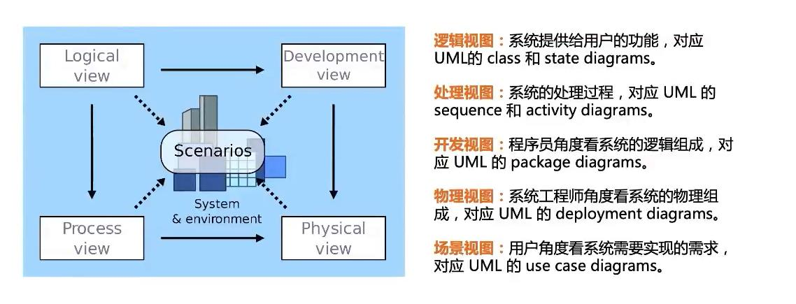
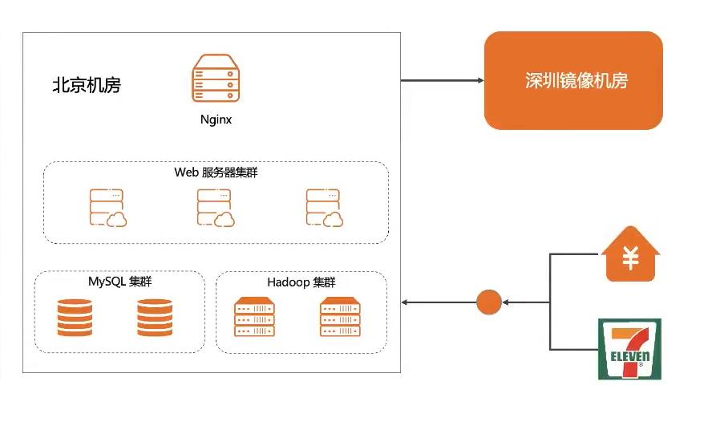
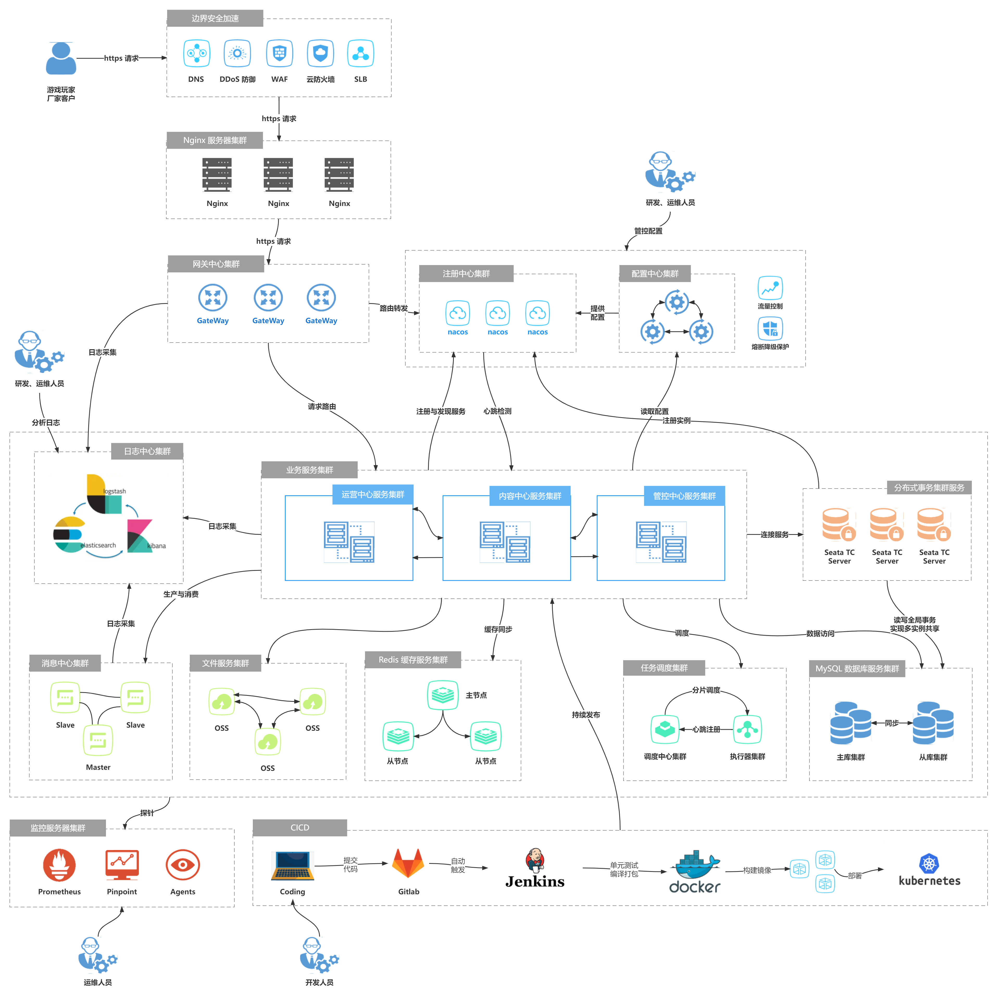
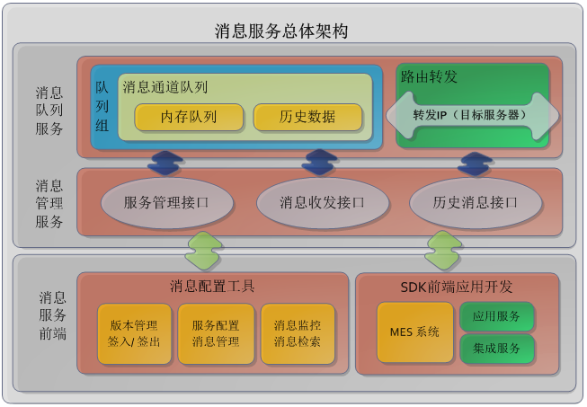
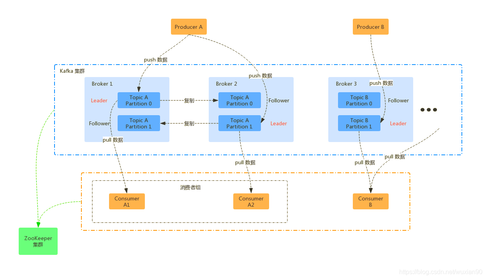
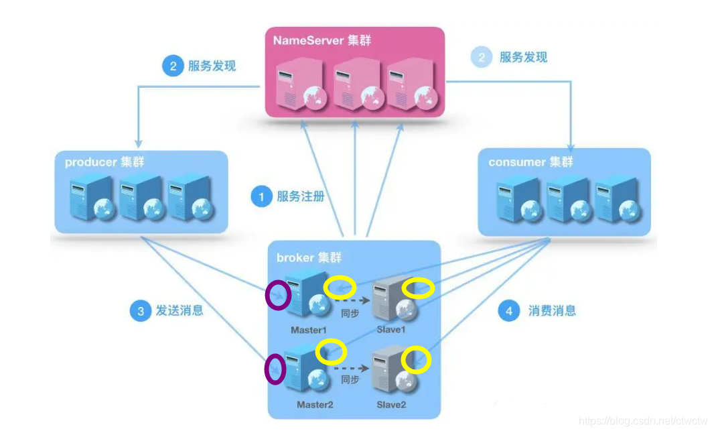
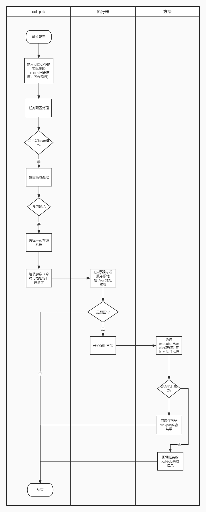
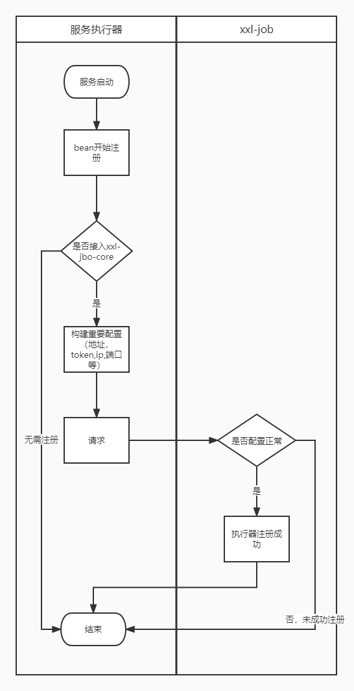
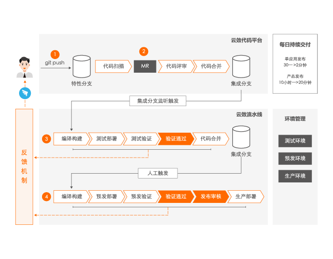
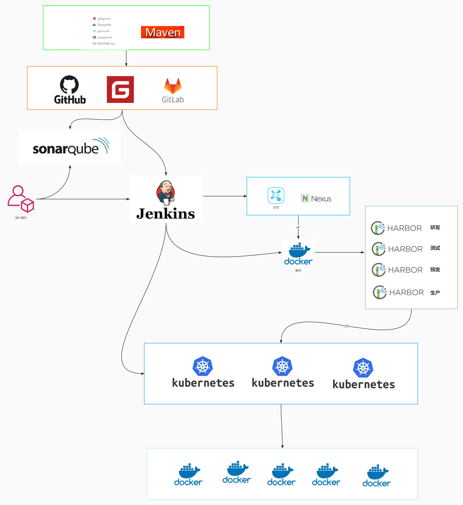

# 部署架构设计

> 作者: 大厂研究员
>
> 更新: 2022-08-18

## 概述

### 📖 定义

描述后端系统具体如何部署，对应 4+1 视图的物理视图。参考 [《阿里云 - 运用RUP 4+1视图方法进行软件架构设计》](https://developer.aliyun.com/article/458980)

### 🌏 使用场景

1. 总体架构设计；
2. 运维规划和优化；
3. 面试、晋升。

### 🎨 画图技巧

1. 使用 **图标** 代替区块。

### 🛠️ 工具推荐

1. [ProcessOn - 制图共享工具](https://www.processon.com/)
2. [Cloudcraft - 部署架构图设计工具](https://www.cloudcraft.co/)

### 👉 部署示例

## 云游戏平台部署架构

详见 [ProcessOn - 云游戏平台部署架构](https://www.processon.com/view/link/62ff5d350e3e7437cac1c423)

!> 图片预览效果不佳，具体请打开以上详细链接

## 网关服务

`待补充`

## 消息服务

#### 消息服务总体架构

#### kafka集群架构

#### rocketmq集群架构

## 文件服务

`待补充`

## 日志中心

`待补充`

## 任务调度 xxl-job 架构

### 部署

### 任务调度

### 执行器注册

## 分布式事务

`待补充`

## 触达中心

`待补充`

## 配置中心与注册中心

`待补充`

## mysql

`待补充`

## 缓存服务

`待补充`

## nginx

`待补充`

## 容器化部署

`待补充`

## 自动化构建测试发布流程

### 部署

## 监控预警

`待补充`

## 全链路追踪

`待补充`

## 熔断限流

`待补充`

## 性能监控平台

`待补充`

## 数据采集分析

#### 数据分析技术架构

#### 数据分析开发流程

## 参考

- [极客专栏 - 如何画好架构图](https://u.geekbang.org/lesson/381) 👍👍👍

- [微信 - 如何画好一张架构图？](https://mp.weixin.qq.com/s/2HjvNnfP7bLNQF5xh8PxIQ)