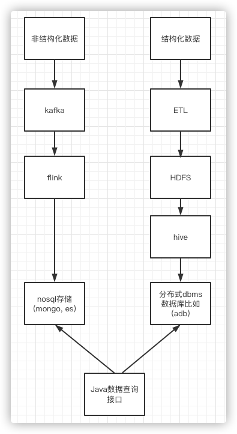

# 部署架构设计

> 作者: 大厂研究员
>
> 更新: 2022-08-18

## 概述

### 📖 定义

描述后端系统具体如何部署，对应 4+1 视图的物理视图。参考 [《阿里云 - 运用RUP 4+1视图方法进行软件架构设计》](https://developer.aliyun.com/article/458980)

### 🌏 使用场景

1. 总体架构设计；
2. 运维规划和优化；
3. 面试、晋升。

### 🎨 画图技巧

1. 使用 **图标** 代替区块。

### 🛠️ 工具推荐

1. [ProcessOn - 制图共享工具](https://www.processon.com/)
2. [Cloudcraft - 部署架构图设计工具](https://www.cloudcraft.co/)

### 👉 部署示例

## 云游戏平台部署架构

详见 [ProcessOn - 云游戏平台部署架构](https://www.processon.com/view/link/62ff5d350e3e7437cac1c423)

!> 图片预览效果不佳，具体请打开以上详细链接

## 网关服务

### 技术选型

互联网企业常见的方案有基于 Openresty 的 Kong、Orange，基于 Go 的 Tyk 和基于 Java 的 Zuul。

| 技术项          | 概述  |
| --------------- | ----- |
| Zuul            | 是一种提供动态路由、监视、弹性、安全性等功能的边缘服务，Zuul 是 Netflix 出品的一个基于 JVM 路由和服务端的负载均衡器。 |
| Tyk             | 是一个基于 Go 实现的开源 API 网关服务， Tyk 提供一个 API 管理平台，其中包括 API 网关、API 分析、开发人员门户和 API 管理面板。|
| Kong            | Kong 是 Mashape 提供的一款 API 管理软件，它本身是基于 Nginx + Lua 的，但是比 Nginx 提供了更简单的配置方式，数据采用了 Apache Cassandra/PostgreSQL 存储并提供了一些优秀的插件，比如验证、日志、调用频率限制等。|
| Orange          | 和 Kong 类似也是基于 OpenResty 的一个 API 网关程序。|
| apiaxle         | Nodejs 实现的一个 API 网关。|
| api-umbrella    | Ruby 实现的一个 API 网关。|

### 选型参考

| 维度     |  Zuul 1.0     | OpenResty 自建     | Kong                    | Orange                    | 
| -----    | ---------     | -----------------  | ------------------------ | -------------------------| 
| 效率     |  一般          |  高                | 高                      | 高                        | 
| 开发语言 |  Java          |  Lua               | Lua                     | Lua                       | 
| 技术栈   |  Springboot    |  Nginx + Lua       | Nginx + Lua + OpenResty | Nginx + Lua + OpenResty   |
| 存储     |                |  Redis、Memcached  | Cassandra、PostgreSQL   | MySQL                     | 
| 服务注册 |  Eureka、Consul |  Consul、ETCD     | Consul、ETCD             | Consul/ETCD               | 
| 管理界面 |  内置           |  开源             | 第三方开源                | 开源                      | 
| 社区     |  成熟           |  成熟             | 较少                     | 少，个人开发者             | 
| 代码     |  开源           |  开源             | 开源，更新频繁            | 开源                       | 
| 学习成本 |  一般           |  普通              | 较高                     | 较高                       | 
| 维护成本 |  一般           |  普通              | 较高                     | 较高                       | 
| 扩展     |  支持           |  自建              | 支持集群                  | 支持集群                  | 
| 多节点   |  支持           |  自建              | 支持                      | 需要开发                  | 
| 功能     |  丰富           |  自建              | 丰富，部分开源 + 商业      | 丰富                     | 

### 选型权衡因素

1. 权衡学习成本与维护成本，基于 Java 语言开发的 Zuul 和 SpringCloudGateWay 值得优先考虑。
2. 权衡性能，Kong 等非 Java 语言开发的网关值得优先考虑。

### 网关选型参考

- [InfoQ - 天翼账号网关系统架构演进历程](https://xie.infoq.cn/article/c6703d216c43c2b522b9b4ffa)

- [InfoQ - 业务网关的落地实践](https://www.infoq.cn/article/cAcwMUNMJMQpIxGJYkcS)

- [博客园 - 亿级流量架构之网关设计思路、常见网关对比](https://www.cnblogs.com/Courage129/p/14446586.html)

## 消息服务

`待补充`

## 文件服务

`待补充`

## 日志中心

`待补充`

## 任务调度 xxl-job 架构

## 分布式事务

`待补充`

## 触达中心

`待补充`

## 配置中心与注册中心

`待补充`

## mysql

`待补充`

## 缓存服务

`待补充`

## nginx

`待补充`

## 容器化部署

`待补充`

## 自动化构建测试发布流程

## 监控预警

`待补充`

## 全链路追踪

`待补充`

## 熔断限流

`待补充`

## 性能监控平台

`待补充`

## 数据采集分析

#### 数据分析技术架构

#### 数据分析开发流程

## 参考

- [极客专栏 - 如何画好架构图](https://u.geekbang.org/lesson/381) 👍👍👍

- [微信 - 如何画好一张架构图？](https://mp.weixin.qq.com/s/2HjvNnfP7bLNQF5xh8PxIQ)