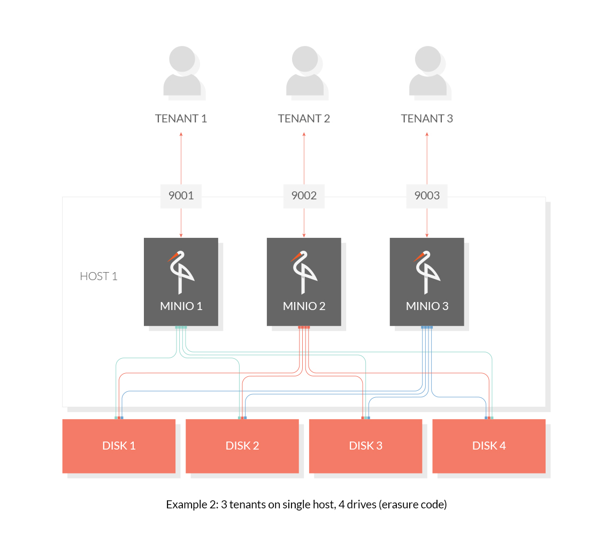
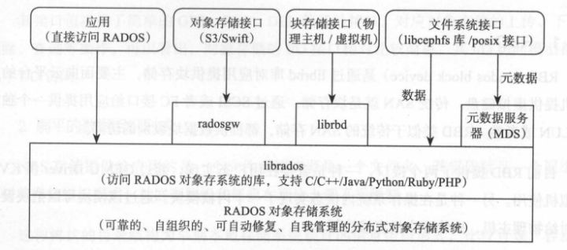
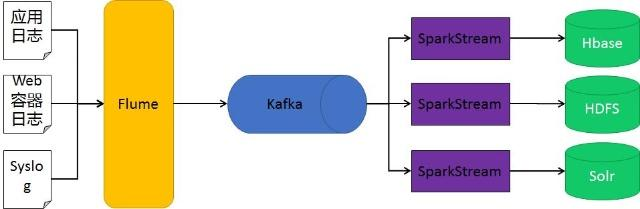

# 部署架构设计


> 作者: 大厂研究员
>
> 更新: 2022-08-18

## 概述

### 📖 定义

描述后端系统具体如何部署，对应 4+1 视图的物理视图。参考 [《阿里云 - 运用RUP 4+1视图方法进行软件架构设计》](https://developer.aliyun.com/article/458980)


### 🌏 使用场景

1. 总体架构设计；
2. 运维规划和优化；
3. 面试、晋升。

### 🎨 画图技巧

1. 使用 **图标** 代替区块。

### 🛠️ 工具推荐

1. [ProcessOn - 制图共享工具](https://www.processon.com/)
2. [Cloudcraft - 部署架构图设计工具](https://www.cloudcraft.co/)

### 👉 部署示例


## 云游戏平台部署架构


详见 [ProcessOn - 云游戏平台部署架构](https://www.processon.com/view/link/62ff5d350e3e7437cac1c423)

!> 图片预览效果不佳，具体请打开以上详细链接


## 网关中心

### 流量网关与业务网关基本关系

- 集群隔离（混合或独占）


（亿级流量架构之网关设计思路、常见网关对比 [via](https://www.cnblogs.com/Courage129/p/14446586.html)）

- 线程池隔离


（美团技术团队 - 百亿规模API网关服务Shepherd的设计与实现 [via](https://mp.weixin.qq.com/s/iITqdIiHi3XGKq6u6FRVdg)）


### 常见网关对比

> 目前常见的开源网关大致上按照语言分类有如下几类:

| 语言           | 网关                               | 
| ---------------| --------------------------------- |
| Nginx + lua    | [OpenResty](http://openresty.org/)、[Kong](https://konghq.com/)、[Orange](http://orange.sumory.com/)、[Apache APISIX](https://apisix.apache.org/) 等 |
| Java           | [Zuul1/Zuul2](https://github.com/Netflix/zuul)、[Spring Cloud Gateway](https://spring.io/projects/spring-cloud-gateway/)、[Apache ShenYu](https://shenyu.apache.org/)、[Kaazing KWG](https://kaazing.com)、[gravitee](https://www.gravitee.io/) 等    |
| Go             | Janus、fagongzi、Grpc-gateway 等 |
| C++            | Envoy 等                         |
| .net           | Ocelot 等                        |
| NodeJS         | Express Gateway、Micro Gateway 等|

> 按照使用数量、成熟度等来划分，主流的有 4 个：

- **OpenResty** 
    - Nginx + Lua
- **Kong/Orange** 
    - Nginx + Lua + OpenResty
- **Zuul/Zuul2** 
    - Java（Servlet/Netty Server）
- **Spring Cloud Gateway**
    - Java（WebFlux）

> 互联网企业常见的方案有基于 Openresty 的 Kong、Orange，基于 Java 的 Zuul 系列、SpringCloudGateWay ，以及基于 Go 的 Tyk

| 维度         | OpenResty         | Kong                               | Orange                    |  Zuul 1         | Zuul 2         | SpringCloudGateway                 | 
| ---------    | ----------------- | -----------------------------------| ------------------------- | ----------------| ---------------| ---------------------------------- | 
| **效率**     |  高                | 高                                 | 高                        |  低             | 一般            | 一般，RPS 是 Zuul2 的 1.6 倍   | 
| **开发语言** |  Lua               | Lua                                | Lua                       |  Java           | Java           | Java                               | 
| **技术栈**   |  Nginx + Lua       | Nginx + Lua + OpenResty            | Nginx + Lua + OpenResty   |  Springboot     | Springboot     | Springboot                         | 
| **存储**     |  Redis、Memcached  | Cassandra、PostgreSQL              | MySQL                     |  MySQL 等       |  MySQL 等       | MySQL 等                          | 
| **服务注册** |  Consul、ETCD      | Consul、ETCD                       | Consul、ETCD              |  Nacos、Consul   | Nacos、Consul  | Nacos、Consul                      | 
| **配置中心** |  Consul、ETCD      | Consul、ETCD                       | Consul、ETCD              |  Nacos、Consul   | Nacos、Consul  | Nacos、Consul                      | 
| **管理界面** |  开源              |  第三方开源                         | 开源                      |  内置            | 内置           |  无                                | 
| **社区**     |  成熟              | 相对成熟，用户问题汇总，社区，插件开源| 少，个人开发者             |  成熟            | 开源不久，资料少 | 社区成熟，资源较少                  | 
| **代码**     |  开源              | 开源，更新频繁                      | 开源                      |  开源            | 开源            |  开源                              | 
| **学习成本** |  简易，需进行lua开发| 简易，简易，需进行lua开发            | 较高                      |  一般            | 参考资料较少     | 简单易用                           | 
| **维护成本** |  普通，需维护lua脚本| 较高，需要维护lua脚本                | 较高                      |  一般            | 一般            | spring系列可扩展强，易配置 可维护性好| 
| **扩展**     |  自建              | 支持集群                           | 支持集群                   |  支持            | 支持            |  支持                              |  
| **多节点**   |  自建              | 支持                               | 需要开发                   |  支持            | 支持            |  支持                              | 
| **功能**     |  自建              | 丰富，部分开源 + 商业（收费）        | 丰富                      |  丰富            | 丰富            |  异步，配置灵活                      | 
| **限流**     |  需要lua开发       | 支持                               |                           |  支持            | 支持            |  支持                               |
| **鉴权**     |  需要lua开发       | 支持普通鉴权，Key Auth鉴权，HMAC，auth2.0 |                      |  filter中实现    | filter中实现    |  支持普通鉴权、auth2.0               | 
| **监控**     |  需要lua开发       | 内置                               |                           |  filter中实现    | filter中实现    |  Gateway Metrics Filter             |
| **WEb容器**   |                   |                                   |                           |  Servlet        |  Netty Server   |  WebFlux                           | 
| **线程模型**  |                   |                                   |                           |  阻塞            |  非阻塞         |  非阻塞                             | 
| **适用场景**  |  大型流量网关      | 大型流量网关                        | 大型流量网关                |  中小型业务网关  | 大型业务网关    | 大型业务网关                        | 

### 网关风险评估


### 网关设计重点

- **高性能**
    - 在技术设计上，网关不应该也不能成为性能的瓶颈。对于高性能，最好使用高性能的编程语言来实现，如 C、C++、Go 和 Java。网关对后端的请求，以及对前端的请求的服务一定要使用异步非阻塞的 I/O 来确保后端延迟不会导致应用程序中出现性能问题。C 和 C++ 可以参看 Linux 下的 epoll 和 Windows 的 I/O Completion Port 的异步 IO 模型，Java 下如 Netty、Spring Reactor 的 NIO 框架。
- **高可用**
    - 因为所有的流量或调用经过网关，所以网关必须成为一个高可用的技术组件，它的稳定直接关系到了所有服务的稳定。网关如果没有设计，就会成变一个单点故障。因此，一个好的网关至少要做到以下几点。
    - **集群化**。网关要成为一个集群，其最好可以自己组成一个集群，并可以自己同步集群数据，而不需要依赖于一个第三方系统来同步数据。
    - **服务化**。网关还需要做到在不间断的情况下修改配置，一种是像 Nginx reload 配置那样，可以做到不停服务，另一种是最好做到服务化。也就是说，得要有自己的 Admin API 来在运行时修改自己的配置。
    - **持续化**。比如重启，就是像 Nginx 那样优雅地重启。有一个主管请求分发的主进程。当我们需要重启时，新的请求被分配到新的进程中，而老的进程处理完正在处理的请求后就退出。
- **高扩展**
    - 因为网关需要承接所有的业务流量和请求，所以一定会有或多或少的业务逻辑。而我们都知道，业务逻辑是多变和不确定的。比如，需要在网关上加入一些和业务相关的东西。因此，一个好的 Gateway 还需要是可以扩展的，并能进行二次开发的。当然，像 Nginx 那样通过 Module 进行二次开发的固然可以。另外，在运维方面，网关应该有以下几个设计原则。
    - **业务松耦合，协议紧耦合**。在业务设计上，网关不应与后面的服务之间形成服务耦合，也不应该有业务逻辑。网关应该是在网络应用层上的组件，不应该处理通讯协议体，只应该解析和处理通讯协议头。另外，除了服务发现外，网关不应该有第三方服务的依赖。
    - **应用监视，提供分析数据**。网关上需要考虑应用性能的监控，除了有相应后端服务的高可用的统计之外，还需要使用 Tracing ID 实施分布式链路跟踪，并统计好一定时间内每个 API 的吞吐量、响应时间和返回码，以便启动弹力设计中的相应策略。
    - **用弹力设计保护后端服务**。网关上一定要实现熔断、限流、重试和超时等弹力设计。如果一个或多个服务调用花费的时间过长，那么可接受超时并返回一部分数据，或是返回一个网关里的缓存的上一次成功请求的数据。你可以考虑一下这样的设计。
    - **DevOps**。因为网关这个组件太关键了，所以需要 DevOps 这样的东西，将其发生故障的概率降到最低。这个软件需要经过精良的测试，包括功能和性能的测试，还有浸泡测试。还需要有一系列自动化运维的管控工具。

### 网关设计注意事项

1. 不要在网关中的代码里内置聚合后端服务的功能，而应考虑将聚合服务放在网关核心代码之外。可以使用 Plugin 的方式，也可以放在网关后面形成一个 Serverless 服务。
2. 网关应该靠近后端服务，并和后端服务使用同一个内网，这样可以保证网关和后端服务调用的低延迟，并可以减少很多网络上的问题。这里多说一句，网关处理的静态内容应该靠近用户（应该放到 CDN 上），而网关和此时的动态服务应该靠近后端服务。
3. 网关也需要做容量扩展，所以需要成为一个集群来分担前端带来的流量。这一点，要么通过 DNS 轮询的方式实现，要么通过 CDN 来做流量调度，或者通过更为底层的性能更高的负载均衡设备。
4. 对于服务发现，可以做一个时间不长的缓存，这样不需要每次请求都去查一下相关的服务所在的地方。当然，如果你的系统不复杂，可以考虑把服务发现的功能直接集成进网关中。
5. 为网关考虑 bulkhead 设计方式。用不同的网关服务不同的后端服务，或是用不同的网关服务前端不同的客户。

另外，因为网关是为用户请求和后端服务的桥接装置，所以需要考虑一些安全方面的事宜。具体如下：

1. **加密数据**。可以把 SSL 相关的证书放到网关上，由网关做统一的 SSL 传输管理。
2. **校验用户的请求**。一些基本的用户验证可以放在网关上来做，比如用户是否已登录，用户请求中的 token 是否合法等。但是，我们需要权衡一下，网关是否需要校验用户的输入。因为这样一来，网关就需要从只关心协议头，到需要关心协议体。而协议体中的东西一方面不像协议头是标准的，另一方面解析协议体还要耗费大量的运行时间，从而降低网关的性能。对此，我想说的是，看具体需求，一方面如果协议体是标准的，那么可以干；另一方面，对于解析协议所带来的性能问题，需要做相应的隔离。
3. **检测异常访问**。网关需要检测一些异常访问，比如，在一段比较短的时间内请求次数超过一定数值；还比如，同一客户端的 4xx 请求出错率太高……对于这样的一些请求访问，网关一方面要把这样的请求屏蔽掉，另一方面需要发出警告，有可能会是一些比较重大的安全问题，如被黑客攻击。


### 选型初步推论

👉 对于现有规模小的项目、接入成本有限制的项目、以 Java 开发语言为主导 **且** 对上线有迫切要求的团队，推荐优先使用 **Spring Cloud Gateway** 或 **Apache ShenYu**，尝鲜可以使用 **Zuul2**，据说性能很有优势，至于 **Zuul1** 由于效率瓶颈，已不再推荐。

🤌 对于未来有预期的项目、接入成本有空间的项目、有 Nginx 实践经验 **或** 学习能力强 **且** 允许成长的团队，推荐使用 **Kong** ，对效率有更高要求可以自建 **OpenResty**，当然想尝鲜国产网关可以试用 **Apache APISIX** ，功能也相当完备。

☁️ 对于有云原生规划的项目，建议更多参考 [CNCF Cloud Native && API GateWay](https://landscape.cncf.io/card-mode?category=api-gateway) 的趋势。 

### 云原生基金会网关现状


（CNCF Cloud Native && API GateWay. [via](https://landscape.cncf.io/card-mode?category=api-gateway)）

### 部署架构参考


（天翼账号网关系统 3.0 [via](https://xie.infoq.cn/article/c6703d216c43c2b522b9b4ffa)）


（美团技术团队 - 百亿规模API网关服务Shepherd的设计与实现 [via](https://mp.weixin.qq.com/s/iITqdIiHi3XGKq6u6FRVdg)）


（Apache ShenYu 2.4.2 [via](https://shenyu.apache.org/zh/docs/2.4.2/index)）


（Apache ShenYu 2.4.3 [via](https://shenyu.apache.org/zh/docs/index)）

### 业务网关功能基本要求

- **拦截层**
    - 鉴权
    - 反爬
    - 黑白名单
    - XXS 防御
    - 数据加密
    - SSL 加密
    - 证书管理
- **调度层**
    - 服务注册
    - 动态路由
    - 负载均衡
    - 灰度发布
    - API 编排
    - API 聚合
    - 分组隔离
    - 流量复制
- **通信层**
    - 日志
    - 监控
    - 缓存
    - Mock 测试
    - 协议适配
    - 熔断限流
    - 服务降级
    - 重试
    - 幂等
    - 异步
    - 配置同步
- **扩展层**
    - SPI 扩展
    - 组件市场


（Qunar技术沙龙 - 业务网关的落地实践 [via](https://www.infoq.cn/article/cAcwMUNMJMQpIxGJYkcS)）


（美团技术团队 - 百亿规模API网关服务Shepherd的设计与实现 [via](https://mp.weixin.qq.com/s/iITqdIiHi3XGKq6u6FRVdg)）

### API 发布流程


（美团技术团队 - 百亿规模API网关服务Shepherd的设计与实现 [via](https://mp.weixin.qq.com/s/iITqdIiHi3XGKq6u6FRVdg)）

### 稳定性保障


（美团技术团队 - 百亿规模API网关服务Shepherd的设计与实现 [via](https://mp.weixin.qq.com/s/iITqdIiHi3XGKq6u6FRVdg)）

### 灰度场景


（美团技术团队 - 百亿规模API网关服务Shepherd的设计与实现 [via](https://mp.weixin.qq.com/s/iITqdIiHi3XGKq6u6FRVdg)）

### 故障自愈


（美团技术团队 - 百亿规模API网关服务Shepherd的设计与实现 [via](https://mp.weixin.qq.com/s/iITqdIiHi3XGKq6u6FRVdg)）

### 静态网站托管


（美团技术团队 - 百亿规模API网关服务Shepherd的设计与实现 [via](https://mp.weixin.qq.com/s/iITqdIiHi3XGKq6u6FRVdg)）

### 网关选型参考 

- [InfoQ - 天翼账号网关系统架构演进历程](https://xie.infoq.cn/article/c6703d216c43c2b522b9b4ffa)

- [Qunar技术沙龙 - 业务网关的落地实践](https://www.infoq.cn/article/cAcwMUNMJMQpIxGJYkcS)

- [博客园 - 亿级流量架构之网关设计思路、常见网关对比](https://www.cnblogs.com/Courage129/p/14446586.html)

- [美团技术团队 - 百亿规模API网关服务Shepherd的设计与实现](https://mp.weixin.qq.com/s/iITqdIiHi3XGKq6u6FRVdg)


## 消息服务

> 几种常用MQ对比

| 维度    | ActiveMQ                       | RabbitMQ                       | RocketMQ             | Kafka              | 
|-------|--------------------------------|--------------------------------|----------------------|-----------------| 
| 多语言支持 | 支持，JAVA优先                      | 语言无关                           | 只支持Java              | 支持，Java优先       |
| 单机吞吐量 | 万级                             | 万级                             | 10万级                 | 10万级              | 
| 时效性   | ms级                            | 微秒级                            | ms级                  | ms级以内          | 
| 持久化   | 内存、文件、数据库                      | 内存、文件，支持数据堆积，但数据堆积会影响生产速率      | 磁盘文件        | 磁盘文件，只要磁盘容量足够，可以做到无限消息堆积 | 
| 功能支持  | MQ领域的功能极其完备                    | 基于erlang开发，所以并发能力很强，性能极其好，延时很低 | MQ功能较为完善，还是分布式的，扩展性好 | 功能较为简单，主要支持简单的MQ功能，在大数据领域的实时计算以及日志采集被大规模使用，是事实上的标准 | 
| 可用性   | 高（主从）                          | 高（主从）                          | 非常高（分布式）             | 非常高（分布式）        | 
| 消息丢失  | 低                              | 低                              | 非常高（分布式）             | 中              | 
| 社区活跃度 | 高                              | 高                              | 中                    | 高              | 
| 成熟度   | 成熟                             | 成熟                             | 比较成熟                 | 成熟日志领域         | 
| 支持协议  | OpenWirte、Stomp、rest、amop、xmpp | AMQP                           | 自己定义的一套              |            | 
| 事务    | 支持                             | 不支持                            | 支持                   |                | 
| 负载均衡  | 支持                             | 支持                             | 支持                   |                | 
| 部署方式  | 独立、嵌入                          | 独立                             | 独立                   |                | 

> 常用MQ优缺点及应用场景

[图片链接]：http://assets.processon.com/chart_image/630a0f2d63768906ff68ca0e.png


#### mq基本架构


#### kafka集群架构


#### rocketmq集群架构


#### activemq集群架构
##### 1.p2p


##### 2.p/s


#### rabbitmq集群架构


> MQ选型

- 1. Kafka
   Kafka 主要特点是基于 Pull 的模式来处理消息消费，追求高吞吐量，一开始的目的就是用于日志收集和传输，适合产生 大量数据 的互联网服务的数据收集业务。 大型公司 建议可以选用，如果有 日志采集功能，肯定是首选 kafka 了。
- 2. RocketMQ
   天生为金融互联网领域而生，对于可靠性要求很高的场景，尤其是电商里面的订单扣款，以及业务削峰，在大量交易涌入时，后端可能无法及时处理的情况。 RoketMQ 在稳定性上可能更值得信赖，这些业务场景在阿里双 11 已经经历了多次考验，如果你的业务有上述并发场景，建议可以选择 RocketMQ 。
- 3. RabbitMQ
   结合 erlang 语言本身的并发优势，性能好 时效性微秒级 ， 社区活跃度也比较高，管理界面用起来十分方便，如果你的 数据量没有那么大 ，中小型公司优先选择功能比较完备的 RabbitMQ 。

## 文件服务


### 使用场景

1. 存储平台业务产生的二进制文件
2. 大部分数据都是非结构化数据

### 需求

a. 具备高效的SDK提供给上层进行调用

b. 支持分片上传断点续传

c. 提供统一资源访问入口

d. 支持根据业务进行鉴权

e. 支持高吞吐量

f. 建议抽象存储设备

g. 高可用性，避免单机故障

### 存储技术选型及对比

#### 单机文件系统级分布式文件系统对比

| 文件系统       | 高可用                                                       | 扩展                          | 部署复杂程度   | 性能                                                 |
| -------------- | ------------------------------------------------------------ | ----------------------------- | -------------- | ---------------------------------------------------- |
| 单机文件系统   | 低，依赖于单机服务器，只要服务器崩溃，完全不可用。           | 低，要扩容只能停机增加硬盘。  | 低             | 当文件数量多到一定的程度，磁盘IO寻址操作将会成为瓶颈 |
| 分布式文件系统 | 高，一个group内的服务器崩溃后，group内的其他storage将接管服务。 | 高，可以不停机增加group机器。 | 高，部署较复杂 | 高，通过集群或者分布式的方式分担服务器的压力。       |

#### 自有分布式文件系统实现

##### 对比

| 对比说明/文件系统 | MinIO                                       | FastDFS                          | Ceph                         | GlusterFS                               |
| ----------------- | ------------------------------------------- | -------------------------------- | ---------------------------- | --------------------------------------- |
| 开发语言          | golang                                      | C                                | C++                          | C                                       |
| 开源协议          | APGL-V3                                     | GPL-V3                           | LGPL                         | GPL-V3                                  |
| 社区活跃度        | 非常活跃                                    | 活跃                             | 活跃                         | 一般                                    |
| 数据存储方式      | 文件/nas/s3/HDFS                            | 文件/Trunk                       | 对象/文件/块                 | 文件/块                                 |
| 集群节点通信协议  | HTTP/TCP                                    | 私有协议（TCP）                  | 私有协议（TCP）              | 私有协议（TCP）/ RDAM(远程直接访问内存) |
| 专用元数据存储    | 无                                          | 无                               | 占用MDS                      | 无                                      |
| 在线扩容          | 支持                                        | 支持                             | 支持                         | 支持                                    |
| 冗余备份          | 支持                                        | 支持                             | 支持                         | 支持                                    |
| 单点故障          | N/2可读，N/2+1可读写                        | 不存在                           | 存在                         | 不存在                                  |
| 跨集群同步        | 部分支持                                    | 部分支持                         | 不适用                       | 支持                                    |
| UI管理            | 支持                                        | 不支持                           | 支持                         | 支持                                    |
| 云原生            | 云原生项目                                  | 支持                             | 支持                         | 支持                                    |
| 原生SDK支持       | java，go，python，javascript，.net，Haskell | Java,c,php                       | c,c++,python                 | C                                       |
| 易用性            | 部署简单，方便维护扩展，官方文档支持。      | 部署相对简单，官方文档支持较差。 | 部署运维复杂，官方文档支持。 | 安装简单，官方文档专业化。              |
| 适用场景          | 单集群的大中小文件                          | 单集群的中小文件                 | 单集群的大中小文件           | 跨集群云存储                            |

##### 各自介绍

###### Minio

1. 基础概念

- Object：存储到 Minio 的基本对象，如文件、字节流，Anything…

- Bucket：用来存储 Object 的逻辑空间。每个 Bucket 之间的数据是相互隔离的。对于客户端而言，就相当于一个存放文件的顶层文件夹。

- Drive：即存储数据的磁盘，在 MinIO 启动时，以参数的方式传入。Minio 中所有的对象数据都会存储在 Drive 里。

- Set即一组 Drive 的集合，分布式部署根据集群规模自动划分一个或多个 Set ，每个 Set 中的 Drive 分布在不同位置。一个对象存储在一个 Set 上。（For example: {1…64} is divided into 4 sets each of size 16.）
  
- 一个对象存储在一个Set上  
  一个集群划分为多个Set  
  一个Set包含的Drive数量是固定的，默认由系统根据集群规模自动计算得出  
  一个Set中的Drive尽可能分布在不同的节点上  

2. 部署架构

- 单主机，单硬盘模式

     

     Minio只在一台服务器上搭建服务，且数据都存在单块磁盘上，该模式存在单点风险，主要用作开发、测试等使用

- 单主机，多硬盘模式

     

     Minio在一台服务器上搭建服务，但数据分散在多块（大于4块）磁盘上，提供了数据上的安全保障

- 多主机、多硬盘模式（分布式）

     

     Minio服务最常用的架构，通过共享一个access_key和secret_key,在多台（2-32）服务器上搭建服务，且数据分散在多块（大于4块，无上限）磁盘上，提供了较为强大的数据冗余机制（Reed-Solomon纠删码）

3. 优势

- 数据保护

     分布式Minio采用 纠删码来防范多个节点宕机和位衰减bit rot。

     分布式Minio至少需要4个硬盘，使用分布式Minio自动引入了纠删码功能。

- 高可用

     单机Minio服务存在单点故障，相反，如果是一个有N块硬盘的分布式Minio, 只要有N/2硬盘在线，你的数据就是安全的。

- 一致性

     Minio在分布式和单机模式下，所有读写操作都严格遵守read-after-write一致性模型

- 可靠性

     Minio使用了Erasure Code 纠删码和 Bit Rot Protection 数据腐化保护，提高数据的可靠性

###### FastDFS

1. 基础概念

- tracker-server

     跟踪服务器， 主要做调度工作， 起负载均衡的作用。 在内存中记录集群中所有存储组和存储服务器的状态信息， 是客户端和数据服务器交互的枢纽。 相比GFS中的master更为精简， 不记录文件索引信息， 占用的内存量很少。

- storage-server

     存储服务器（ 又称：存储节点或数据服务器） ， 文件和文件属性（ metadata） 都保存到存储服务器上。 Storage server直接利用OS的文件系统调用管理文件。

- group

     组， 也可称为卷。 同组内服务器上的文件是完全相同的 ，同一组内的storage server之间是对等的， 文件上传、 删除等操作可以在任意一台storage server上进行 。

- meta data

     meta data：文件相关属性，键值对（ Key Value Pair） 方式，如：width=1024,heigth=768 。

2. 部署架构

   

3. 时序图

- 文件上传时序图

     

- 文件下载时序图

     


###### Ceph

1. 基础概念

- Monitor
     一个Ceph集群需要多个Monitor组成的小集群，它们通过Paxos同步数据，用来保存OSD的元数据。
- OSD
     OSD全称Object Storage Device，也就是负责响应客户端请求返回具体数据的进程。一个Ceph集群一般都有很多个OSD。
- MDS
     MDS全称Ceph Metadata Server，是CephFS服务依赖的元数据服务。
- Object
     Ceph最底层的存储单元是Object对象，每个Object包含元数据和原始数据。
- PG
     PG全称Placement Grouops，是一个逻辑的概念，一个PG包含多个OSD。引入PG这一层其实是为了更好的分配数据和定位数据。
- RADOS
     RADOS全称Reliable Autonomic Distributed Object Store，是Ceph集群的精华，用户实现数据分配、Failover等集群操作。
- Libradio
     Librados是Rados提供库，因为RADOS是协议很难直接访问，因此上层的RBD、RGW和CephFS都是通过librados访问的，目前提供PHP、Ruby、Java、Python、C和C++支持。
- CRUSH
     CRUSH是Ceph使用的数据分布算法，类似一致性哈希，让数据分配到预期的地方。
- RBD
     RBD全称RADOS block device，是Ceph对外提供的块设备服务。
- RGW
     RGW全称RADOS gateway，是Ceph对外提供的对象存储服务，接口与S3和Swift兼容。
- CephFS
     CephFS全称Ceph File System，是Ceph对外提供的文件系统服务。

2. 基本组件

- OSD

   用于集群中所有数据与对象的存储。处理集群数据的复制、恢复、回填、再均衡。并向其他osd守护进程发送心跳，然后向Mon提供一些监控信息。

   当Ceph存储集群设定的数据有两个副本时（一共存两份），则至少需要两个OSD守护进程，即两个OSD节点，集群才能到达active+clean状态。

- MDS(可选)

   为Ceph文件系统提供元数据计算、缓存与同步。在Ceph中，元数据也是存储在osd节点中的，mds类似于元数据的代理缓存服务器。MDS进程并不是必须的进程，只有需要使用CephFS时，才需要配置MDS节点。

- Monitor

   监控整个集群的状态，维护集群的cluster MAP二进制表，保证集群数据的一致性。ClusterMAP描述了对象块存储的物理位置，以及一个将设备聚合到物理位置的桶列表。

3. 整体架构

   

   

4. 访问流程

   


###### GlusterFS

1. 基础概念

- Brick（存储块）：
    - 指可信主机池中由主机提供的用于物理存储的专用分区，是GlusterFS中的基本存储单元，同时也是可信存储池中服务器上对外提供的存储目录。
    - 存储目录的格式由服务器和目录的绝对路径构成，表示方法为 SERVER:EXPORT，如 192.168.80.10:/data/mydir/。
- Volume（逻辑卷）：
    - 一个逻辑卷是一组 Brick 的集合。卷是数据存储的逻辑设备，类似于 LVM 中的逻辑卷。大部分 Gluster 管理操作是在卷上进行的。
- FUSE：
    - 是一个内核模块，允许用户创建自己的文件系统，无须修改内核代码。
-  VFS：
    - 内核空间对用户空间提供的访问磁盘的接口。
- Glusterd（后台管理进程）：
    - 在存储群集中的每个节点上都要运行。

2. 工作流程

   

   （1）客户端或应用程序通过 GlusterFS 的挂载点访问数据。

   （2）linux系统内核通过 VFS API 收到请求并处理。

   （3）VFS 将数据递交给 FUSE 内核文件系统，并向系统注册一个实际的文件系统 FUSE，而 FUSE 文件系统则是将数据通过 /dev/fuse 设备文件递交给了 GlusterFS client 端。可以将 FUSE 文件系统理解为一个代理。

   （4）GlusterFS client 收到数据后，client 根据配置文件的配置对数据进行处理。

   （5）经过 GlusterFS client 处理后，通过网络将数据传递至远端的 GlusterFS Server，并且将数据写入到服务器存储设备上。

3. 七种卷类型

- 分布式卷

     **文件通过 HASH 算法分布到所有 Brick Server 上**，这种卷是 GlusterFS 的默认卷；以文件为单位根据 HASH 算法散列到不同的 Brick，其实只是扩大了磁盘空间，如果有一块磁盘损坏，数据也将丢失，属于文件级的 RAID0， 不具有容错能力。

     在该模式下，并**没有对文件进行分块处理**，文件直接存储在某个 Server 节点上。 由于直接使用本地文件系统进行文件存储，所以存取效率并没有提高，反而会因为网络通信的原因而有所降低。

     

- 条带卷

     类似 RAID0，文件被分成数据块并以轮询的方式分布到多个 Brick Server 上，文件存储以数据块为单位，支持大文件存储， 文件越大，读取效率越高，但是不具备冗余性。

     

- 复制卷

     将文件同步到多个 Brick 上，使其具备多个文件副本，属于文件级 RAID 1，具有容错能力。因为数据分散在多个 Brick 中，所以读性能得到很大提升，但写性能下降。

     复制卷具备冗余性，即使一个节点损坏，也不影响数据的正常使用。但因为要保存副本，所以磁盘利用率较低。

     

- 分布式条带卷

     Brick Server 数量是条带数（数据块分布的 Brick 数量）的倍数，兼具分布式卷和条带卷的特点。 主要用于大文件访问处理**，创建一个分布式条带卷最少需要 4 台服务器。**

     

     File1 和 File2 通过分布式卷的功能分别定位到Server1和 Server2。在 Server1 中，File1 被分割成 4 段，其中 1、3 在 Server1 中的 exp1 目录中，2、4 在 Server1 中的 exp2 目录中。在 Server2 中，File2 也被分割成 4 段，其中 1、3 在 Server2 中的 exp3 目录中，2、4 在 Server2 中的 exp4 目录中。

- 分布式复制卷

     Brick Server 数量是镜像数（数据副本数量）的倍数，兼具分布式卷和复制卷的特点。主要用于需要冗余的情况下。

     File1 和 File2 通过分布式卷的功能分别定位到 Server1 和 Server2。在存放 File1 时，File1 根据复制卷的特性，将存在两个相同的副本，分别是 Server1 中的exp1 目录和 Server2 中的 exp2 目录。在存放 File2 时，File2 根据复制卷的特性，也将存在两个相同的副本，分别是 Server3 中的 exp3 目录和 Server4 中的 exp4 目录。

     

- 条带复制卷

    - 类似 RAID 10，同时具有条带卷和复制卷的特点。

- 分布式条带复制卷

    - 三种基本卷的复合卷，通常用于类 Map Reduce 应用

  

#### 基于公有云对象存储实现

##### 思路

对上层业务抽象存储服务，提供标准S3 API，下层服务采用公有云（腾讯云/阿里云等）对象存储服务

下层服务可根据需要替换为其他服务

类似于适配器模式

##### 优势

1. 无需自搭建及运维分布式存储服务，减少运维成本
2. 高效利用云优势及云方法，降本增效
3. 不直接依赖公有云服务，可根据业务等需要，自由更换下层实现（公有云实现、后续自实现）
4. 网关无状态，可根据需要扩容

##### 整体方案设计

1. 在文件存储服务实现之上加入文件存储服务网关，上层业务不直接依赖于文件存储服务实现，而依赖于文件存储服务网关

![img](data:image/png;base64,iVBORw0KGgoAAAANSUhEUgAAAcMAAADnCAYAAABizD1KAAAAAXNSR0IArs4c6QAABA50RVh0bXhmaWxlACUzQ214ZmlsZSUyMGhvc3QlM0QlMjJhcHAuZGlhZ3JhbXMubmV0JTIyJTIwbW9kaWZpZWQlM0QlMjIyMDIyLTA5LTAzVDA2JTNBMTIlM0EzMC43MjJaJTIyJTIwYWdlbnQlM0QlMjI1LjAlMjAoV2luZG93cyUyME5UJTIwMTAuMCUzQiUyMFdpbjY0JTNCJTIweDY0KSUyMEFwcGxlV2ViS2l0JTJGNTM3LjM2JTIwKEtIVE1MJTJDJTIwbGlrZSUyMEdlY2tvKSUyMENocm9tZSUyRjEwNC4wLjUxMTIuMTAyJTIwU2FmYXJpJTJGNTM3LjM2JTIwRWRnJTJGMTA0LjAuMTI5My43MCUyMiUyMGV0YWclM0QlMjJWaldJMUozNXhjRmhBX1ZXRENidSUyMiUyMHZlcnNpb24lM0QlMjIyMC4yLjglMjIlMjB0eXBlJTNEJTIyZGV2aWNlJTIyJTNFJTNDZGlhZ3JhbSUyMGlkJTNEJTIydjVjem83aUlpQlQwY3RfV1VQSFclMjIlMjBuYW1lJTNEJTIyJUU3JUFDJUFDJTIwMSUyMCVFOSVBMSVCNSUyMiUzRXpaUkJhNE13RklCJTJGelRzT2pHazFIdFdtMjhvR0d4NjIyd2lhcWFCRzBuVGElMkZmcEZqYlhTRlRwWW9TZVQ3NzJYWjc2RUFBN0w5bDZ5T25zV0NTJTJGQXRwSVc4QXBzRzFtV3JUOGQyUTlrU1F4SVpaNllwQWxFJTJCVGNmS3czZDVRbmZ6aEtWRUlYSzZ6bU1SVlh4V00wWWsxSTA4N1JQVWN5NzFpemxKeUNLV1hGSzMlMkZKRVpRTWx0anZ4QjU2bjJkZ1pPZDRRS2RtWWJIYXl6VmdpbWlPRUtlQlFDcUdHVWRtR3ZPamtqVjZHdXZXWjZPSEhKSyUyRlVKUVdiajVDJTJCUG0wZWNWU1g0ZnZMeDdxMCUyQkoxWjVZc1ZPN05ob0FzSUNCQWY2QklDQkdRa1hrODA5MDNSVnUxSFMxTHNxb1IzalN6QVFaUGxpa2MxaTd0b28lMkIlMkJGWnBrcUN6MURlbWhhY3FsNGUzWXY2R0JJWHkwdVNxN2tYcWVNQlk2UmFtNFZXcGg1TTUzUlltbFlkblElMkJybUhNWEl2MHNQUmtUZyUyQk12RCUyQkl4TCUyQklkTUJ6Z0xpOXZ3QUNwJTJGUG5yOEFqdlVnYmZOTG5oRUJXazFycVFxQnpVRSUyRjBDZUNiazIzakMyVTcxNUs5JTJGRGZaT29lQ1J6dnJoRUpnM1p4c2pLNG5XMCUyQm41NmVQSFQzaW1QNEElM0MlMkZkaWFncmFtJTNFJTNDJTJGbXhmaWxlJTNFCyydtwAAF2hJREFUeF7t3E2oVVUfB+B1h2o1UcJokERgMyEiAmuQEkoggoFGKhQGhklgGA3M7xwEkhBpObAoNVAoiCC0yAYpRETkIFCIkMCJJEEfOrwv/827Dvue9rmebSe7Z6/nQGTnrr33Ws9a+nN97CZSSpPJhwABAgQIFCwwEWE4OSkPCx4Dmk6AAIGiBSYmJpIwLHoIaDwBAgQICENjgAABAgSKFxCGxQ8BAAQIECAgDI0BAgQIECheQBgWPwQAECBAgIAwNAYIECBAoHgBYVj8EABAgAABAsLQGCBAgACB4gWEYfFDAAABAgQICENjgAABAgSKFxCGxQ8BAAQIECAgDI0BAgQIECheQBgWPwQAECBAgIAwNAYIECBAoHgBYVj8EABAgAABAsLQGCBAgACB4gWEYfFDAAABAgQICENjgAABAgSKFxCGxQ8BAAQIECAgDI0BAgQIECheQBgWPwQAECBAgIAwNAYIECBAoHgBYVj8EABAgAABAsLQGCBAgACB4gWEYfFDAAABAgQICENjgAABAgSKFxCGxQ8BAAQIECAgDI0BAjchcPXq1bRt27a0b9++NHfu3MY7HD9+PK1bt+6Gdz979mxavHhxr1z93rNnz0779+9PmzZtanxOlN28eXPatWtXWrhw4Q2fpQABAs0CwtDIIHATAsOGYdx67dq1A58QgblgwYKbDsO9e/emHTt2NN5/0aJF6cSJE0LyJvrXJeUJCMPy+lyLRyAwbBgOOzOcN29eOnLkSNq9e3e6du1ab9bZPzOM8FuyZEkVnvHry5cvV63pn6HGz+Kzffv2EbTWLQh0X0AYdr+PtfBfEBg2DIedGT7wwANp586dacOGDSmCMS/B1sMw7pW/P3XqVNWqmHVGXeLfEXxx7Zo1a9LBgwenzDb/BQK3JNApAWHYqe7UmFslkAPo9OnTUx65cePGdODAgTRr1qwUS6A3CsP6xbn88uXLG8PwwoUL6cyZM3+b7V28eLEKwPPnz/du178PeatcPIfAuAoIw3HtOfX+TwWGnRnGfuClS5cGHqRZtmxZFZpxCCdCLZZKX3zxxfTaa69VS5/1meGhQ4eqJdKYRW7ZsiUdPny4MqgHcEap7yXu2bPHcul/Olo8fBwEhOE49JI6zjiBNmFYPyk6XUOuX79eLZWuXLkyHT16dEoYxszvjTfeGHh69dy5c1XoTndYZ8YhqhCBGSQgDGdQZ6jK+AgME4axXDpnzpxq5jbdp39p9cqVK9UssT4zvO2229Kdd97ZC7sIzvrssOn+TpOOz3hS0/9eQBj+932gBmMocKMwjJ/HsubWrVur/cP41E+CfvHFF9VyZ9M7im3eM4z75hllHL7J7xrGd9O9nziG5KpM4F8VEIb/Kq+bd1XgRmFYPzyTZ3Hr16/vnfD84Ycf0uuvv974snybMMyHZ/pPj96ofl3tF+0icLMCwvBm5VxXlMB0L7f3Q8SBlfnz56dVq1ZVB2ButJz55ZdfppMnT/YOxNwINpZVV69enZYuXTrl8Ez/qdJjx47ZQ7wRpp8T+L+AMDQUCBAgQKB4AWFY/BAAQIAAAQLC0BggQIAAgeIFhGHxQwAAAQIECAhDY4AAAQIEihcQhsUPAQAECBAgIAyNAQIECBAoXkAYFj8EABAgQICAMDQGCBAgQKB4AWFY/BAAQIAAAQLC0BggQIAAgeIFhGHxQwAAAQIECAhDY4AAAQIEihcQhsUPAQAECBAgIAyNAQIECBAoXkAYFj8EABAgQICAMDQGCBAgQKB4AWFY/BAAQIAAAQLC0BggQIAAgeIFhGHxQwAAAQIECAhDY4AAAQIEihcQhsUPAQAECBAgIAyNAQIECBAoXkAYFj8EABAgQICAMDQGCBAgQKB4AWFY/BAAQIAAAQLC0BggQIAAgeIFhGHxQwAAAQIECAhDY4AAAQIEihcQhsUPAQAECBAg0AtDFAQIECBAoGSBicnJycmSAbSdAAECBAgIQ2OAAAECBIoXEIbFDwEABAgQICAMjQECBAgQKF5AGBY/BAAQIECAgDA0BggQIECgeAFhWPwQAECAAAECwtAYIECAAIHiBYRh8UMAAAECBAgIQ2OAAAECBIoXEIbFDwEABAgQICAMjQECBAgQKF5AGBY/BAAQIECAgDA0BggQIECgeAFhWPwQAECAAAECwtAYIECAAIHiBYRh8UMAAAECBAgIQ2OAAAECBIoXEIbFDwEABAgQIDCRUprEQIAAAQIEShaownByUh6WPAi0nQABAiULTExMJGFY8gjQdgIECBBIwtAgIECAAIHiBYRh8UMAAAECBAgIQ2OAAAECBIoXEIbFDwEABAgQICAMjQECBAgQKF5AGBY/BAAQIECAgDA0BggQIECgeAFhWPwQAECAAAECwtAYIECAAIHiBYRh8UMAAAECBAgIQ2OAAAECBIoXEIbFDwEABAgQICAMjQECBAgQKF5AGBY/BAAQIECAgDA0BggQIECgeAFhWPwQAECAAAECwtAYIECAAIHiBYRh8UMAAAECBAgIQ2OAAAECBIoXEIbFDwEABAgQICAMjQECBAgQKF5AGBY/BLoJcP369bRly5a0fv36tHjx4oGNPHfuXLp06VJau3Ztr0x8d+bMmbR9+/bG6y5evJh27dqV3nrrrTR37tyB94467Ny5s/r5ypUre/U4fvx4WrBgwZR6Xb16tarD6dOnq/Jnz56t6rBjx44p91+2bFmK6/Nz47rNmzdX9Vm4cOHAuvTff1DB/vvv3bs33XvvvVN84tr4fsmSJdPadnNkaVVXBYRhV3tWu9IwQXHgwIH0xBNPVEGSf/3rr7/+LQzjD//+YBpEvHHjxupe165dS4cOHUrPPvtseu+999KKFSvSM888k86fP19dGuWefPLJdOXKlbR8+fKq7NatW9PHH39cheW3337bq1uUj3Ddv39/2rRpUy8Mp6vXokWL0okTJ6q2hUW+/6xZsxqr3nT/HHyXL1+u2hTXDgpIQ47AOAsIw3HuPXWvBPIs8PDhw0OJ5LD65Zdf0pEjR9Lu3bt7wRVh9P333w+cGQ4TsLkS9VlnfTaYfz1v3rzG5w8Kw3j2tm3b0r59+6owjFCKkIpP/i4/O34Wnzy7jWtff/31dNddd6Xnn38+1dseARd1/eSTT9Ltt99ehe3s2bOrmfWNTPtnkkN1gEIEZqCAMJyBnaJKNy/QtAQZd2taDo2yP//8cxUY8fNHHnmk8cHHjh3rLRPm0Pj9998bg6IeDoNmUPHcv/76K3311Ve9pdamZdI8M/zuu+/SunXrqrrlusQ94hNLq/naaEcE7Jo1a9LBgwf/tgwbM8OHH364monGJ+oQ/0ToRV3jZ998882UmWcdpMnw5nvKlQRmloAwnFn9oTb/UCD28z777LPqD/j6p74cGt/nAIn9xJgNxt7ehg0bqiXFQXuGeQ8wl+sPigjT2OuLe0Y9IpTuv//+aqlyz5491d5bDrX6tTFTjSB79913p10mHUSTn5WXX6Ncrke+pr5MGkut0cYI1FOnTlXh+Oeff1YhGIFZX4YVhv9wQLp8bASE4dh0lYoOI9AUWBEWeTk075dFEER4xLJh7BnWA3RQGMY1R48enXKAJeoU33/99de9PbX4LmZaP/74Y7VP+OCDD065f31W1xRWeZm06QBN7AO+//776e233+7NTPOyb30vsL6XGEGcgy4vA0c74i8I8Ym/ODz66KNp1apVvT3JCMmm4G7qg7j/oMNGw/SZMgRmgoAwnAm9oA4jFaiHXxxiaTptGftj99xzT7VU2T+LbArDPPuaP39+iqXQl156aWCdI5yWLl2afvvttzRnzpxeGMZeXf8+XF5WjZv1nyaNZdK4Pv7Jy6H1PcM2s7Y8M4zDPK+99lo1A37ooYeqmWvcO8+Q+w/o5Gfkfdm7775b8I10tLrZTBEQhjOlJ9RjpAJ5D7B+orL/AXlJNUJh0H5hXBPhFkucERgxo+o/rDJonzLPAGNmePLkyfTHH3+k++67rxdu9dOb8Zym06RRt/zMmK3l0Bzm0FDTadKoQ3yfT6/Gf8drHxG8jz32WPr0008bl0nz/mq8ThGf6V5XGWlHuhmBWyQgDG8RtMfcWoH6gZj+/bNck0H7i4OWSftPc+b7DBOGeRm2/6BOnhnG6xx5Kbf/NGn8LMK6aTk06tC0NNz/mkTeI43y+T3F+oGYsIhl0zvuuCO98sorU96fjHJ5WTW/WuEdw1s7nj3t3xcQhv++sSfcQoG8V1bfx8rf1U+FRpVuZRjGAZ34zfbUU09Vh1ViabIeWPVZXw7X/tOkTbPcvHzbdHq0vqR6M+8Z1g8Z9e8Jhmk+hDPd/3jgFna9RxH4RwLC8B/xuXgmCNSXDAfNAvOMKA6F1N8zbDp5OuzMMIfsoKXYvEwaL9BH2fjvCxcuTFmSzTPDDz74oFqmfOedd6rXG+IEaiytxov+OdhzOMX9Vq9eXe1L1meL/adK6+E/XRjWZ6v5fvUTp4PCbrqwnAnjQh0ItBEQhm20lCVAgACBTgoIw052q0YRIECAQBsBYdhGS1kCBAgQ6KSAMOxkt2oUAQIECLQREIZttJQlQIAAgU4KCMNOdqtGESBAgEAbAWHYRktZAgQIEOikgDDsZLdqFAECBAi0ERCGbbSUJUCAAIFOCgjDTnarRhEgQIBAGwFh2EZLWQIECBDopIAw7GS3ahQBAgQItBEQhm20lCVAgACBTgoIw052q0YRIECAQBsBYdhGS1kCBAgQ6KSAMOxkt2oUAQIECLQREIZttJQlQIAAgU4KCMNOdqtGESBAgEAbAWHYRktZAgQIEOikgDDsZLdqFAECBAi0ERCGbbSUJUCAAIFOCgjDTnarRhEgQIBAGwFh2EZLWQIECBDopIAw7GS3ahQBAgQItBEQhm20lCVAgACBTgr0wrCTrdMoAgQIECAwpMDE5OTk5JBlFSNAgAABAp0UEIad7FaNIkCAAIE2AsKwjZayBAgQINBJAWHYyW7VKAIECBBoIyAM22gpS4AAAQKdFBCGnexWjSJAgACBNgLCsI2WsgQIECDQSQFh2Mlu1SgCBAgQaCMgDNtoKUuAAAECnRQQhp3sVo0iQIAAgTYCwrCNlrIECBAg0EkBYdjJbtUoAgQIEGgjIAzbaClLgAABAp0UEIad7FaNIkCAAIE2AsKwjZayBAgQINBJAWHYyW7VKAIECBBoIyAM22gpS4AAAQKdFBCGnexWjSJAgACBNgLCsI2WsgQIECDQSYGJlNJkJ1umUQQIECBAYEiBKgwnJ+XhkF6KESBAgEDHBCYmJpIw7Finag4BAgQItBMQhu28lCZAgACBDgoIww52qiYRIECAQDsBYdjOS2kCBAgQ6KCAMOxgp2oSAQIECLQTEIbtvJQmQIAAgQ4KCMMOdqomESBAgEA7AWHYzktpAgQIEOiggDDsYKdqEgECBAi0ExCG7byUJkCAAIEOCgjDDnaqJhEgQIBAOwFh2M5LaQIECBDooIAw7GCnahIBAgQItBMQhu28lCZAgACBDgoIww52qiYRIECAQDsBYdjOS2kCBAgQ6KCAMOxgp2oSAQIECLQTEIbtvJQmQIAAgQ4KCMMOdqomESBAgEA7AWHYzktpAgQIEOiggDDsYKdqEgECBAi0ExCG7byUJkCAAIEOCgjDDnaqJqV0/fr1tGXLlrR+/fq0ePHigSTnzp1Lly5dSmvXru2Vie/OnDmTtm/f3njdxYsX065du9Jbb72V5s6dO/DeUYedO3dWP1+5cmWvHsePH08LFiyYUq+rV69WdTh9+nRV/uzZs1UdduzYMeX+y5YtS3F9fm5ct3nz5qo+CxcuHLrrs8+jjz46pe35Bnv37p3y7Jdffjl9/vnn6fz581OesXHjxnTgwIE0a9asoZ+tIIGZKCAMZ2KvqNNIBIYJiviD/IknnqiCJP/6119//VsY9ofDdBXMAXHt2rV06NCh9Oyzz6b33nsvrVixIj3zzDO9QIlyTz75ZLpy5Upavnx5VXbr1q3p448/rsLy22+/7dUtnhcBtn///rRp06ZeGE5Xr0WLFqUTJ05UbYuAf+SRR4ZyjSCOv0CEX67TL7/8ko4cOZJ2797dC776z4XhULQKzWABYTiDO0fVhhPIs5zDhw8PdUEOq/of8Dm4Ioy+//77gTPDYQI2V6I+66zPBvOv582b1wuY+vMHhWE8e9u2bWnfvn1VGEYQXr58uXpc/q4+s4tf59lt0wy4Catez0Fh+M4771QhHfXPYSkMhxp6Cs1gAWE4gztH1doLNC1Bxl2awiDK/vzzz1VgTDdzOnbsWG8pMcp98skn6ffff09N4Vtfxoywuvfee/+2DBnP/euvv9JXX33VW2ptWibNM8PvvvsurVu3rsLIdYl7xCeWVvO10Y4IqDVr1qSDBw9OWYbN7X/wwQfTiy++mN58883GZVVh2H7MuaIbAsKwG/2oFf8XiP28zz77rNovrH/qy6HxfQ6QWA6M2WDs7W3YsKG3pNi0Z5j3AHO5+v1zmOYlxqhHhNL9999fLVXu2bOnCsYcavVrY6YaQfbuu+9Ou0w6qJPzs+r7ebkeTdfU9wvzz+t7pvFdhGK9rhH8P/30U7VMambot1sXBYRhF3u14DY1BVaERf9+V/xhH+Fx1113VUt+9QAddIAmrjl69OiUAyw5OL7++uspB0liVvjjjz9W+4QxG6vfvz6ry11VX5LMy6RNB2hiH/D9999Pb7/9dm9m2nSIpb6XGEGcZ78vvPBCbx8x173/ME9TnfKS8iuvvFItjca+ZXwskxb8m61jTReGHetQzUmpHn6xF9d02jKWOu+5555qqbJ/FtkUhnn2NX/+/BRLoS+99NJA6ginpUuXpt9++y3NmTOnF4bPP/989az68mpeVs1LnvXTpLFMGtfHP3k5tL5n2D8z7T8Ve6NZYdwzQnPJkiWNJ26b9gxjifW5556rDvi8+uqr1cGgmFnbM/Q7b9wFhOG496D6NwrkZcv6icr+gnlJ9aGHHpr2pGWEWyxxxpJqzAz7D6sM2qfMM8CYGZ48eTL98ccf6b777uuFW/10aH2WVT9AE3XLzzx16lTVhAixYQ4N1dvev+w53bDJM8mmMHz88cfTF198UV1eP1lqGBIYdwFhOO49qP7ThmH8cND+2aD9xUHLpP2nOfODhwnDvEzaf1AnzwzjdY68lNt/mjR+Fq9FDHqnr2lpuOk1jH6omBV+9NFHU5ZN62Xqh3oiIFevXl3V8emnn04ffvhhFYaxfNq0R2tYEhg3AWE4bj2mvtMK5L2yPLuJwvm7+qnQ+P5WhmEc0InfbE899VT6888/e7O7/N5gfdaXw7X/NGnTLDcv3/afHh0U3P0eq1at6i3dTmcWIR6OUbd6cAtDvyG7IiAMu9KTBbejvmQ43SnKvFRYf8+waVYz7Mwwh+ygpdi8TBr7azlILly4MGVJNs8MP/jgg/TYY49VJzW/+eabarYWS6vxf6CpL1vGEmncL2ZpsS9Zny32nyqth3/9QM0go/4TsXlIxbXxye8s9i/RTmde8LDU9DETEIZj1mGqS4AAAQKjFxCGozd1RwIECBAYMwFhOGYdproECBAgMHoBYTh6U3ckQIAAgTETEIZj1mGqS4AAAQKjFxCGozd1RwIECBAYMwFhOGYdproECBAgMHoBYTh6U3ckQIAAgTETEIZj1mGqS4AAAQKjFxCGozd1RwIECBAYMwFhOGYdproECBAgMHoBYTh6U3ckQIAAgTETEIZj1mGqS4AAAQKjFxCGozd1RwIECBAYMwFhOGYdproECBAgMHoBYTh6U3ckQIAAgTETEIZj1mGqS4AAAQKjFxCGozd1RwIECBAYMwFhOGYdproECBAgMHoBYTh6U3ckQIAAgTETEIZj1mGqS4AAAQKjFxCGozd1RwIECBAYMwFhOGYdproECBAgMHoBYTh6U3ckQIAAgTETEIZj1mGqS4AAAQKjF+iF4ehv7Y4ECBAgQGB8BP4HpTsdUr0YJVAAAAAASUVORK5CYII=)

2. 文件存储服务实现采购公有云服务，得到公有云相关参数，配置在存储服务网关
3. 存储服务网关采用Minio S3网关，可配置相应参数缓存热点数据，减少网络传输

##### 部署架构

![img](data:image/png;base64,iVBORw0KGgoAAAANSUhEUgAAAZUAAAPWCAYAAAAoCAXQAAAAAXNSR0IArs4c6QAAB3R0RVh0bXhmaWxlACUzQ214ZmlsZSUyMGhvc3QlM0QlMjJhcHAuZGlhZ3JhbXMubmV0JTIyJTIwbW9kaWZpZWQlM0QlMjIyMDIyLTA5LTAzVDA3JTNBMTElM0E0Ni4wNTRaJTIyJTIwYWdlbnQlM0QlMjI1LjAlMjAoV2luZG93cyUyME5UJTIwMTAuMCUzQiUyMFdpbjY0JTNCJTIweDY0KSUyMEFwcGxlV2ViS2l0JTJGNTM3LjM2JTIwKEtIVE1MJTJDJTIwbGlrZSUyMEdlY2tvKSUyMENocm9tZSUyRjEwNC4wLjUxMTIuMTAyJTIwU2FmYXJpJTJGNTM3LjM2JTIwRWRnJTJGMTA0LjAuMTI5My43MCUyMiUyMGV0YWclM0QlMjJHWUxXdDZRUWhpdkJSaTV5aEI1UiUyMiUyMHZlcnNpb24lM0QlMjIyMC4yLjglMjIlMjB0eXBlJTNEJTIyZGV2aWNlJTIyJTNFJTNDZGlhZ3JhbSUyMGlkJTNEJTIydjVjem83aUlpQlQwY3RfV1VQSFclMjIlMjBuYW1lJTNEJTIyJUU3JUFDJUFDJTIwMSUyMCVFOSVBMSVCNSUyMiUzRTdWbmZiNk00RVA1ciUyRkhnUnh1SFhZeUQwOWxZOXFYZDl1TDJueWcwT2VCZHdaSndtdWIlMkYlMkJ4c1JBQ0xTN1ZkT3kwa2FLRlB3eE51TnZQZzh6Q1NKUnNmOWQwazMycDBoWWptd3IyU095UkxhTjV3VERsMFlPUjhSdmdGVHl4Qmgxd0QzJTJGanhuUU11aVdKNnpxR1NvaGNzVTNmWEFseXBLdFZBJTJCalVvcGQzMnd0OHY1VE56UmxBJTJCQiUyQlJmTWglMkJnOVBWR1oyWVhzZCUyRm9ueE5HdWVqTjNnZUtlZ2piSFpTWlhSUk94T0lCSWpFa2toMVBHcTJFY3MxJTJCUTF2QnpuM1R4enQzVk1zbEw5eUlUUEQxSDgxJTJCM25QOGo5cG9pJTJCM0QzY0ZCYjdEUlBqbkRvME8yWUpFR0NHUXFwTXBLS2tlZHlob1JUYk1tRjZXUXRHbmMydEVCc0FNWUJmbVZJSEUwMjZWUUtnVEJXNXVRc2V5OE1YUFglMkZtTk1OJTJGelhMMVlMbnZqUTVtZFBSVk8lMkZnc0J3YXF4RmF1MkFzYk4xRlNWS1pNdlVRUWJrTUZHbWVpWU9BUVRKUXNwNG8lMkY5UjJoUm14cGE5ZkZBeTVNU0Y0Ukh1UGxFODIzNWttRGNQV0RzY3U0WXZjYld1OTlCMGV5VDd4WmprbkY5aTlUT055eG1XQzd6bkdLT2REdTNPaDcxeDJQVnZQWnlkR3dMZXVkV0hLJTJGejFMMWphbFZaa2phQ0Y0cUp1TW4ySEpsbUdsUHB6WklhSlcxbEo3UVZ5a3B2ckZJNUVJQ1VvcFNuNGFjUHJMOFRsUmNjVkVDdkdKNmNiaWhhZWFRU1c3UERCNkZVcUk0TVZqa1BOVTNsRDQlMkJvZGlxbkpmd2xDYWhhU2VvTVdrWEIzODNlbSUyRkZQdFdKZHliV2E3NWlzNHBKV0xXYWJiSkRwWmQlMkJ5RVFGYTRScm51ZU4zOGdtdHVYWm9YOFpRUkFYejg0a0VZeEl3aHNxd3JIZlNSRGVWUkFUQ21KdTllWGdPUlBMd2IlMkZLWWNyODBMd01maFk1TktYbHFSNWlGd1V1OGowVXoxRVlvdEJGc1lNV1N4VDQlMkJzSzMwY0t2YlNMa0wydGtnUllZeFI0S3dRYlhpSVBDWVRFRnRLbm5oSEhLdVlHYU1PWnNyVVlFVVBBa3FTdXdDdDd3dkV4dmE3UGx2RVAlMkJOdnhwU01EMGRWNkxOb09Kckd5a1hSUHFoUEFCSmlKZGd6bmdhd1JqM0kzaG84MmxBcUdCJTJCNVRYMFdhMFVqdFdTMFlLUlJWOXJIZHFYVVlxdHVlZnYwcEd4SUx4U0hWQjNxdTR3UGhpYWdHYkdBV3hsbzBmbzlBYXFPV2phemtjOUk5bVlBM1pKdDRJMiUyRmpkNkxhREFTc2YwSkNneXpVV2JaZjZ2YzdpbVBPbTZpeklVSDIlMkZSdVAzdyUyRkVKM2hpZWV1cENTbm80TVRENXQxdjVUZ01uTDB1dm4lMkYlMkZJJTJGS3lwZjUwOVhCdzk2SVRTYnVVTlozUWtKVTZkeW16SDZ4RXhWbVNNZGFWdENyeDhKck92WmVlVVphZER6bW9KUFBKMiUyQjlEQzB5WlhSVXlwaUtDZklyQTd0UjdtVnoxTXFRZHMlMkYyUjZjSVo2Z0RZaWhBWUN1b2RBTnh6JTJCemJYcHZIalRhWjAzblZQM25MYiUyRnF4Ym4zZ2NWNTI4THo4anZ5eVB0Zm9DQ0VQbHVmV0JqdEpoUFhpTmp4JTJCM3BuSkFSb2Z0a3BFakdyMWM2REx2JTJGTm8lMkJkUiUyRmNQTVluJTJGQnclM0QlM0QlM0MlMkZkaWFncmFtJTNFJTNDJTJGbXhmaWxlJTNFoLmKZgAAIABJREFUeF7tnQ+sn9VZxw9xUwuWmLbiRsmGtAkdW0QXytBCIhgowSATJjD+LBBMwELKYBAw0ALtUCcMHIFuJBYif7ZBADeJhGJGYwDtKGEh2VhJKCNKmUNaEgrUTZJrzivv9b2//u79veec55zzvOd8brII/Z3znOd8vs9zvpz3/d26z9TU1JThRxWBffbZR1U+JAOB0glwDMopvA+mIgdTKpI1FYpciiZxIDA3AfpNtkIwFVmeItEochGMBIFALwL0Wy9MvQdhKr1RpRtIkadjzUoQoN9kawBTkeUpEo0iF8FIEAj0IkC/9cLUexCm0htVuoEUeTrWrAQB+k22BjAVWZ4i0ShyEYwEgUAvAvRbL0y9B2EqvVGlG0iRp2PNShCg32RrAFOR5SkSjSIXwUgQCPQiQL/1wtR7EKbSG1W6gRR5OtasBAH6TbYGMBVZniLRKHIRjASBQC8C9FsvTL0HYSq9UaUbSJGnY81KEKDfZGsAU5HlKRKNIhfBSBAI9CJAv/XC1HsQptIbVbqBFHk61qwEAfpNtgYwFVmeItEochGMBIFALwL0Wy9MvQdhKr1RpRtIkadjzUoQoN9kawBTkeUpEo0iF8FIEAj0IkC/9cLUexCm0htVuoEUeTrWrAQB+k22BjAVWZ4i0ShyEYwEgUAvAvRbL0y9B2EqvVGlG0iRp2PNShCg32RrAFOR5SkSTbLI9+zZYy677DJzzDHHmLPPPns6v5deesmsXr3a3HbbbebQQw/dK+9nnnnGHH300bPu57777puOd//995tzzjln4t67c+z6119/vbn99tvNwoULZ+S1ceNGc8MNN5h58+ZNjMkACIQSkOy30FxKmI+pKFQxRpGvX7/e/Nqv/ZrZtGlT879xPytXrjTWIOwhb03l1VdfnWFE7ZzRz+ycgw8+2KxYsWJWmuPiWWM544wzzB133NHMnc1oFEpESgURiNFvBeFx3gqm4ows/oTYRb5z505zySWXNDeFcbcUu0PXm8orr7xijjvuuMYcrIG1/2xvStddd51ZunSp2W+//RqTmhS7Jdy92cSnzgq1Eojdb7VxxVQUKi5Z5PYAt4d8ewMZvQ20j8fOPffcGTcN15vKAQccYLZs2dLcPB544IGG6umnn978X/s46/jjjzdvvPHG2JuPzeHmm282q1atmvEoTKE0pFQgAcl+KxCP85YwFWdk8SdIF3n7/mTt2rWNwYx7/HX44YdPm4E1hhdeeKHXRp9++unmMZl9/LVo0aLGVK688kpz4oknmmuuuaa5CR155JFNrNkep2EqvVAzKBIB6X6LlOZgwmIqCqXKUeT2YL/33nuNvbHYF+Td9ySjh769xTz55JNmzZo1Db127Kc//enmSwHtrad7S9q2bVtjKtZs7COw2d7rdOVojW62R3QKpSOlARLI0W8DxNQ7ZUylN6p0A6WLvH2vccEFFzSbeOyxx8xFF100/cjpnnvuMSeddNKM9yuTvtG1bt26vUzFmoZ9xPXOO++YK664wjzyyCPmpptuam5Ab7755pwv/i+++OJmHAaSrs5Y6f8ISPdb7VwxFYUVIF3k9sX8hg0bmoP++eefb24Z9p/b9xizmUr7ja4+N5V3333XbN68ufmK8OOPP27sv7/88svmrLPOav7cPgIb9/ir/dLAVVddZZ599tnpm5JCWUipUALS/VYopt7bwlR6o0o3ULrIu4+r7A3E/px66ql7mcpzzz03vck+v3fS3lbaW037ba1RE7LvcezPIYccMuNF/eiXBOy7H35HJV2dsRI3lRg1gKnEoBoYU9pU7KFuD/Qjjjhi+hceP/axj401lXG/bzLpRbrP76nYOe2jse4jr/Z3V+zL/u4vawYiZToEZiUg3W+1o8ZUFFaAZJG3j5fOPPPM5hFY+xv0XaOwj6vszcS+GLePoewjq74/3W9/jf7yY3sTufPOO5twdmz3G2JzmcZsptM3L8ZBoC8ByX7ru2bJ4zAVhepS5ApFIaViCdBvstJiKrI8RaJR5CIYCQKBXgTot16Yeg/CVHqjSjeQIk/HmpUgQL/J1gCmIstTJBpFLoKRIBDoRYB+64Wp9yBMpTeqdAMp8nSsWQkC9JtsDWAqsjxFolHkIhgJAoFeBOi3Xph6D8JUeqNKN5AiT8ealSBAv8nWAKYiy1MkGkUugpEgEOhFgH7rhan3IEylN6p0AynydKxZCQL0m2wNYCqyPEWiUeQiGAkCgV4E6LdemHoPwlR6o0o3kCJPx5qVIEC/ydYApiLLUyQaRS6CkSAQ6EWAfuuFqfcgTKU3qnQDKfJ0rFkJAvSbbA1gKrI8RaJR5CIYCQKBXgTot16Yeg/CVHqjSjeQIk/HmpUgQL/J1gCmIstTJBpFLoKRIBDoRYB+64Wp9yBMpTeqdAMp8nSsWQkC9JtsDWAqsjxFolHkIhgJAoFeBOi3Xph6D8JUeqNKN5AiT8ealSBAv8nWAKYiy1MkGkUugjE4yGu79pjvb3/LvPbWnuBYowH2n/chc/wnDzAHLZgnHpuAbgToNzdek0ZjKpMIZficIs8AfWTJF3fsNp//+rPm7T3vR0vGGsu3/vxIc9ji+dHWIPBkAvTbZEYuIzAVF1qJxlLkiUDPscwf3fKvxhpL7B9rKP90+e/HXob4cxCg32TLA1OR5SkSjSIXwRgU5Le+tClovsvkn3x1pctwxgoToN9kgWIqsjxFolHkIhiDgmAqQfgGNZl+k5ULU5HlKRKNIhfBGBQEUwnCN6jJ9JusXJiKLE+RaBS5CMagIJhKEL5BTabfZOXCVGR5ikSjyEUwBgUZZyprTlkW9E0t++J//Xe37ZUX71SCpAqeTL8FI5wRAFOR5SkSjSIXwRgUZJypfGvVcnPUkgXecbds32U+v2ErpuJNMM5E+k2WK6Yiy1MkGkUugjEoyDhT+dzyxUG/rGh/mfKhrTswlSBl5CfTb7JMMRVZniLRKHIRjEFBeKcShG9Qk+k3WbkwFVmeItEochGMQUEwlSB8g5pMv8nKhanI8hSJRpGLYAwKgqkE4RvUZPpNVi5MRZanSDSKXARjUBBMJQjfoCbTb7JyYSqyPEWiUeQiGIOCYCpB+AY1mX6TlQtTkeUpEo0iF8EYFARTCcI3qMn0m6xcmIosT5FoFLkIxqAgmEoQvkFNpt9k5cJUZHmKRKPIRTAGBcFUgvANajL9JisXpiLLUyQaRS6CMSgIphKEb1CT6TdZuTAVWZ4i0ShyEYxBQTCVIHyDmky/ycqFqcjyFIlGkYtgDAqCqQThG9Rk+k1WLkxFlqdINIpcBGNQEEwlCN+gJtNvsnJhKrI8RaJR5CIYg4JgKkH4BjWZfpOVC1OR5SkSjSIXwRgUBFMJwjeoyfSbrFyYiixPkWgUuQjGoCCYShC+QU2m32TlwlRkeYpEo8hFMAYFwVSC8A1qMv0mKxemIstTJBpFLoIxKAimEoRvUJPpN1m5MBVZniLRKHIRjEFBMJUgfIOaTL/JyoWpyPIUiUaRi2AMCoKpBOEb1GT6TVYuTEWWp0g0ilwEY1AQTCUI36Am02+ycmEqsjxFolHkIhiDgmAqQfgGNZl+k5ULU5HlKRKNIhfBGBQEUwnCN6jJ9JusXJiKLE+RaBS5CMagIJhKEL5BTabfZOXCVGR5ikSjyEUwBgXBVILwDWoy/SYrF6Yiy1MkGkUugjEoCKYShG9Qk+k3WbkwFVmeItEochGMQUEwlSB8g5pMv8nKhanI8hSJRpGLYAwKgqkE4RvUZPpNVi5MRZanSDSKXARjUJBxpvKJA+eb/ed92Dvu23v+x/z49d17zf/JV1d6x2RiOAH6LZxhNwKmIstTJBpFLoIxKMg4U/nWquXmqCULvONu2b7LfH7DVkzFm2CcifSbLFdMRZanSDSKXARjUBBMJQjfoCbTb7JyYSqyPEWiUeQiGIOC8E4lCN+gJtNvsnJhKrI8RaJR5CIYg4JgKkH4BjWZfpOVC1OR5SkSjSIXwRgUBFMJwjeoyfSbrFyYiixPkWgUuQjGoCCYShC+QU2m32TlwlRkeYpEo8hFMAYFGWcqa05ZZg5bPN877os7dpv1392213y+UuyNVGQi/SaCcToIpiLLUyQaRS6CMSgI3/4KwjeoyfSbrFyYiixPkWgUuQjGoCDjTOVzyxebgxbM84772q495qGtO7ipeBOMM5F+k+WKqcjyFIlGkYtgDArCO5UgfIOaTL/JyoWpyPIUiUaRi2AMCoKpBOEb1GT6TVYuTEWWp0g0ilwEY1AQTCUI36Am02+ycmEqsjxFolHkIhiDgmAqQfgGNZl+k5ULU5HlKRKNIhfBGBQEUwnCN6jJ9JusXJiKLE+RaBS5CMagIH+76eWg+S6Tv7hyqctwxgoToN9kgWIqsjxFolHkIhgJAoFeBOi3Xph6D8JUeqNKN5AiT8ealSBAv8nWAKYiy1MkGkUugpEgEOhFgH7rhan3IEylN6p0AynydKxZCQL0m2wNYCqyPEWiUeQiGAkCgV4E6LdemHoPwlR6o0o3kCJPx5qVIEC/ydYApiLLUyQaRS6CkSAQ6EWAfuuFqfcgTKU3qnQDayjy72/fZbZsfysK1MMOnG+O/9QBUWJrDgpTP3Vq6Dc/Mn6zMBU/blFnlV7kV377h2P/CnhJqPavqb/pzE9JhlQdC6b+8pTeb/5k/GZiKn7cos4qucif+OEb5sK7fxCVXxv8zvN/15xQwY0FpmHlVHK/hZHxm42p+HGLOqvkIrd//cnXntgelV8b/NITlpga/goUmIaVU8n9FkbGbzam4sct6qySi5wDUL50YBrGtOR+CyPjNxtT8eMWdVbJRc4BKF86MA1jWnK/hZHxm42p+HGLOqvkIucAlC8dmIYxLbnfwsj4zcZU/LhFnVVykY87AD9x4Hyz9rPLgpiu+8428+PXd8+IUfM7FZj2L6eS+60/BbmRmIocS7FIJRf5OFP5zJIF5turlgfxO3PDVmN/T6P7U7OpwLR/OZXcb/0pyI3EVORYikUqucjHmcpBC+YZ+3slIT8Pbd1hXtu1B1P5gABM+1dTyf3Wn4LcSExFjqVYpJKLnOf/YmUyHQimYUxL7rcwMn6zMRU/blFnlVzkHIDypQPTMKYl91sYGb/ZmIoft6izSi5yDkD50oFpGNOS+y2MjN9sTMWPW9RZJRc5B6B86cA0jGnJ/RZGxm82puLHLeqskoucA1C+dGAaxrTkfgsj4zcbU/HjFnVWyUXOAShfOjANY1pyv4WR8ZuNqfhxizqr5CLnAJQvHZiGMS2538LI+M3GVPy4RZ1VcpFzAMqXDkzDmJbcb2Fk/GZjKn7cos4qucg5AOVLB6ZhTEvutzAyfrMxFT9uUWeVXOQcgPKlA9MwpiX3WxgZv9mYih+3qLNKLnIOQPnSgWkY05L7LYyM32xMxY9b1FklFzkHoHzpwDSMacn9FkbGbzam4sct6qySi5wDUL50YBrGtOR+CyPjNxtT8eMWdVbJRc4BKF86MA1jWnK/hZHxm42p+HGLOqvkIucAlC8dmIYxLbnfwsj4zcZU/LhFnVVykXMAypcOTMOYltxvYWT8ZmMqftyiziq5yDkA5UsHpmFMS+63MDJ+szEVP25RZ5Vc5ByA8qUD0zCmJfdbGBm/2ZiKH7eos0oucg5A+dKBaRjTkvstjIzfbEzFj1vUWSUXOQegfOnANIxpyf0WRsZvNqbixy3qrJKLnANQvnRgGsa05H4LI+M3G1Px4xZ1VslFzgEoXzowDWNacr+FkfGbjan4cYs6q+Qi5wCULx2YhjEtud/CyPjNxlT8uEWdVXKRcwDKlw5Mw5iW3G9hZPxmYyp+3KLOKrnIOQDlSwemYUxL7rcwMn6zMRU/blFnlVzkHIDypQPTMKYl91sYGb/ZmIoft6izSi5yDkD50oFpGNOS+y2MjN9sTMWPW9RZJRf5uANw/q9+yBy2eP8gpi/ueNvs/u/3Z8S49IQl5osrlwbFHcJkmIapVHK/hZHxm42p+HGLOqvkIh93AH5myQLz7VXLg5ieuWGr+f72XZjKBwRg2r+cSu63/hTkRmIqcizFIpVc5JiKWJlMB4JpGNOS+y2MjN9sTMWPW9RZJRc5z//lSwemYUxL7rcwMn6zMRU/blFnlVzkHIDypQPTMKYl91sYGb/ZmIoft6izSi5yDkD50oFpGNOS+y2MjN9sTMWPW9RZJRc5B6B86cA0jGnJ/RZGxm82puLHLeqskot83AH4iQPnm7WfXRbEdN13tpkfv757Royav1IM0/7lVHK/9acgNxJTkWMpFqnkIuebSmJlMh0IpmFMS+63MDJ+szEVP25RZ5Vc5OMOwIMWzDOfW744iOlDW3eY13bt4abyAQGY9i+nkvutPwW5kZiKHEuxSCUXOc//xcpkzpuK/Cr/F7HER4ol91usOpgrLqaSg/qENUsuckxFvuBgGsa05H4LI+M3G1Px4xZ1VslFzgEoXzowDWNacr+FkfGbjan4cYs6q+Qi5wCULx2YhjEtud/CyPjNxlT8uEWdVXKRcwDKlw5Mw5iW3G9hZPxmYyp+3KLOKrnIt2zfZba8PPNvE44F86ilC8xRSxbECq8mLkzDpCi538LI+M3GVPy4RZ1FkUfFS3AIzCBAv8kWBKYiy1MkGkUugpEgEOhFgH7rhan3IEylN6p0AynydKxZCQL0m2wNYCqyPEWiUeQiGAkCgV4E6LdemHoPwlR6o0o3kCJPx5qVIEC/ydYApiLLUyQaRS6CkSAQ6EWAfuuFqfcgTKU3qnQDKfJ0rFkJAvSbbA1gKrI8RaJR5CIYCQKBXgTot16Yeg/CVHqjSjeQIk/HmpUgQL/J1gCmIstTJBpFLoKRIBDoRYB+64Wp9yBMpTeqdAMp8nSsWQkC9JtsDWAqsjxFolHkIhgJAoFeBOi3Xph6D8JUeqNKN5AiT8ealSBAv8nWAKYiy1MkGkUugpEgEOhFgH7rhan3IEylN6p0AynydKxZCQL0m2wNYCqyPEWiUeQiGAkCgV4E6LdemHoPwlR6o0o3kCJPx5qVIEC/ydYApiLLUyQaRS6CkSAQ6EWAfuuFqfcgTKU3qnQDKfJ0rFkJAvSbbA1gKrI8RaJR5CIYCQKBXgTot16Yeg/CVHqjSjeQIk/HmpUgQL/J1gCmIstTJBpFLoKRIBDoRYB+64Wp9yBMpTeqdAMp8nSsWQkC9JtsDWAqsjxFolHkIhgJAoFeBOi3Xph6D8JUeqNKN5AiT8ealSBAv8nWAKYiy1MkGkUugpEgEOhFgH7rhan3IEylN6p0AynydKxZCQL0m2wNYCqyPEWi2SLnBwIQSEdgamoq3WKFr4SpFC4w20tHYNJ/8U76PF2mrASBeAQwlXhsiVwZgUmmMenzynCx3UIJYCqFCsu20hOYZBqTPk+fMStCQJ4ApiLPlIiVEphkGpM+rxQb2y6MAKZSmKBsJx+BSaYx6fN8mbMyBOQIYCpyLIlUOYFJpjHp88rxsf1CCGAqhQjJNvITmGQakz7PvwMygEA4AUwlnCERINAQmGQakz4HIwRKIICplKAie1BBYJJpTPpcxSZIAgKBBDCVQIBMh0BLYJJpTPockhAogQCmUoKK7EEFgUmmMelzFZsgCQgEEsBUAgEyHQLcVKgBCPw/AUyFaoCAEIFJN5FJnwulQRgIZCWAqWTFz+IlEZhkGpM+L4kFe6mXAKZSr/bsXJjAJNOY9LlwOoSDQBYCmEoW7CxaIoFJpjHp8xKZsKf6CGAq9WnOjiMRmGQakz6PlBZhIZCUAKaSFDeLlUxgkmlM+rxkNuytHgKYSj1as9PIBCaZxqTPI6dHeAgkIYCpJMHMIjUQmGQakz6vgRF7LJ8AplK+xuwwEYFJpjHp80RpsgwEohLAVKLiJXhNBCaZxqTPa2LFXsslgKmUqy07S0xgkmlM+jxxuiwHgSgEMJUoWAlaI4FJpjHp8xqZsefyCGAq5WnKjjIRmGQakz7PlDbLQkCUAKYiipNgNROYZBqTPq+ZHXsvhwCmUo6W7CQzgUmmMenzzOmzPARECGAqIhgJAgH+f9RTAxCwBDAV6gACQgQm3UQmfS6UBmEgkJUAppIVP4uXRGCSaUz6vCQW7KVeAphKvdqzc2ECk0xj0ufC6RAOAlkIYCpZsLNoiQQmmcakz0tkwp7qI4Cp1Kc5O45EYJJpTPo8UlqEhUBSAphKUtwsVjKBSaYx6fOS2bC3eghgKvVozU4jE5hkGpM+j5we4SGQhACmkgQzi9RAYJJpTPq8BkbssXwCmEr5GrPDRAQmmcakzxOlyTIQiEoAU4mKl+A1EZhkGpM+r4kVey2XAKZSrrbsLDGBSaYx6fPE6bIcBKIQwFSiYCVojQQmmcakz2tkxp7LI4CplKcpO8pEYJJpTPo8U9osCwFRApiKKE6C1UxgkmlM+rxmduy9HAKYSjlaspPMBCaZxqTPM6fP8hAQIYCpiGAkCAT4/6dCDUDAEsBUEtbB1Vdfbb7yla8kXJGlUhL4gz/4A7N58+ZZl+SmklIN1spFAFNJSP7SSy81S5YsMatXr064KktpIYCpaFGCPGISwFRi0h2JjakkhK1wKUxFoSikJE4AUxFHOntATCUhbIVLYSoKRSElcQKYijhSTCUh0kEthakMSi6S9SSAqXiC85nGTcWHWjlzMJVytGQnsxPAVBJWB6aSELbCpTAVhaKQkjgBTEUcKY+/EiId1FKYyqDkIllPApiKJzifadxUfKiVMwdTKUdLdsLjLxU1gKmokCFbEphKNvQsnJAAN5WEsDGVhLAVLoWpKBSFlMQJYCriSHmnkhDpoJbCVAYlF8l6EsBUPMH5TOOm4kOtnDmYSjlashPeqaioAUxFhQzZksBUsqFn4YQEuKkkhI2pJIStcClMRaEopCROAFMRR8o7lYRIB7UUpjIouUjWkwCm4gnOZxo3FR9q5czBVMrRkp3wTkVFDWAqKmTIlgSmkg09CyckwE0lIWxMJSFshUthKgpFISVxApiKOFLeqSREOqilMJVByUWyngQwFU9wPtO4qfhQK2cOplKOluyEdyoqagBTUSFDtiQwlWzoWTghAW4qCWFjKglhK1wKU1EoCimJE8BUxJHyTiUh0kEthakMSi6S9SSAqXiC85nGTcWHWjlzMJVytGQnvFNRUQOYigoZsiWBqWRDz8IJCXBTSQgbU0kIW+FSmIpCUUhJnACmIo6UdyoJkQ5qKUxlUHKRrCcBTMUTnM80bio+1MqZg6mUoyU74Z2KihrAVFTIkC0JTCUbehZOSICbSkLYmEpC2AqXwlQUikJK4gQwFXGkvFNJiHRQS2Eqg5KLZD0JYCqe4HymcVPxoVbOHEylHC3ZCe9UVNQApqJChmxJYCrZ0LNwQgLcVBLCxlQSwla4FKaiUBRSEieAqYgj5Z1KQqSDWgpTGZRcJOtJAFPxBNd32o9+9CPzyU9+shk+elN59913zX777dc3FOMGTgBTGbiApN+LAKbSC5PfoP/4j/8wK1asML/9279t/vIv/9Js3LjRLFmyxPzO7/yOufLKK80vfvEL84Mf/MAvOLMGRwBTGZxkJOxBAFPxgOYy5cILLzR33XWX+aVf+iWzaNEi8+EPf9js3LnT/PznPzd/8zd/09xe+KmDAKZSh8617xJTiVwB9rby8Y9/3ExNTc1YaeHChebNN9+MvDrhNRHAVDSpQS6xCGAqsch24q5ataq5rdjbif3Zd999m8dh3FISwFe0BKaiSAxSiUYAU4mG9v8Dj95WuKUkgK5wCUxFoSikJE4AUxFHOj5ge1ux71a4pSSCrmwZTEWZIKQThQCmEgXr3kHb28qv//qvm127diValWU0EcBUNKlBLrEIYCqxyI6J+6d/+qdm2bJlZv369QlXZSktBDAVLUqQR0wC+xhjZn4tKeZqxIZAYgKj37pLvPyM5TCVnPRZOxWBxlQ0NV6qjbNO+QS0HeLa8im/AthhDgKYSg7qrJmEgLZDXFs+SURgkeoIYCrVSV7PhrUd4tryqacS2GlKAphKStqslZSAtkNcWz5JxWCxaghgKtVIXd9GtR3i2vKpryLYcQoCmEoKyqyRhYC2Q1xbPllEYdHiCWAqxUtc7wa1HeLa8qm3Mth5TAKYSky6xM5KQNshri2frOKweLEEMJVipWVj2g5xbflQIRCIQQBTiUGVmCoIaDvEjz32WLN582YVbEgCArEIYCqxyBI3OwFtpqItn+wCkUCRBDCVImVlU5aAtkNcWz5UCQRiEMBUYlAlpgoC2g5xbfmoEIkkiiOAqRQnKRtqCWg7xLXlQ6VAIAYBTCUGVWKqIKDtENeWjwqRSKI4AphKcZKyIW4q1AAE8hHAVPKxZ+XIBLTdDLTlExk/4SslgKlUKnwN29Z2iGvLp4YaYI/pCWAq6ZmzYiIC2g5xbfkkkoFlKiOAqVQmeE3b1XaIa8unplpgr+kIYCrpWLNSYgLaDnFt+SSWg+UqIYCpVCJ0jdvUdohry6fGmmDP8QlgKvEZs0ImAtoOcW35ZJKFZQsngKkULnDN29N2iGvLp+baYO/xCGAq8dgSOTMBbYe4tnwyy8PyhRLAVAoVlm3xtxRTAxDIQQBTyUGdNZMQ0HYz0JZPEhFYpDoCmEp1ktezYW2HuLZ86qkEdpqSAKaSkjZrJSWg7RDXlk9SMVisGgKYSjVS17dRbYe4tnzqqwh2nIIAppKCMmtkIaDtENeWTxZRWLR4AphK8RLXu0Fth7i2fOqtDHYekwCmEpMusbMS0HaIa8snqzgsXiwBTKVYadmYtkNcWz5UCARiEMBUYlAlpgoC2g5xbfmoEIkkiiOAqRQnKRtqCWg7xLXlQ6VAIAYBTCUGVWKqIKDtENeWjwqRSKI4AphKcZKyIW4q1AAE8hHAVPKxZ+XIBLTdDLTlExk/4SslgKlUKnwN29Z2iGvLp4YaYI/pCWDYLapdAAAgAElEQVQq6ZmzYiIC2g5xbfkkkoFlKiOAqVQmeE3b1XaIa8unplpgr+kIYCrpWLNSYgLaDnFt+SSWg+UqIYCpVCJ0jdvUdohry6fGmmDP8QlgKvEZs0ImAtoOcW35ZJKFZQsngKkULnDN29N2iGvLp+baYO/xCGAq8dgSOTMBbYe4tnwyy8PyhRLAVAoVlm0Zo+0Q15YPNQKBGAQwlRGq999/vznnnHOaP73wwgvNRRddZM477zzzwgsvzBh53333mbPPPnv6z+y8V155xaxZs6aXTrfeeqs56aSTzKGHHmrWr19vDjnkkBnxbJCdO3c2f7Zp06bpmCtXrjR/93d/Z+6++26zatUqs3DhQvPMM8+YJ598svfavRIsYJC2Q1xbPgVIzBYUEsBUxpjKwQcfbJYtW2Y2bNhgTj75ZLN582Zz2WWXTY+0h/irr746bQIvvfSSOeOMM/YynnbCunXrZhz4dv7RRx89ZzlYQ7PGM2/evMZ0jjvuuCana665xtx4443NXPvP5557rnn22Wdn5KewzrKkpO0Q15ZPFlFYtHgCmIqHqdhbif2xtwhrKKtXrzaHH35487/u7aX97LbbbmtuJPZnz549jQFYM1ixYkXzZzaeNbL239uUZjOfE044wfzsZz+bYWJ27QceeGB6neIrt8cGtR3i2vLpgZAhEHAmgKmMMZXRx1/2pvKFL3xh+lGUfQTVGkt7c7CPoeyfPfXUU80N4+abbzY7duyYvm20y9jPfvrTn5qbbrppTrGefvrpaZNpH5UtWrRo+qZi17OPx+xt6oorrmhuNPzMJKDtENeWD/UCgRgEMBWPm8psQtjHVGvXrp3+uPsIy/6hvbk89thj5oADDphxM5ntpjLbOxX73ubiiy+ecVNpjc6aDT//R0DbIa4tH+oEAjEIYCo9TGXci3r7nsS+5+i+G+neLloTad+1dB9Pdb8MMJuobay5biPcVOZuCW2HuLZ8YhwoxIQAptLj8dejjz7ajGq/bdV9p9Kdbt+X2Mde7bjZymv0ZjLbTcXOH32v0jUnTAVT4QiDgDYCmEqPm4p9p2IfWdmfE088ccZ7jT7f5Gq//TXucdZsBWEfZ23cuNHcdddd5sUXXzS333672Xfffc11113XTBn3Tmb0pqSt2FLno+1moC2f1HqwXh0EMJURnbtf3+1+pdj+vor91tadd95pZju8x/2+yOjXj7vL2c/uvffe6T/qfiOsfXz2L//yL+b5559vvkbcmsoFF1zQfMuLmwo3lTqOKXY5JAKYSkcte0h3fw+kayrdb3+N/t6JDWHNaNy3vcY9Kmt/r+W0005rHpW1a9r1Hn744RlfDR693fD4q397absZaMunP0lGQqA/AUylw6r9dtaRRx7ZvIC35nH66ac3v9hof9rfA2lftH/ve98zDz744F63l+63wLrfymrN5Kijjpr+qnHXyOw3t9rfY2lvRN1feOSm0r+w7Uhth7i2fNxoMhoC/QhgKv04MWqABLQd4tryGaCkpDwAApjKAEQiRT8C2g5xbfn4UWUWBCa8yzTGTE1NTcEJAsUR0HaIa8unOMHZkAoC3FRUyEASMQhoO8S15RODOTEhgKlQA8US0HaIa8unWOHZWFYCmEpW/Cwek4C2Q1xbPjHZE7teAphKvdoXv3Nth7i2fIovADaYhQCmkgU7i6YgoO0Q15ZPCg1Yoz4CmEp9mlezY22HuLZ8qikENpqUAKaSFDeLpSSg7RDXlk9KLVirHgKYSj1aV7dTbYe4tnyqKwg2nIQAppIEM4vkIKDtENeWTw5NWLN8AphK+RpXu0Nth7i2fKotDDYelQCmEhUvwXMS0HaIa8snpzasXS4BTKVcbavfmbZDXFs+1RcIAKIQwFSiYCWoBgLaDnFt+WjQiBzKI4CplKcpO/qAgLZDXFs+FAoEYhDAVGJQJaYKAtoOcW35qBCJJIojgKkUJykbagloO8S15UOlQCAGAUwlBlViqiCg7RDXlo8KkUiiOAKYSnGSsiFuKtQABPIRwFTysWflyAS03Qy05RMZP+ErJYCpVCp8DdvWdohry6eGGmCP6QlgKumZs2IiAtoOcW35JJKBZSojgKlUJnhN29V2iGvLp6ZaYK/pCGAq6VizUmIC2g5xbfkkloPlKiGAqVQidI3b1HaIa8unxppgz/EJYCrxGbNCJgLaDnFt+WSShWULJ4CpFC5wzdvTdohry6fm2mDv8QhgKvHYEjkzAW2HuLZ8MsvD8oUSwFQKFZZtGaPtENeWDzUCgRgEMJUYVImpgoC2Q1xbPipEIoniCGAqxUnKhloC2g5xbflQKRCIQQBTiUGVmCoIaDvEteWjQiSSKI4AplKcpGyImwo1AIF8BDCVfOxZOTIBbTcDbflExk/4SglgKpUKX8O2tR3i2vKpoQbYY3oCmEp65qyYiIC2Q1xbPolkYJnKCGAqlQle03a1HeLa8qmpFthrOgKYSjrWrJSYgLZDXFs+ieVguUoIYCqVCF3jNrUd4tryqbEm2HN8AphKfMaskImAtkNcWz6ZZGHZwglgKoULXPP2tB3i2vKpuTbYezwCmEo8tkTOTEDbIa4tn8zysHyhBDCVQoVlW/wtxdQABHIQwFRyUGfNJAS03Qy05ZNEBBapjgCmUp3k9WxY2yGuLZ96KoGdpiSAqaSkzVpJCWg7xLXlk1QMFquGAKZSjdT1bVTbIa4tn/oqgh2nIICppKDMGlkIaDvEteWTRRQWLZ5AYyrF75INVktgakpPeWMq1ZZhVRvfZ0pT1xWO/tJLLzVLliwxq1evLnynbG8cAUyFuqiBAKaSUGVMJSFshUthKgpFISVxApiKONLZA2IqCWErXApTUSgKKYkTwFTEkWIqCZEOailMZVBykawnAUzFE5zPNG4qPtTKmYOplKMlO5mdAKaSsDowlYSwFS6FqSgUhZTECWAq4kh5/JUQ6aCWwlQGJRfJehLAVDzB+UzjpuJDrZw5mEo5WrITHn+pqAFMRYUM2ZLAVLKhZ+GEBLipJISNqSSErXApTEWhKKQkTgBTEUfKO5WESAe1FKYyKLlI1pMApuIJzmcaNxUfauXMwVTK0ZKd8E5FRQ1gKipkyJYEppINPQsnJMBNJSFsTCUhbIVLYSoKRSElcQKYijhS3qkkRDqopTCVQclFsp4EMBVPcD7TuKn4UCtnDqZSjpbshHcqKmoAU1EhQ7YkMJVs6Fk4IQFuKglhYyoJYStcClNRKAopiRPAVMSR8k4lIdJBLYWpDEoukvUkgKl4gvOZxk3Fh1o5czCVcrRkJ7xTUVEDmIoKGbIlgalkQ8/CCQlwU0kIG1NJCFvhUpiKQlFISZwApiKOlHcqCZEOailMZVBykawnAUzFE5zPNG4qPtTKmYOplKMlO+GdiooawFRUyJAtCUwlG3oWTkiAm0pC2JhKQtgKl8JUFIpCSuIEMBVxpLxTSYh0UEthKoOSi2Q9CWAqnuB8pnFT8aFWzhxMpRwt2QnvVFTUAKaiQoZsSWAq2dCzcEIC3FQSwsZUEsJWuBSmolAUUhIngKmII+WdSkKkg1oKUxmUXCTrSQBT8QTnM42big+1cuZgKuVoyU54p6KiBjAVFTJkSwJTyYaehRMS4KaSEDamkhC2wqUwFYWikJI4AUxFHCnvVBIiHdRSmMqg5CJZTwKYiic4n2ncVHyolTMHUylHS3bCOxUVNYCpqJAhWxKYSjb0LJyQADeVhLAxlYSwFS6FqSgUhZTECWAq4kh5p5IQ6aCWwlQGJRfJehLAVDzB+UzjpuJDrZw5mEo5WrIT3qmoqAFMRYUM2ZLAVLKhZ+GEBLipJISNqSSErXApTEWhKKQkTgBTEUfKO5WESAe1FKYyKLlI1pMApuIJzmcaNxUfauXMwVTK0ZKd8E5FRQ1gKipkyJYEppINPQsnJMBNJSFsTCUhbIVLYSoKRSElcQKYijhS3qkkRDqopTCVQclFsp4EMBVPcD7TuKn4UCtnDqZSjpbshHcqKmoAU1EhQ7YkMJVs6Fk4IQFuKglhYyoJYStcClNRKAopiRPAVMSR8k4lIdJBLYWpDEoukvUkgKl4gvOZxk3Fh1o5czCVcrRkJ7xTUVEDmIoKGbIlgalkQ8/CCQlwU0kIG1NJCFvhUpiKQlFISZwApiKOlHcqCZEOailMZVBykawnAUzFE5zPNG4qPtTKmYOplKMlO+GdiooawFRUyJAtCUwlG3oWTkiAm0pC2JhKQtgKl8JUFIpCSuIEMBVxpLxTSYh0UEthKoOSi2Q9CWAqnuB8pnFT8aFWzhxMpRwt2QnvVFTUAKaiQoZsSWAq2dCzcEIC3FQSwsZUEsJWuBSmolAUUhIngKmII+WdSkKkg1oKUxmUXCTrSQBT8QTnM42big+1cuZgKuVoyU54p6KiBjAVFTJkSwJTyYaehRMS4KaSEDamkhC2wqUwFYWikJI4AUxFHCnvVBIiHdRSmMqg5CJZTwKYiic4n2ncVHyolTMHUylHS3bCOxUVNYCpqJAhWxKYSjb0LJyQADeVhLAxlYSwFS6FqSgUhZTECWAq4kh5p5IQ6aCWwlQGJRfJehLAVDzB+UzjpuJDrZw5mEo5WrIT3qmoqAFMRYUM2ZLAVLKhZ+GEBLipJISNqSSErXApTEWhKKQkTgBTEUfKO5WESAe1FKYyKLlI1pMApuIJzmcaNxUfauXMwVTK0ZKd8E5FRQ1gKipkyJYEppINPQsnJMBNJSFsTCUhbIVLYSoKRSElcQKYijhS3qkkRDqopTCVQclFsp4EMBVPcD7TuKn4UCtnDqZSjpbshHcqKmoAU1EhQ7YkMJVs6Fk4IQFuKglhYyoJYStcClNRKAopiRPAVMSR8k4lIdJBLYWpDEoukvUkgKl4gvOZxk3Fh1o5czCVcrRkJ7xTUVEDmIoKGbIlgalkQ8/CCQlwU0kIG1NJCFvhUpiKQlFISZwApiKOlHcqCZEOailMZVBykawnAUzFE5zPNG4qPtTKmYOplKMlO+GdiooawFRUyJAtCUwlG3oWTkiAm0pC2JhKQtgKl8JUFIpCSuIEMBVxpLxTSYh0UEthKoOSi2Q9CWAqnuB8pnFT8aFWzhxMpRwt2QnvVFTUAKaiQoZsSWAq2dCzcEIC3FQSwsZUEsJWuBSmolAUUhIngKmII+WdSkKkg1oKUxmUXCTrSQBT8QTnM42big+1cuZgKuVoyU54p6KiBjAVFTJkSwJTyYaehRMS4KaSEDamkhC2wqUwFYWikJI4AUxFHCnvVBIiHdRSmMqg5CJZTwKYiic4n2lXX321+cpXvuIzlTmFEJiamipkJ2wDAuMJYCpUBgQSEeCmkgg0y2QlgKlkxc/iNRHAVGpSu969Yir1as/OExPAVBIDZ7ksBDCVLNhZtEYCmEqNqte3Z0ylPs3ZcSYCmEom8CyblACmkhQ3i9VMAFOpWf169o6p1KM1O81MAFPJLADLJyGAqSTBzCIQMAZToQpqIICp1KAye1RBAFNRIQNJRCaAqUQGTHgItAQwFWqhBgKYSg0qs0cVBDAVFTKQRGQCmEpkwISHADcVaqAmAphKTWqz16wEuKlkxc/iiQhgKolAswwEMBVqoAYCmEoNKrNHFQQwFRUykERkAphKZMCEhwDvVKiBmghgKjWpzV6zEuCmkhU/iycigKkkAs0yEMBUqIEaCGAqNajMHlUQwFRUyEASkQlgKpEBEx4CvFOhBmoigKnUpDZ7zUqAm0pW/CyeiACmkgg0y0AAU6EGaiCAqdSgMntUQQBTUSEDSUQmgKlEBkx4CPBOhRqoiQCmUpPa7DUrAW4qWfGzeCICmEoi0CwDAUyFGqiBAKZSg8rsUQUBTEWFDCQRmQCmEhkw4SHAOxVqoCYCmEpNarPXrAS4qWTFz+KJCGAqiUCzDAQwFWqgBgKYSg0qs0cVBDAVFTKQRGQCmEpkwISHAO9UqIGaCGAqNanNXrMS4KaSFT+LJyKAqSQCzTIQwFSogRoIYCo1qMweVRDAVFTIQBKRCWAqkQETHgK8U6EGaiKAqdSkNnvNSoCbSlb8LJ6IAKaSCDTLQABToQZqIICp1KAye1RBAFNRIQNJRCaAqUQGTHgI8E6FGqiJAKZSk9rsNSsBbipZ8bN4IgKYSiLQLAMBTIUaqIEAplKDyuxRBQFMRYUMJBGZAKYSGTDhIcA7FWqgJgKYSk1qs9esBLipZMXP4okIYCqJQLMMBDAVaqAGAphKDSqzRxUEMBUVMpBEZAKYSmTAhIcA71SogZoIYCo1qc1esxLgppIVP4snIoCpJALNMhDAVKiBGghgKjWozB5VEMBUVMhAEpEJYCqRARMeArxToQZqIoCp1KQ2e81KgJtKVvwsnogAppIINMtAAFOhBmoggKnUoDJ7VEEAU1EhA0lEJoCpRAZMeAjwToUaqIkAplKT2uw1KwFuKlnxs3giAphKItAsAwFMhRqogQCmUoPK7FEFAUxFhQwkEZkAphIZMOEhwDsVaqAmAphKTWqz16wEuKlkxc/iiQhgKolAswwEMBVqoAYCmEoNKrNHFQQwFRUykERkAphKZMCEhwDvVKiBmghgKjWpzV6zEuCmkhU/iycigKkkAs0yEMBUqIEaCGAqNajMHlUQwFRUyEASkQlgKpEBEx4CvFOhBmoigKnUpDZ7zUqAm0pW/CyeiACmkgg0y0AAU6EGaiCAqdSgMntUQQBTUSEDSUQmgKlEBkx4CPBOhRqoiQCmUpPa7DUrAW4qWfGzeCICmEoi0CwDAUyFGqiBAKZSg8rsUQUBTEWFDCQRmQCmEhkw4SHAOxVqoCYCmEpNarPXrAS4qWTFz+KJCGAqiUCzDAQwFWqgBgKYSg0qs0cVBDAVFTKQRGQCmEpkwISHAO9UqIGaCGAqNanNXrMS4KaSFT+LJyKAqSQCzTIQwFSogRoIYCo1qMweVRDAVFTIQBKRCWAqkQETHgK8U6EGaiKAqdSkNnvNSoCbSlb8LJ6IAKaSCDTLQABToQZqIICp1KAye1RBAFNRIQNJRCaAqUQGTHgI8E6FGqiJAKZSk9rsNSsBbipZ8bN4IgKYSiLQLAMBTIUaqIEAplKDyuxRBQFMRYUMJBGZAKYSGTDh6yXwx3/8x+bRRx81f/Inf2IeeeQR05rKqaeeav7hH/7BnHzyyeYf//Ef6wXEzoskgKkUKSub0kDgpz/9qTnwwAObVFpD6d5WXn/9dfPRj35UQ6rkAAExApiKGEoCQWBvAr/3e79ntmzZstcHRx11lPm3f/s3kEGgOAKYSnGSsiFNBLq3lW5e3FI0qUQukgQwFUmaxILAGAKjtxVuKZRJyQQwlZLVZW8qCIzeVrilqJCFJCIRwFQigSUsBLoE2tsKtxTqonQCmErpCrM/FQTsbWX58uVm69atfONLhSIkEYsAphKLbMS49mup/EAAAukITE1NpVts4CthKgMUkN/MHqBopDxYAvSbm3SYihsvFaMpchUykEQlBOg3N6ExFTdeKkZT5CpkIIlKCNBvbkJjKm68VIymyFXIQBKVEKDf3ITGVNx4qRhNkauQgSQqIUC/uQmNqbjxUjGaIlchA0lUQoB+cxMaU3HjpWI0Ra5CBpKohAD95iY0puLGS8VoilyFDCRRCQH6zU1oTMWNl4rRFLkKGUiiEgL0m5vQmIobLxWjKXIVMpBEJQToNzehMRU3XipGU+QqZCCJSgjQb25CYypuvFSMpshVyEASlRCg39yExlTceKkYTZGrkIEkKiFAv7kJjam48VIxmiJXIQNJVEKAfnMTGlNx46ViNEWuQgaSqIQA/eYmNKbixkvFaIpchQwkUQkB+s1NaEzFjZeK0RS5ChlIohIC9Jub0JiKGy8VoylyFTKQRCUE6Dc3oTEVN14qRlPkKmQgiUoI0G9uQmMqbrxUjI5d5M8884y59957za233mrmzZs3ds979uwxN998s1m1apVZuHBhM8b+2XXXXWcuuOACc+ihh46dt379enPIIYeYs88+e06WbQ6LFy82V1xxRZPHzp07zYYNG6b/vQ1w//33m3POOaf51wsvvNBcdNFF5rzzzjMvvPDCjDXuu+++Gevaea+88opZs2bNnLl04881sBv/pZdeMtdff725/fbbp/nYufbPN27caG644YZZ2aooMpKYJhC730pDjakMUNEURT7pwLWH42OPPWYuu+yy5qC0/2wP81FTsZ+dccYZex3ws2F/+umnzYoVK4xd/+CDDzavvvpq83+ffPJJs3bt2ulpTzzxhNmyZUtjao8//ngzZtmyZY3pnHzyyWbz5s1Nbu2PNSkbqzWzSXmtW7du2mzaXGxes/2Mxm8NxO79jjvuaPY0m9EMsASrSjlFv5UEFFMZoJqSRW4Pw6OPPro3hfbQtzeO4447boYBfPrTn57zpjLJqNokurcg+2ft7eS9996b/md7Sxpdfy5TsWvbH2sq9nBfvXq1Ofzww5v/dW9N7We33Xbb9G2rzbtdr7v39na2dOlSs99++zWx+jIdvTn1FoGBSQlI9lvSxDMthqlkAh+ybIwin+3R0rjHXHbsJZdc0jze+djHPtbcCO688869trRy5crmxmEfj3UPX/uIatxPe8jO9l/0bY67d++eYQbjHn/Zm8oXvvCF5pDftGmTaXOx615zzTXmxhtvbPKyc5966qnmUZ81qh07duz12M+OOeCAA5qbkb15PPDAA036p59+evN/7eOs448/3rzxxhtjH+uNYxiiP3PTEojRb2l3kHY1TCUtb5HVYhW5PVhPOumkGe9Duo+52uTtIXvTTTc1h+ubb77ZPJqy7yXmeqdi/+u9HdeFYOe0j6nadzj2JvDwww+b3/zN3zQ/+9nPmsdH9s+sOYz+2JtT+4hsrpvKbOBt3O5jNWt4o++S2sdfixYtakzlyiuvNCeeeGJjTvbd0ZFHHtmE7z5eG93j6PsnkUIgSBICsfotSfIZFsFUMkAPXTJWkY87+LuPemze9rZgD9P999+/eSFv36W0RjSbqdg59sZw7rnnzvgv+fbPrSG17yusidn3MnaP9iX3PffcMx2/Xbu9ZXRNbvSdyrgX9fY9iX2E1X3c1z7Oa2N137XYR2PWOJ977rnmnY19vGcN0O7D5mt5WT7WdLZt29aYijWb9nY0Sec2/mxfapg0n8/TEIjVb2myT78KppKeefCKMYt89F3J6Lej7KFrzcM+Xhq91cxmKu1t4JZbbmluG+NuHC2Ub37zm8beCOxNxZpHayr2RjT67qd9XDbu8dejjz7ahGy/ndZ9p+J6i+h+acA+4nrnnXeab6A98sgjM25ss91UrPlcfPHFjUFhIMHlnzxAzH5LvpkEC2IqCSBLLxGzyNvHUfYdSfcbUKN7sI+Ijj32WPONb3xj7PuUrkn853/+Z/NOwv50X4rP9h6neyOxpmJfgL/88stm/vz50ybR/bZVe+iPPv5q12wfVbU3nD4v0ke//fXuu+82RmpvT/bbZvbfbU5nnXVW8+f2Edg4U2nfP1111VXm2WefbW45s31NW7pOiCdDIGa/yWSoKwqmokuPXtnELPKuqYx7v9AmOO79y1zvVMbdFPqair0RjftCQHtTaW9Xo6Ziv+Lcfolg9DFXu49xj/xGvx7c3oTa9UZfvNv17c/o79+0LNvHZfyOSq/yVjcoZr+p26xAQpiKAMTUIWIUefsuwe6lfUzT/tlHPvKR6W9x5TAVezM47bTTmpf27eOs9uDv3kJsbt3fU+l++2vcrcuawWzf9ureqnx+T6X7ZYbuI6+WqX3ZP+kXQFPXFeuNJxCj30pmjakMUF3JIm8fBc11K2lfqNt3Ie1/8YfcVLovw8cd9u3jr2uvvdZ8+ctfNsccc4w59dRT9/rqsr05HHHEEc2XBezjJ/vOxcazX/W139LqGmR72/je975nHnzwweaRXff20v0WWPer0DbGbKbSvdXZcTZe9xtic5nGbKYzwHIsPmXJfiseljEGUxmgyhT5AEUj5cESoN/cpMNU3HipGE2Rq5CBJCohQL+5CY2puPFSMZoiVyEDSVRCgH5zExpTceOlYjRFrkIGkqiEAP3mJjSm4sZLxWiKXIUMJFEJAfrNTWhMxY2XitEUuQoZSKISAvSbm9CYihsvFaMpchUykEQlBOg3N6ExFTdeKkZT5CpkIIlKCNBvbkJjKm68VIymyFXIQBKVEKDf3ITGVNx4qRhNkauQgSQqIUC/uQmNqbjxUjGaIlchA0lUQoB+cxMaU3HjpWI0Ra5CBpKohAD95iY0puLGS8VoilyFDCRRCQH6zU1oTMWNl4rRFLkKGUiiEgL0m5vQmIobLxWjKXIVMpBEJQToNzehMRU3XipGU+QqZCCJSgjQb25CYypuvFSMpshVyEASlRCg39yExlTceKkYTZGrkIEkKiFAv7kJjam48VIxmiJXIQNJVEKAfnMTGlNx46ViNEWuQgbz2q495vvb3zKvvbVHPKH9533IHP/JA8xBC+aJxyagGwH6zZHX1NTUlNsURucmQJHnVsCYF3fsNp//+rPm7T3vR0vGGsu3/vxIc9ji+dHWIPBkAvTbZEbdEdxU3HipGE2R55fhj27518ZYYv9YQ/mny38/9jLEn4MA/eZWHpiKGy8Voyny/DL81pc2JUviJ19dmWwtFtqbAP3mVhWYihsvFaMp8vwyYCr5NUiVAf3mRhpTceOlYjRFnl8GTCW/BqkyoN/cSGMqbrxUjKbI88uAqeTXIFUG9JsbaUzFjZeK0RR5fhnGmcqaU5YFfVPLvvhf/91te22Odyp59abf3PhjKm68VIymyPPLMM5UvrVquTlqyQLv5LZs32U+v2ErpuJNMM5E+s2NK6bixkvFaIo8vwzjTOVzyxcH/bKi/WXKh7buwFTyyzsjA/rNTRBMxY2XitEUeX4ZeKeSX4NUGdBvbqQxFTdeKkZT5PllwFTya5AqA/rNjTWXmVgAABwfSURBVDSm4sZLxWiKPL8MmEp+DVJlQL+5kcZU3HipGE2R55cBU8mvQaoM6Dc30piKGy8Voyny/DJgKvk1SJUB/eZGGlNx46ViNEWeXwZMJb8GqTKg39xIYypuvFSMpsjzy4Cp5NcgVQb0mxtpTMWNl4rRFHl+GTCV/BqkyoB+cyONqbjxUjGaIs8vA6aSX4NUGdBvbqQxFTdeKkZT5PllwFTya5AqA/rNjTSm4sZLxWiKPL8MmEp+DVJlQL+5kcZU3HipGE2R55cBU8mvQaoM6Dc30piKGy8Voyny/DJgKvk1SJUB/eZGGlNx46ViNEWeXwZMJb8GqTKg39xIYypuvFSMpsjzy4Cp5NcgVQb0mxtpTMWNl4rRFHl+GTCV/BqkyoB+cyONqbjxUjGaIs8vA6aSX4NUGdBvbqQxFTdeKkZT5PllwFTya5AqA/rNjTSm4sZLxWiKPL8MmEp+DVJlQL+5kcZU3HipGE2R55cBU8mvQaoM6Dc30piKGy8Voyny/DJgKvk1SJUB/eZGGlNx46ViNEWeXwZMJb8GqTKg39xIYypuvFSMpsjzy4Cp5NcgVQb0mxtpTMWNl4rRFHl+GTCV/BqkyoB+cyONqbjxUjGaIs8vA6aSX4NUGdBvbqQxFTdeKkZT5PllwFTya5AqA/rNjTSm4sZLxWiKPL8MmEp+DVJlQL+5kcZU3HipGE2R55dhnKl84sD5Zv95H/ZO7u09/2N+/Pruveb/5KsrvWMyMZwA/ebGEFNx46ViNEWeX4ZxpvKtVcvNUUsWeCe3Zfsu8/kNWzEVb4JxJtJvblwxFTdeKkZT5PllwFTya5AqA/rNjTSm4sZLxWiKPL8MvFPJr0GqDOg3N9KYihsvFaMp8vwyYCr5NUiVAf3mRhpTceOlYjRFnl8GTCW/BqkyoN/cSGMqbrxUjKbI88uAqeTXIFUG9JsbaUzFjZeK0RR5fhnGmcqaU5aZwxbP907uxR27zfrvbttrPl8p9kYqMpF+c8OIqbjxUjGaIs8vA9/+yq9BqgzoNzfSmIobLxWjKfL8Mowzlc8tX2wOWjDPO7nXdu0xD23dwU3Fm2CcifSbG1dMxY2XitEUeX4ZeKeSX4NUGdBvbqQxFTdeKkZT5PllwFTya5AqA/rNjTSm4sZLxWiKPL8MmEp+DVJlQL+5kcZU3HipGE2R55cBU8mvQaoM6Dc30piKGy8Voyny/DJgKvk1SJUB/eZGGlNx46ViNEWeX4a/3fRysiS+uHJpsrVYaG8C9JtbVWAqbrxUjKbIVchAEpUQoN/chMZU3HipGE2Rq5CBJCohQL+5CY2puPFSMZoiVyEDSVRCgH5zExpTceOlYjRFrkIGkqiEAP3mJjSm4sZLxWiKXIUMJFEJAfrNTWhMxY2XitEUuQoZSKISAvSbm9CYihsvFaMpchUykEQlBOg3N6ExFTdeKkbXUOTf377LbNn+VhTehx043xz/qQOixNYcFKZ+6tTQb35kxs/CVCRpJopVepFf+e0fjv0r4CXx2r+m/qYzPyUZUnUsmPrLU3q/+ZPBVKTZZYtXcpE/8cM3zIV3/yAJ2zvP/11zQgU3FpiGlVPJ/RZGBlOJwS9LzJKL3P71J197YnsSrpeesMTU8FegwDSsnErutzAymEoMfllillzkHIDyJQXTMKYl91sYGUwlBr8sMUsucg5A+ZKCaRjTkvstjAymEoNflpglFzkHoHxJwTSMacn9FkYGU4nBL0vMkot83AH4iQPnm7WfXRbEet13tpkfv757Roya36nAtH85ldxv/Sn0H8lXivuzUjOy5CIfZyqfWbLAfHvV8iD+Z27YauzvaXR/ajYVmPYvp5L7rT+F/iMxlf6s1IwsucjHmcpBC+YZ+3slIT8Pbd1hXtu1B1P5gABM+1dTyf3Wn0L/kZhKf1ZqRpZc5Dz/ly8zmIYxLbnfwsjwTiUGvywxSy5yDkD5koJpGNOS+y2MDKYSg1+WmCUXOQegfEnBNIxpyf0WRgZTicEvS8ySi5wDUL6kYBrGtOR+CyODqcTglyVmyUXOAShfUjANY1pyv4WRwVRi8MsSs+Qi5wCULymYhjEtud/CyGAqMfhliVlykXMAypcUTMOYltxvYWQwlRj8ssQsucg5AOVLCqZhTEvutzAymEoMfllillzkHIDyJQXTMKYl91sYGUwlBr8sMUsucg5A+ZKCaRjTkvstjAymEoNflpglFzkHoHxJwTSMacn9FkYGU4nBL0vMkoucA1C+pGAaxrTkfgsjg6nE4JclZslFzgEoX1IwDWNacr+FkcFUYvDLErPkIucAlC8pmIYxLbnfwshgKjH4ZYlZcpFzAMqXFEzDmJbcb2FkMJUY/LLELLnIOQDlSwqmYUxL7rcwMphKDH5ZYpZc5ByA8iUF0zCmJfdbGBlMJQa/LDFLLnIOQPmSgmkY05L7LYwMphKDX5aYJRc5B6B8ScE0jGnJ/RZGBlOJwS9LzJKLnANQvqRgGsa05H4LI4OpxOCXJWbJRc4BKF9SMA1jWnK/hZHBVGLwyxKz5CLnAJQvKZiGMS2538LIYCox+GWJWXKRcwDKlxRMw5iW3G9hZDCVGPyyxCy5yDkA5UsKpmFMS+63MDKYSgx+WWKWXOQcgPIlBdMwpiX3WxgZTCUGvywxSy5yDkD5koJpGNOS+y2MDKYSg1+WmCUXOQegfEnBNIxpyf0WRgZTicEvS8ySi3zcATj/Vz9kDlu8fxDrF3e8bXb/9/szYlx6whLzxZVLg+IOYTJMw1Qqud/CyGAqMfhliVlykY87AD+zZIH59qrlQazP3LDVfH/7LkzlAwIw7V9OJfdbfwr9R+4zNTU11X84IzUQKLnIMRX5CoNpGNOS+y2MDDeVGPyyxCy5yHn+L19SMA1jWnK/hZHBVGLwyxKz5CLnAJQvKZiGMS2538LIYCox+GWJWXKRcwDKlxRMw5iW3G9hZDCVGPyyxCy5yDkA5UsKpmFMS+63MDKYSgx+WWKWXOTjDsBPHDjfrP3ssiDW676zzfz49d0zYtT8lWKY9i+nkvutP4X+I/n2V39WakaWXOR8U0m+zGAaxrTkfgsjw00lBr8sMUsu8nEH4EEL5pnPLV8cxPqhrTvMa7v2cFP5gABM+5dTyf3Wn0L/kdxU+rNSM7LkIuf5v3yZwTSMacn9FkaGm0oMfllillzkHIDyJQXTMKYl91sYGUwlBr8sMUsucg5A+ZKCaRjTkvstjAymEoNflpglFzkHoHxJwTSMacn9FkYGU4nBL0vMkoucA1C+pGAaxrTkfgsjg6nE4JclZslFvmX7LrPl5Zl/m3AsyEctXWCOWrIgVng1cWEaJkXJ/RZGBlOJwS9LTIo8C3YWrZQA/eYmPF8pduOlYjRFrkIGkqiEAP3mJjSm4sZLxWiKXIUMJFEJAfrNTWhMxY2XitEUuQoZSKISAvSbm9CYihsvFaMpchUykEQlBOg3N6ExFTdeKkZT5CpkIIlKCNBvbkJjKm68VIymyFXIQBKVEKDf3ITGVNx4qRhNkauQgSQqIUC/uQmNqbjxUjGaIlchA0lUQoB+cxMaU3HjpWI0Ra5CBpKohAD95iY0puLGS8VoilyFDCRRCQH6zU1oTMWNl4rRFLkKGUiiEgL0m5vQmIobLxWjKXIVMpBEJQToNzehMRU3XipGU+QqZCCJSgjQb25CYypuvFSMpshVyEASlRCg39yExlTceKkYTZGrkIEkKiFAv7kJjam48VIxmiJXIQNJVEKAfnMTGlNx46ViNEWuQgaSqIQA/eYmNKbixkvFaIpchQwkUQkB+s1NaEzFjZeK0RS5ChlIohIC9Jub0JiKGy8VoylyFTKQRCUE6Dc3oTEVN14qRlPkKmQgiUoI0G9uQmMqbrxUjKbIVchAEpUQoN/chMZU3HipGE2Rq5CBJCohQL+5CY2puPFSMZoiVyEDSVRCgH5zExpTceOlYjRFrkIGkqiEAP3mJjSm4sZLxWiKXIUMJFEJAfrNTWhMxY2XitEUuQoZSKISAvSbm9CYihsvFaMpchUykEQlBOg3N6ExFTdeKkZT5CpkIIlKCNBvbkJjKm68VIymyFXIQBKVEKDf3ITGVNx4qRhNkauQgSQqIUC/uQmNqbjxUjGaIlchA0lUQoB+cxMaU3HjpWI0Ra5CBpKohAD95iY0puLGS8VoilyFDCRRCQH6zU1oTMWNl4rRFLkKGUiiEgL0m5vQmIobLxWjKXIVMpBEJQToNzehMRU3XipG2yLnBwIQSEdgamoq3WIDXwlTGbiApD8cAvwX73C0IlN/ApiKPztmQsCJAKbihIvBAyWAqQxUONIeHgFMZXiakbE7AUzFnRkzIOBFAFPxwsakgRHAVAYmGOkOlwCmMlztyLw/AUylPytGQiCIAKYShI/JAyGAqQxEKNIcPgFMZfgasoPJBDCVyYwYAQERApiKCEaCKCeAqSgXiPTKIYCplKMlO5mdAKZCdUAgEQFMJRFolslKAFPJip/FayKAqdSkdr17xVTq1Z6dJyaAqSQGznJZCGAqWbCzaI0EMJUaVa9vz5hKfZqz40wEMJVM4Fk2KQFMJSluFquZAKZSs/r17B1TqUdrdpqZAKaSWQCWT0IAU0mCmUUgYAymQhXUQABTqUFl9qiCAKaiQgaSiEwAU4kMmPAQaAlgKtRCDQQwlRpUZo8qCGAqKmQgicgEMJXIgAkPAW4q1EBNBDCVmtRmr1kJcFPJip/FExHAVBKBZhkIYCrUQA0EMJUaVGaPKghgKipkIInIBDCVyIAJDwHeqVADNRHAVGpSm71mJcBNJSt+Fk9EAFNJBJplIICpUAM1EMBUalCZPaoggKmokIEkIhPAVCIDJjwEeKdCDdREAFOpSW32mpUAN5Ws+Fk8EQFMJRFoloEApkIN1EAAU6lBZfaoggCmokIGkohMAFOJDJjwEOCdCjVQEwFMpSa12WtWAtxUsuJn8UQEMJVEoFkGApgKNVADAUylBpXZowoCmIoKGUgiMgFMJTJgwkOAdyrUQE0EMJWa1GavWQlwU8mKn8UTEcBUEoFmGQhgKtRADQQwlRpUZo8qCGAqKmQgicgEMJXIgAkPAd6pUAM1EcBUalKbvWYlwE0lK34WT0QAU0kEmmUggKlQAzUQwFRqUJk9qiCAqaiQgSQiE8BUIgMmPAR4p0IN1EQAU6lJbfaalQA3laz4WTwRAUwlEWiWgQCmQg3UQABTqUFl9qiCAKaiQgaSiEwAU4kMmPAQ4J0KNVATAUylJrXZa1YC3FSy4mfxRAQwlUSgWQYCmAo1UAMBTKUGldljFgJf/epXzbXXXmv++q//2lx66aWmNZWvfe1r5uqrrzZf/vKXzZe+9KUsubEoBGIRwFRikSVu9QR2795tFi5caD70oQ+Zfffd1+zcubP59/fee8+8//77zb/Pnz+/ek4AKIsAplKWnuxGGYG/+Iu/MLfccov5xS9+MZ3ZL//yL5vLL7/c/NVf/ZWybEkHAuEEMJVwhkSAwKwE7G3lN37jN8zPf/7z6TG/8iu/Yv7rv/6LWwp1UyQBTKVIWdmUJgLd2wq3FE3KkEsMAphKDKrEhECHQPe2wi2F0iidAKZSusLsTwUBe1ux3waz3/biXYoKSUgiEgFMJRJYwkKgS8DeVs4//3xz99138y6F0iiagBpTsd/h5wcCEIAABIZNQJWpTE1NDZsm2UMAAhComIC9HGAqFRcAW4cABCAgSQBTkaRJLAhAAAKVE8BUKi8Atg8BCEBAkgCmIkmTWBCAAAQqJ4CpVF4AbB8CEICAJAFMRZImsSAAAQhUTgBTqbwA2D4EIAABSQKYiiRNYkEAAhConACmUnkBsH0IQAACkgQwFUmaxIIABCBQOQFMpfICYPsQgAAEJAlgKpI0iQUBCECgcgKYSuUFwPYhAAEISBLAVCRpEgsCEIBA5QQwlcoLgO1DAAIQkCSAqUjSJBYEIACByglgKpUXANuHAAQgIEkAU5GkSSwIQAAClRPAVCovALYPAQhAQJIApiJJk1gQgAAEKieAqVReAGwfAhCAgCQBTEWSJrEgAAEIVE4AU6m8ANg+BCAAAUkCmIokTWJBAAIQqJwAplJ5AbB9CEAAApIEMBVJmsSCAAQgUDkBTKXyAmD7EIAABCQJYCqSNIkFAQhAoHICmErlBcD2IQABCEgSwFQkaRILAhCAQOUEMJXKC4DtQwACEJAkgKlI0iQWBCAAgcoJYCqVFwDbhwAEICBJAFORpEksCEAAApUTwFQqLwC2DwEIQECSAKYiSZNYEIAABCongKlUXgBsHwIQgIAkAUxFkiaxIAABCFROAFOpvADYPgQgAAFJApiKJE1iQQACEKicAKZSeQGwfQhAAAKSBDAVSZrEggAEIFA5AUyl8gJg+xCAAAQkCWAqkjSJBQEIQKByAphK5QXA9iEAAQhIEsBUJGkSCwIQgEDlBDCVyguA7UMAAhCQJICpSNIkFgQgAIHKCWAqlRcA24cABCAgSQBTkaRJLAhAAAKVE8BUKi8Atg8BCEBAkgCmIkmTWBCAAAQqJ4CpVF4AbB8CEICAJAFMRZImsSAAAQhUTgBTqbwA2D4EIAABSQKYiiRNYkEAAhConACmUnkBsH0IQAACkgQwFUmaxEpOYM+ePeayyy4z5557rlmxYsWs6z/zzDPm1VdfNWefffb0GPtnTz75pFmzZs3YeS+99JK5/vrrze23324WLlw4a2ybw3XXXdd8fsopp0zncf/995uDDz54Rl47d+5scti0aVMz/umnn25yWLt27Yz4K1euNHZ+u66dd8kllzT5HHroob05t3yOOeaYGXtvA6xfv37G2ldeeaV54oknzAsvvDBjjQsvvNDceuutZt68eb3XZmCdBDCVOnUvatd9Dlx7IJ500knNgdz+85tvvrmXqYwesnOBag/a9957z2zYsMGcf/755u677zYnn3yyOe+886YPZjvutNNOM2+88YY58cQTm7FXXHGFeeSRRxrTefbZZ6dzs+tZI7j55pvNqlWrpk1lrrwOP/xw88ADDzR7s0Z59NFH99LXGpo1Ysuvzenf//3fzcaNG80NN9wwbSDdzzGVXmirHoSpVC3/sDbf/lf3nXfe2Svx9tDvHpStAdhD/fnnn5/1ptLHqNokureg7u2k/edFixZNH9Td9WczFbv2NddcY2688cbGVKyh7Nixo1mu/bPuTcP+c3vbGncjGwerm+dspvKNb3yjMTubf2s6mEqv0qt6EKZStfzD3fy4R0t2N+MOVTv2lVdeaQ7euf5L/r777pt+RGTHffe73zVvv/22GWdi3cdT9tA/5JBD9nq8ZNd99913zebNm6cfoY17/NXeVJ577jlzzjnnNKK0udgY9sc+Mmvn2n3Yg/6MM84wd9xxx4zHa+3+jzjiCLN69Wpz2223jX1chqkMt/a1Z46paFeI/MYSsO87HnvsseZ9Sven+5jL/nl7ENvHPPZ2Yt99XHDBBdOPisa9U2nfkbTjuvFbU2ofHdk87OG+bNmy5hHUunXrGoNpzaE7196crCHcddddcz7+mk3ydq3u+442j3Fzuu9T2s+775Tsn1lz6eZqDfTll19uHn9xU6H5fAhgKj7UmJOdwLiD3x66o+8D7KFpD+GPfvSjzaOcrhHN9qLezrn33ntnvChvD+Cnnnpqxgtre0v50Y9+1LxHsbeDbvzuLaMF1n3U1D7+Gvei3r4n+fu//3vz9a9/ffqmNO5lefddizW09jZ28cUXT79naXMf/dLAuJzaR4VXXXVV88jLvtexPzz+yl7yg0kAUxmMVCQ6SqBrIvZdxbhvR9lHWB//+MebR1Cjt5pxptLeBj7ykY8Y+4jr8ssvnxW8PeT/8A//0Lz11ltmv/32mzaViy66qFmr+9isfVzWPsrqfvvLPv6y8+3/2sdc3Xcqozel0W+xTbql2JjWfI477rix35Ab907FPjr7sz/7s+aLBNdee23zBQR70+OdCn04iQCmMokQn6sm0D6O6n4Dapz52BvEkUceOec3o6xJ2EdX9lGZvamMvhSf7T1OeyOxN5UHH3zQ7N692yxdunTaJLrf5ur+V3/3Rb3NrV3z8ccfb7ZgzaDPlxO6ex99nDWXeO3NZpypHH/88eaf//mfm+ndb4KpLgaSU0EAU1EhA0n4Eui+eJ/t/cJs719me/w1+u2rNrc+ptI+/hr9QkB7U7FfY24f0Y1++8t+Zr8OPNvvhIx75Dfu68ejLO0t5eGHH57xOKw7pvvlAWs0p59+epPjWWedZb75zW82pmIfi417h+WrG/PKJYCplKtt0Ttr3yW0/7VtN9v+WfdbXPbPU5qK/SKAbaozzzzTvPPOO9O3jfb3Trq3kNakRr/9Ne7W1T6WG/2212wGOMrj1FNPnX4kNxcza4aWo82ta4CYStHtJLo5TEUUJ8FiEug+CprrW0/tI6Du76mM+6/svjeV1qxme8TWPv6y7x/aA3nbtm0zHrW1N5V77rnHHHvssc03q7Zs2dLcHuwjM/sb9d3HUfbRl41nbw32vU339jL6LbCuiXZf3M/GaPQbbK1mdq79aX/nZfTR21zMY+pO7GERwFSGpRfZQgACEFBNAFNRLQ/JQQACEBgWAUxlWHqRLQQgAAHVBDAV1fKQHAQgAIFhEcBUhqUX2UIAAhBQTQBTUS0PyUEAAhAYFgFMZVh6kS0EIAAB1QQwFdXykBwEIACBYRHAVIalF9lCAAIQUE0AU1EtD8lBAAIQGBYBTGVYepEtBCAAAdUEMBXV8pAcBCAAgWERwFSGpRfZQgACEFBNAFNRLQ/JQQACEBgWAUxlWHqRLQQgAAHVBDAV1fKQHAQgAIFhEcBUhqUX2UIAAhBQTQBTUS0PyUEAAhAYFgFMZVh6kS0EIAAB1QQwFdXykBwEIACBYRHAVIalF9lCAAIQUE0AU1EtD8lBAAIQGBYBTGVYepEtBCAAAdUEMBXV8pAcBCAAgWERwFSGpRfZQgACEFBNAFNRLQ/JQQACEBgWAUxlWHqRLQQgAAHVBDAV1fKQHAQgAIFhEcBUhqUX2UIAAhBQTQBTUS0PyUEAAhAYFgFMZVh6kS0EIAAB1QQwFdXykBwEIACBYRHAVIalF9lCAAIQUE0AU1EtD8lBAAIQGBYBTGVYepEtBCAAAdUEMBXV8pAcBCAAgWERwFSGpRfZQgACEFBNAFNRLQ/JQQACEBgWAUxlWHqRLQQgAAHVBDAV1fKQHAQgAIFhEcBUhqUX2UIAAhBQTQBTUS0PyUEAAhAYFgFMZVh6kS0EIAAB1QQwFdXykBwEIACBYRHAVIalF9lCAAIQUE0AU1EtD8lBAAIQGBYBTGVYepEtBCAAAdUEMBXV8pAcBCAAgWERwFSGpRfZQgACEFBNAFNRLQ/JQQACEBgWAUxlWHqRLQQgAAHVBDAV1fKQHAQgAIFhEcBUhqUX2UIAAhBQTQBTUS0PyUEAAhAYFgFMZVh6kS0EIAAB1QQwFdXykBwEIACBYRHAVIalF9lCAAIQUE0AU1EtD8lBAAIQGBYBTGVYepEtBCAAAdUEMBXV8pAcBCAAgWERUGcqw8JHthCAAAQgMEpgn6mpqSmwQAACEIAABCQI/C9LK/MyD+R/KAAAAABJRU5ErkJggg==)

### 整体方案

文件存储服务实现可根据需要选择自由分布式文件系统或公有云对象存储

1. 对于上传的业务

   用户访问流量网关，流量网关完成鉴权并将请求转发到业务服务微服务，业务微服务调用文件存储服务网关，文件存储服务网关调用实际文件存储服务实现方，完成文件上传

2. 对于下载的业务

   用户访问流量网关，流量网关完成鉴权并请求转发到文件存储服务网关，文件存储服务网关检查是否命中缓存，不命中缓存则调用实际文件存储服务实现方获取文件。

## 任务调度

### 使用场景

>1.合同到期，定时任务处理，处理相关的资源，处理相关的通知<br>
>2.每日，每月生成日账单和月账单<br>
>3.定时查询相关企业风险，分析相关情况<br>
>4.定时分析资源情况<br>
>5.订单支付超时<br>
>6.定时同步数据

### 选型


### xxl-job 架构


#### 部署

#### 任务调度

#### 执行器注册

#### 故障转移

#### 失败重试

#### 超时 失败重试

## 分布式事务

`待补充`

## 注册中心

`待补充`

## 配置中心

`待补充`

## 缓存服务

> 几种常用缓存对比


| 维度 | memcache | redis | ehcache | guava | hashmap |
| ---- | -------- | ----- | ------- | ----- | ------- |
|   **是否是分布式缓存**   |    是      |   是    |   是，但一致性不高   |   否    |       否  |
| **是否支持持久化** | 否 | 是 | 是 | 否 | 否 |
| **高可用** | 是，依赖插件 | 是 | 是 | 否 | 否 |
| **过期策略** | 是 | 是 | 是 | 是 | 否 |
| **可存储数据大小** | 服务器内存 | 服务器内存 | 服务器内存+磁盘 | jvm内存| jvm内存|
| **特性** | 分布式模式下最快缓存，可存储图片视频 | 支持多种类型数据，用法灵活，可以作为内存数据库使用 | 轻量，快，无限存储 | 简单轻量,更新锁定，集成db回填| java内置|


> 缓存优点
* memcache: 多线程，速度快，无内存碎片内存使用率高
* Redis: 支持数据结构多，灵活可靠，功能多，可做nosql数据库，mq甚至数据分析，成熟高可用方案
* ehcache: 支持分布式的本地缓存 简单轻便
* guava: 本地缓存简单高效
* hashmap: 本地缓存 java内置

> 选型推荐

* 分布式缓存首选redis, 追求极致性能且读多写少且可靠性要求不高可考虑尝试memcache
* 本地缓存首选guava, 如需要分布式缓存且不想用redis可尝试ehcache，追求降低学习成本及依赖且存储几乎不变数据可选择hashmap


> Redis 部署架构示意图


## 关系数据库服务

> 几种常用DBMS对比

| 维度 | mysql | pgsql | oracle |
| ---- | -------- | ----- | ------- |
|   **是否开源**   |    是      |   是    |   否|
| **支持系统** | all | all | all | 
| **事务支持** | 支持 | 支持 | 支持 |
| **技术支持** | 社区 | 社区 | 客服 |
| **存储结构** | 索引组织表 | 堆表 | 都支持 |
| **sql支持** | 宽松sql | 严格sql | 严格sql|
| **复杂sql支持** | 低 | 高 | 高|
| **并发模式** | 单进程多线程 | 多进程 | 多进程|
| **主从复制** | biglog逻辑复制 | 物理复制 | 物理复制|

> 优势分析

* mysql优势：多存储引擎，相对灵活，开源简单，学习成本低，多线程模式单机性能高，天然支持高链接
* pgsql优势：开源，功能强大，支持大量复杂函数，支持多索引，支持函数内索引，对oracle兼容较好
* oracle优势：好的东西除了贵哪都好

> 选型推荐

* 中小型项目可选mysql,计算量较大或数据仓库项目可选 pg或oracle
* 项目数据庞大，计算量庞大，可靠性和稳定性要求高技术强大，预算足够且不惧制裁首选oracle


> 常用分库分表中间件对比

| 维度 | mycat | shardingjdbc | tddl |
| ---- | -------- | ----- | ------- |
|   **是否开源**   |    是      |   是    |   否|
| **是否中心化** | 是 | 否 | 否 | 
| **orm支持** | 任意 | 任意 | 任意 |
| **数据库支持** | jdbc | jdbc | jdbc |
| **语言支持** | 任意 | java | java |
| **外部依赖** | 无 | 无 | diamond（阿里内部组件）|
| **复杂sql支持** | 低 | 高 | 高|
| **代码侵入性** | 低 | 无 | ——|
| **跨库join** | 支持 | 支持 | ——|
| **分布式事务** | 支持 | 支持 | ——|
| **社区活跃度** | 高 | 高 | ——|
| **成熟度** | 高 | 中 | ——|
| **可扩展性** | 高 | 低 | ——|
| **弹性伸缩** | 支持 | 不支持 | ——|


> 优势分析

* mycat: 开源，功能强大，对应用透明，数据治理方便
* Sharding-jdbc: 开源轻量，代码无侵入，运维简单
* Tddl:  阿里出品 稳定强大


> 选型建议

* 异构项目、大型项目、数据增长快速有高可用、弹性伸缩需求可选mycat
* 中小型java项目，数据增长缓慢可选sharding-jdbc
* 阿里内部项目 可选tddl

> 分库分表中间件功能基本要求

* 分片
* 路由
* 唯一主键
* 主从配置
* 跨库join
* 分布式事务
* 结果聚合

> Sharding-jdbc 架构示意图


> Mycat 部署架构示意图


## 自动化构建测试发布服务（含容器化部署）

### 产品图


### 选型比较
Buddy、Jenkins、GitLab CI/CD和CircleCI


### 部署流程

### 环境流水线


### 部署图


### 其他
- [最适合开发者的21种Jenkins替代工具](https://zhuanlan.zhihu.com/p/359770683)
## 日志中心

#### 分布式日志系统基本要素

**模型：**


* 采集
  * 采集过程中数据应对数据多样性、数据量大、变化快等特点，需要保证数据采集过程中的可靠性、实时性、性能，同时要避免数据重复，和资源的占用大。
  * 日志一般通过两种方式进行收集，一是通过日志文件，二是通过消息中间件。比较主流的数据采集工具有Fluentd、Logstash、Flume、scribe，还有其他的一些比如Promtail、LogAgent、LogTail
* 传输
  * 数据传输需要数据管道，数据传输过程要保证一个高可用，常用最多的一般就是kafka。上面提到的Flume和Logstash框架也有Channel的概念，也可以进行数据传输，要结合具体业务场景进行搭配使用
* 存储
  * 日志收集后需要落地存储并提供检索与分析功能。对于海量的日志数据单节点服务器已经难以存储，同时后续扩容和容灾也会给运维带来很大压力。
所以支持分布式多节点分片存储，主从同步，快速查询索引结构也是设计阶段考虑的因素。常见的存储和检索框架如Hbase、Solr、Elasticsearch等。
* 可视化
  * 可以通过终端进行查看无需通过后台程序，参数可配置，终端上可以使用命令行，界面直观简洁多维度展示等功能。
常用最多的就是Kibana，针对Elasticsearch的一款开源的可视化组件，通过Kibana可以完成对Elasticsearch的可视化检索与分析、还可以自定义统计图表以及做一些实时指标监控。

> 常用日志系统解决方案

|  维度  |                    ELK                    |              Loki              |                         Flume                          |                        Graylog                         |
|:----:|:-----------------------------------------:|:------------------------------:|:------------------------------------------------------:|:------------------------------------------------------:|
| 框架搭配 | Elasticsearch + Logstash + Kibana + kafka |   Loki + Promtail + Grafana    |       Flume + Kafka + Sparkstream + Hbase + Solr       | Elasticsearch + MongoDB + Graylog Server + Graylog Web |
|  优点  |     目前流行的日志系统解决方案；<br/>框架开源，社区活跃，百亿级数据秒级查询     | 安装部署等操作简单，成本低，可扩展，Grafana原生支持  |    所有组件在华为的Fusioninsight平台都有提供；<br/>组件使用熟悉程度高；对已有交易没有侵入性    | 一体化方案，安装方便；搜索语法简单；搜索结果高亮显示；<br/>内置警报可用；用java开发，支持GLEF  |
|  缺点  |     组件多，部署和维护相对复杂，<br/>并且占用服务器资源多，不能处理多行日志     | 技术比较新颖，论坛不是非常活跃；<br/>功能单一，只针对日志的查看；<br/>对于数据的处理以及清洗没有ELK强大 | Hbase由于其Rowkey设计的特点，查询比较受限；<br/>Hdfs只能是作为数据备份；<br/>Solr需要开发一些功能；<br/>Sparkstream的日志加工处理逻辑必须自主实现 |     控制台操作页面是英文的，针对国内开发使用者使用起来不方便；<br/>使用网络传输，可能会占用项目网络      |

> 常用日志框架架构图
- ELK


- Loki


- Flume



- Graylog


> 日志框架技术选型

- ELK：主流的分布式日志系统框架，提供完整的解决方案，扩展性强，组件开源，优先推荐

- Loki：技术新颖，个人不熟悉，不推荐

- Flume：开发量较大，针对开发过程中出现的问题可能会花更多的时间来解决，时间紧迫的话，不推荐

- Graylog：Graylog定位为强大的日志解决方案，提供内置报警功能，部署较ELK更为方便，不介意控制台为界面英文，优先推荐

**综合：** Graylog作为后起之秀，开箱即用，ELK有的功能它都支持，部署比ELK更为方便，在控制台界面和扩展性方面不如ELK，优先推荐

## 大数据中心（数据采集分析）

### 数据分析技术架构


### 数据分析开发流程


## 性能监控中心（全链路追踪）


> apm介绍

随着微服务架构的流行，一次请求往往需要涉及到多个服务，因此服务性能监控和排查就变得更复杂：

```text
如何串联整个调用链路，快速定位问题？
如何澄清各个微服务之间的依赖关系？
如何进行各个微服务接口的性能分析？
如何追踪各个业务流程的调用处理顺序？
```
a因此，就需要一些可以帮助理解系统行为、用于分析性能问题的工具，以便发生故障的时候，能够快速定位和解决问题，这就是APM系统，全称：Application Performance Management tools，AMP最早是谷歌公开的论文提到的 [Google Dapper](https://links.jianshu.com/go?to=http%3A%2F%2Fbigbully.github.io%2FDapper-translation)。其后越来越多的apm或类apm工具出现在人们眼前，在此，我将一些主流的工具进行对比。


> 常用链路追踪中间件对比


| 维度 | cat | zipkin | pinpoint |skywalking|
| ---- | -------- | ----- | ------- | -----|
| **实现方式** | 代码埋点（拦截器，注解，过滤器等） | 拦截请求，发送（HTTP，mq）数据至zipkin服务 | java探针，字节码增强 | java探针，字节码增强|
| **存储选择** | mysql , hdfs | in-memory ， mysql ， Cassandra ， Elasticsearch | HBase | elasticsearch , H2，mysql|
| **通信方式** | netty+mq | http ， MQ | thrift | GRPC + kafka|
| **trace查询** | 不支持 | 支持 | 不支持 | 支持 |
| **外部依赖** | 无 | 无 | diamond（阿里内部组件）||
| **报警** | 支持 | 不支持 | 支持| 不支持|
| **JVM监控** | 不支持 | 不支持 | 支持| 不支持|
| **Metric** | 支持 | 不支持 | 支持| 支持|
| **全局调用统计** | 支持 | 不支持 | 支持|支持|
| **OpenTracing** | 不支持 | 支持 |不支持| 支持|
| **颗粒度** | 代码 不支持跨线程 | 接口级  支持跨线程 | 方法级  不支持跨线程| 方法级 支持跨线程，但是有侵入性|
| **探针对服务器吞吐量影响** | —— | —— | 高| 低|
| **性能** | 高 吞吐量16w/s | 默认采用http 性能较低 |数据采集太详细 影响性能|高|
| **可伸缩** | K8s | K8s |K8s|Satellite|
| **可扩展性** | 高 | 自带多种存储支持，可支持自定义扩展其他数据库支持 |支持 spi|支持 spi|
| **可靠性** | 不保证可靠，允许消息丢失 | —— |——|不保证可靠，允许消息丢失|
| **亮点** | 全异步化，报表非常丰富 | 社区强大，支持内存，低依赖，spring 官方支持 |跟踪粒度细|采集和上报之间 使用无锁环形队列解耦|
| **优点** | 功能完善,实时性高，高容错 | spring-cloud-sleuth可以很好的集成zipkin ， 代码无侵入，集成非常简单 ， 社区更加活跃。 |完全无侵入， 仅需修改启动方式，界面完善，功能细致。|完全无侵入，界面完善，支持应用拓扑图及单个调用链查询，扩展性非常高|


> cat架构图


> cat客户端架构图


> cat服务端架构图


> zipkin架构图


> zipkin 集群部署架构图


> pinpoint架构图


> Skywalking 架构图


> Skywalking 拓扑图


> Skywalking 自动伸缩示意图


> 选型建议和结果

总体上看起来cat虽然功能强大但是代码侵入太强，和业务耦合性太高，不符合互联网发展趋势。整体较封闭未来难以迁移试错成本较高。

zipkin 整体上比较轻便但是功能也相对简单，不支持报警和Metric 还需要独立部署其他报警和Metric组件，增加运维成本。

pinpoint 总的来看还是比较完美，无侵入，功能丰富扩展性也高但是文档不全，没有中文社区，学习成本较高并且需要依赖hbase 带来的运维成本过高。

Skywalking 功能完备，文档齐全，社区活跃，代码无侵入，扩展性极强。虽然ui内容丰富程度相较其他组件略有确实，对于当前项目来说满足基本的排错和性能监控需求。

## 参考

- [极客专栏 - 如何画好架构图](https://u.geekbang.org/lesson/381) 👍👍👍

- [微信 - 如何画好一张架构图？](https://mp.weixin.qq.com/s/2HjvNnfP7bLNQF5xh8PxIQ)