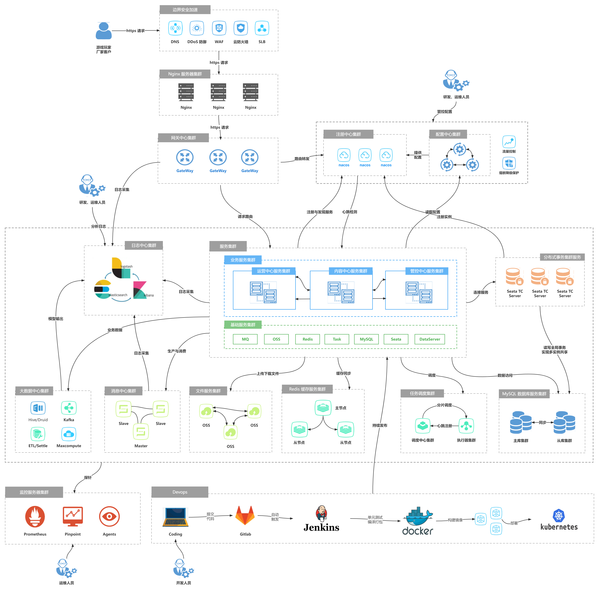

# 部署架构设计


> 作者: 大厂研究员
>
> 更新: 2022-08-18

## 概述

### 📖 定义

描述后端系统具体如何部署，对应 4+1 视图的物理视图。参考 [《阿里云 - 运用RUP 4+1视图方法进行软件架构设计》](https://developer.aliyun.com/article/458980)


### 🌏 使用场景

1. 总体架构设计；
2. 运维规划和优化；
3. 面试、晋升。

### 🎨 画图技巧

1. 使用 **图标** 代替区块。

### 🛠️ 工具推荐

1. [ProcessOn - 制图共享工具](https://www.processon.com/)
2. [Cloudcraft - 部署架构图设计工具](https://www.cloudcraft.co/)

### 👉 部署示例


## 云游戏平台部署架构




详见 [ProcessOn - 云游戏平台部署架构](https://www.processon.com/view/link/62ff5d350e3e7437cac1c423)

!> 图片预览效果不佳，具体请打开以上详细链接


## 网关中心

### 流量网关与业务网关基本关系

- 集群隔离（混合或独占）


（亿级流量架构之网关设计思路、常见网关对比 [via](https://www.cnblogs.com/Courage129/p/14446586.html)）

- 线程池隔离


（美团技术团队 - 百亿规模API网关服务Shepherd的设计与实现 [via](https://mp.weixin.qq.com/s/iITqdIiHi3XGKq6u6FRVdg)）


### 常见网关对比

> 目前常见的开源网关大致上按照语言分类有如下几类:

| 语言           | 网关                               | 
| ---------------| --------------------------------- |
| Nginx + lua    | [OpenResty](http://openresty.org/)、[Kong](https://konghq.com/)、[Orange](http://orange.sumory.com/)、[Apache APISIX](https://apisix.apache.org/) 等 |
| Java           | [Zuul1/Zuul2](https://github.com/Netflix/zuul)、[Spring Cloud Gateway](https://spring.io/projects/spring-cloud-gateway/)、[Apache ShenYu](https://shenyu.apache.org/)、[Kaazing KWG](https://kaazing.com)、[gravitee](https://www.gravitee.io/) 等    |
| Go             | Janus、fagongzi、Grpc-gateway 等 |
| C++            | Envoy 等                         |
| .net           | Ocelot 等                        |
| NodeJS         | Express Gateway、Micro Gateway 等|

> 按照使用数量、成熟度等来划分，主流的有 4 个：

- **OpenResty** 
    - Nginx + Lua
- **Kong/Orange** 
    - Nginx + Lua + OpenResty
- **Zuul/Zuul2** 
    - Java（Servlet/Netty Server）
- **Spring Cloud Gateway**
    - Java（WebFlux）

> 互联网企业常见的方案有基于 Openresty 的 Kong、Orange，基于 Java 的 Zuul 系列、SpringCloudGateWay ，以及基于 Go 的 Tyk

| 维度         | OpenResty         | Kong                               | Orange                    |  Zuul 1         | Zuul 2         | SpringCloudGateway                 | 
| ---------    | ----------------- | -----------------------------------| ------------------------- | ----------------| ---------------| ---------------------------------- | 
| **效率**     |  高                | 高                                 | 高                        |  低             | 一般            | 一般，RPS 是 Zuul2 的 1.6 倍   | 
| **开发语言** |  Lua               | Lua                                | Lua                       |  Java           | Java           | Java                               | 
| **技术栈**   |  Nginx + Lua       | Nginx + Lua + OpenResty            | Nginx + Lua + OpenResty   |  Springboot     | Springboot     | Springboot                         | 
| **存储**     |  Redis、Memcached  | Cassandra、PostgreSQL              | MySQL                     |  MySQL 等       |  MySQL 等       | MySQL 等                          | 
| **服务注册** |  Consul、ETCD      | Consul、ETCD                       | Consul、ETCD              |  Nacos、Consul   | Nacos、Consul  | Nacos、Consul                      | 
| **配置中心** |  Consul、ETCD      | Consul、ETCD                       | Consul、ETCD              |  Nacos、Consul   | Nacos、Consul  | Nacos、Consul                      | 
| **管理界面** |  开源              |  第三方开源                         | 开源                      |  内置            | 内置           |  无                                | 
| **社区**     |  成熟              | 相对成熟，用户问题汇总，社区，插件开源| 少，个人开发者             |  成熟            | 开源不久，资料少 | 社区成熟，资源较少                  | 
| **代码**     |  开源              | 开源，更新频繁                      | 开源                      |  开源            | 开源            |  开源                              | 
| **学习成本** |  简易，需进行lua开发| 简易，简易，需进行lua开发            | 较高                      |  一般            | 参考资料较少     | 简单易用                           | 
| **维护成本** |  普通，需维护lua脚本| 较高，需要维护lua脚本                | 较高                      |  一般            | 一般            | spring系列可扩展强，易配置 可维护性好| 
| **扩展**     |  自建              | 支持集群                           | 支持集群                   |  支持            | 支持            |  支持                              |  
| **多节点**   |  自建              | 支持                               | 需要开发                   |  支持            | 支持            |  支持                              | 
| **功能**     |  自建              | 丰富，部分开源 + 商业（收费）        | 丰富                      |  丰富            | 丰富            |  异步，配置灵活                      | 
| **限流**     |  需要lua开发       | 支持                               |                           |  支持            | 支持            |  支持                               |
| **鉴权**     |  需要lua开发       | 支持普通鉴权，Key Auth鉴权，HMAC，auth2.0 |                      |  filter中实现    | filter中实现    |  支持普通鉴权、auth2.0               | 
| **监控**     |  需要lua开发       | 内置                               |                           |  filter中实现    | filter中实现    |  Gateway Metrics Filter             |
| **WEb容器**   |                   |                                   |                           |  Servlet        |  Netty Server   |  WebFlux                           | 
| **线程模型**  |                   |                                   |                           |  阻塞            |  非阻塞         |  非阻塞                             | 
| **适用场景**  |  大型流量网关      | 大型流量网关                        | 大型流量网关                |  中小型业务网关  | 大型业务网关    | 大型业务网关                        | 

### 网关风险评估


### 网关设计重点

- **高性能**
    - 在技术设计上，网关不应该也不能成为性能的瓶颈。对于高性能，最好使用高性能的编程语言来实现，如 C、C++、Go 和 Java。网关对后端的请求，以及对前端的请求的服务一定要使用异步非阻塞的 I/O 来确保后端延迟不会导致应用程序中出现性能问题。C 和 C++ 可以参看 Linux 下的 epoll 和 Windows 的 I/O Completion Port 的异步 IO 模型，Java 下如 Netty、Spring Reactor 的 NIO 框架。
- **高可用**
    - 因为所有的流量或调用经过网关，所以网关必须成为一个高可用的技术组件，它的稳定直接关系到了所有服务的稳定。网关如果没有设计，就会成变一个单点故障。因此，一个好的网关至少要做到以下几点。
    - **集群化**。网关要成为一个集群，其最好可以自己组成一个集群，并可以自己同步集群数据，而不需要依赖于一个第三方系统来同步数据。
    - **服务化**。网关还需要做到在不间断的情况下修改配置，一种是像 Nginx reload 配置那样，可以做到不停服务，另一种是最好做到服务化。也就是说，得要有自己的 Admin API 来在运行时修改自己的配置。
    - **持续化**。比如重启，就是像 Nginx 那样优雅地重启。有一个主管请求分发的主进程。当我们需要重启时，新的请求被分配到新的进程中，而老的进程处理完正在处理的请求后就退出。
- **高扩展**
    - 因为网关需要承接所有的业务流量和请求，所以一定会有或多或少的业务逻辑。而我们都知道，业务逻辑是多变和不确定的。比如，需要在网关上加入一些和业务相关的东西。因此，一个好的 Gateway 还需要是可以扩展的，并能进行二次开发的。当然，像 Nginx 那样通过 Module 进行二次开发的固然可以。另外，在运维方面，网关应该有以下几个设计原则。
    - **业务松耦合，协议紧耦合**。在业务设计上，网关不应与后面的服务之间形成服务耦合，也不应该有业务逻辑。网关应该是在网络应用层上的组件，不应该处理通讯协议体，只应该解析和处理通讯协议头。另外，除了服务发现外，网关不应该有第三方服务的依赖。
    - **应用监视，提供分析数据**。网关上需要考虑应用性能的监控，除了有相应后端服务的高可用的统计之外，还需要使用 Tracing ID 实施分布式链路跟踪，并统计好一定时间内每个 API 的吞吐量、响应时间和返回码，以便启动弹力设计中的相应策略。
    - **用弹力设计保护后端服务**。网关上一定要实现熔断、限流、重试和超时等弹力设计。如果一个或多个服务调用花费的时间过长，那么可接受超时并返回一部分数据，或是返回一个网关里的缓存的上一次成功请求的数据。你可以考虑一下这样的设计。
    - **DevOps**。因为网关这个组件太关键了，所以需要 DevOps 这样的东西，将其发生故障的概率降到最低。这个软件需要经过精良的测试，包括功能和性能的测试，还有浸泡测试。还需要有一系列自动化运维的管控工具。

### 网关设计注意事项

1. 不要在网关中的代码里内置聚合后端服务的功能，而应考虑将聚合服务放在网关核心代码之外。可以使用 Plugin 的方式，也可以放在网关后面形成一个 Serverless 服务。
2. 网关应该靠近后端服务，并和后端服务使用同一个内网，这样可以保证网关和后端服务调用的低延迟，并可以减少很多网络上的问题。这里多说一句，网关处理的静态内容应该靠近用户（应该放到 CDN 上），而网关和此时的动态服务应该靠近后端服务。
3. 网关也需要做容量扩展，所以需要成为一个集群来分担前端带来的流量。这一点，要么通过 DNS 轮询的方式实现，要么通过 CDN 来做流量调度，或者通过更为底层的性能更高的负载均衡设备。
4. 对于服务发现，可以做一个时间不长的缓存，这样不需要每次请求都去查一下相关的服务所在的地方。当然，如果你的系统不复杂，可以考虑把服务发现的功能直接集成进网关中。
5. 为网关考虑 bulkhead 设计方式。用不同的网关服务不同的后端服务，或是用不同的网关服务前端不同的客户。

另外，因为网关是为用户请求和后端服务的桥接装置，所以需要考虑一些安全方面的事宜。具体如下：

1. **加密数据**。可以把 SSL 相关的证书放到网关上，由网关做统一的 SSL 传输管理。
2. **校验用户的请求**。一些基本的用户验证可以放在网关上来做，比如用户是否已登录，用户请求中的 token 是否合法等。但是，我们需要权衡一下，网关是否需要校验用户的输入。因为这样一来，网关就需要从只关心协议头，到需要关心协议体。而协议体中的东西一方面不像协议头是标准的，另一方面解析协议体还要耗费大量的运行时间，从而降低网关的性能。对此，我想说的是，看具体需求，一方面如果协议体是标准的，那么可以干；另一方面，对于解析协议所带来的性能问题，需要做相应的隔离。
3. **检测异常访问**。网关需要检测一些异常访问，比如，在一段比较短的时间内请求次数超过一定数值；还比如，同一客户端的 4xx 请求出错率太高……对于这样的一些请求访问，网关一方面要把这样的请求屏蔽掉，另一方面需要发出警告，有可能会是一些比较重大的安全问题，如被黑客攻击。


### 选型初步推论

👉 对于现有规模小的项目、接入成本有限制的项目、以 Java 开发语言为主导 **且** 对上线有迫切要求的团队，推荐优先使用 **Spring Cloud Gateway** 或 **Apache ShenYu**，尝鲜可以使用 **Zuul2**，据说性能很有优势，至于 **Zuul1** 由于效率瓶颈，已不再推荐。

🤌 对于未来有预期的项目、接入成本有空间的项目、有 Nginx 实践经验 **或** 学习能力强 **且** 允许成长的团队，推荐使用 **Kong** ，对效率有更高要求可以自建 **OpenResty**，当然想尝鲜国产网关可以试用 **Apache APISIX** ，功能也相当完备。

☁️ 对于有云原生规划的项目，建议更多参考 [CNCF Cloud Native && API GateWay](https://landscape.cncf.io/card-mode?category=api-gateway) 的趋势。 

### 云原生基金会网关现状


（CNCF Cloud Native && API GateWay. [via](https://landscape.cncf.io/card-mode?category=api-gateway)）

### 部署架构参考


（天翼账号网关系统 3.0 [via](https://xie.infoq.cn/article/c6703d216c43c2b522b9b4ffa)）


（美团技术团队 - 百亿规模API网关服务Shepherd的设计与实现 [via](https://mp.weixin.qq.com/s/iITqdIiHi3XGKq6u6FRVdg)）


（Apache ShenYu 2.4.2 [via](https://shenyu.apache.org/zh/docs/2.4.2/index)）


（Apache ShenYu 2.4.3 [via](https://shenyu.apache.org/zh/docs/index)）

### 业务网关功能基本要求

- **拦截层**
    - 鉴权
    - 反爬
    - 黑白名单
    - XXS 防御
    - 数据加密
    - SSL 加密
    - 证书管理
- **调度层**
    - 服务注册
    - 动态路由
    - 负载均衡
    - 灰度发布
    - API 编排
    - API 聚合
    - 分组隔离
    - 流量复制
- **通信层**
    - 日志
    - 监控
    - 缓存
    - Mock 测试
    - 协议适配
    - 熔断限流
    - 服务降级
    - 重试
    - 幂等
    - 异步
    - 配置同步
- **扩展层**
    - SPI 扩展
    - 组件市场


（Qunar技术沙龙 - 业务网关的落地实践 [via](https://www.infoq.cn/article/cAcwMUNMJMQpIxGJYkcS)）


（美团技术团队 - 百亿规模API网关服务Shepherd的设计与实现 [via](https://mp.weixin.qq.com/s/iITqdIiHi3XGKq6u6FRVdg)）

### API 发布流程


（美团技术团队 - 百亿规模API网关服务Shepherd的设计与实现 [via](https://mp.weixin.qq.com/s/iITqdIiHi3XGKq6u6FRVdg)）

### 稳定性保障


（美团技术团队 - 百亿规模API网关服务Shepherd的设计与实现 [via](https://mp.weixin.qq.com/s/iITqdIiHi3XGKq6u6FRVdg)）

### 灰度场景


（美团技术团队 - 百亿规模API网关服务Shepherd的设计与实现 [via](https://mp.weixin.qq.com/s/iITqdIiHi3XGKq6u6FRVdg)）

### 故障自愈


（美团技术团队 - 百亿规模API网关服务Shepherd的设计与实现 [via](https://mp.weixin.qq.com/s/iITqdIiHi3XGKq6u6FRVdg)）

### 静态网站托管


（美团技术团队 - 百亿规模API网关服务Shepherd的设计与实现 [via](https://mp.weixin.qq.com/s/iITqdIiHi3XGKq6u6FRVdg)）

### 网关选型参考 

- [InfoQ - 天翼账号网关系统架构演进历程](https://xie.infoq.cn/article/c6703d216c43c2b522b9b4ffa)

- [Qunar技术沙龙 - 业务网关的落地实践](https://www.infoq.cn/article/cAcwMUNMJMQpIxGJYkcS)

- [博客园 - 亿级流量架构之网关设计思路、常见网关对比](https://www.cnblogs.com/Courage129/p/14446586.html)

- [美团技术团队 - 百亿规模API网关服务Shepherd的设计与实现](https://mp.weixin.qq.com/s/iITqdIiHi3XGKq6u6FRVdg)


## 消息服务

> 几种常用MQ对比

| 维度    | ActiveMQ                       | RabbitMQ                       | RocketMQ             | Kafka              | 
|-------|--------------------------------|--------------------------------|----------------------|-----------------| 
| 多语言支持 | 支持，JAVA优先                      | 语言无关                           | 只支持Java              | 支持，Java优先       |
| 单机吞吐量 | 万级                             | 万级                             | 10万级                 | 10万级              | 
| 时效性   | ms级                            | 微秒级                            | ms级                  | ms级以内          | 
| 持久化   | 内存、文件、数据库                      | 内存、文件，支持数据堆积，但数据堆积会影响生产速率      | 磁盘文件        | 磁盘文件，只要磁盘容量足够，可以做到无限消息堆积 | 
| 功能支持  | MQ领域的功能极其完备                    | 基于erlang开发，所以并发能力很强，性能极其好，延时很低 | MQ功能较为完善，还是分布式的，扩展性好 | 功能较为简单，主要支持简单的MQ功能，在大数据领域的实时计算以及日志采集被大规模使用，是事实上的标准 | 
| 可用性   | 高（主从）                          | 高（主从）                          | 非常高（分布式）             | 非常高（分布式）        | 
| 消息丢失  | 低                              | 低                              | 非常高（分布式）             | 中              | 
| 社区活跃度 | 高                              | 高                              | 中                    | 高              | 
| 成熟度   | 成熟                             | 成熟                             | 比较成熟                 | 成熟日志领域         | 
| 支持协议  | OpenWirte、Stomp、rest、amop、xmpp | AMQP                           | 自己定义的一套              |            | 
| 事务    | 支持                             | 不支持                            | 支持                   |                | 
| 负载均衡  | 支持                             | 支持                             | 支持                   |                | 
| 部署方式  | 独立、嵌入                          | 独立                             | 独立                   |                | 

> 常用MQ优缺点及应用场景

链接：http://assets.processon.com/chart_image/630a0f2d63768906ff68ca0e.png


#### mq基本架构


#### kafka集群架构


#### rocketmq集群架构


#### activemq集群架构
##### 1.p2p


##### 2.p/s


#### rabbitmq集群架构


## 文件服务

`待补充`

## 任务调度

### 使用场景

>1.合同到期，定时任务处理，处理相关的资源，处理相关的通知<br>
>2.每日，每月生成日账单和月账单<br>
>3.定时查询相关企业风险，分析相关情况<br>
>4.定时分析资源情况<br>
>5.订单支付超时<br>
>6.定时同步数据

### 选型


### xxl-job 架构


#### 部署

#### 任务调度

#### 执行器注册

#### 故障转移

#### 失败重试

#### 超时 失败重试

## 分布式事务

`待补充`

## 配置中心

`待补充`

### 配置中心选型参考

- [腾讯云 - 架构设计之微服务配置中心选型](https://cloud.tencent.com/developer/article/1427223)

## 注册中心

`待补充`

### 注册中心选型参考

- [CSDN - 注册中心选型篇-四款注册中心特点超全总结](https://blog.csdn.net/truelove12358/article/details/115081662)

## 缓存服务

> 几种常用缓存对比


| 维度 | memcache | redis | ehcache | guava | hashmap |
| ---- | -------- | ----- | ------- | ----- | ------- |
|   **是否是分布式缓存**   |    是      |   是    |   是，但一致性不高   |   否    |       否  |
| **是否支持持久化** | 否 | 是 | 是 | 否 | 否 |
| **高可用** | 是，依赖插件 | 是 | 是 | 否 | 否 |
| **过期策略** | 是 | 是 | 是 | 是 | 否 |
| **可存储数据大小** | 服务器内存 | 服务器内存 | 服务器内存+磁盘 | jvm内存| jvm内存|
| **特性** | 分布式模式下最快缓存，可存储图片视频 | 支持多种类型数据，用法灵活，可以作为内存数据库使用 | 轻量，快，无限存储 | 简单轻量,更新锁定，集成db回填| java内置|


> 缓存优点
* memcache: 多线程，速度快，无内存碎片内存使用率高
* Redis: 支持数据结构多，灵活可靠，功能多，可做nosql数据库，mq甚至数据分析，成熟高可用方案
* ehcache: 支持分布式的本地缓存 简单轻便
* guava: 本地缓存简单高效
* hashmap: 本地缓存 java内置

> 选型推荐

* 分布式缓存首选redis, 追求极致性能且读多写少且可靠性要求不高可考虑尝试memcache
* 本地缓存首选guava, 如需要分布式缓存且不想用redis可尝试ehcache，追求降低学习成本及依赖且存储几乎不变数据可选择hashmap


> Redis 部署架构示意图


## 关系数据库服务

> 几种常用DBMS对比

| 维度 | mysql | pgsql | oracle |
| ---- | -------- | ----- | ------- |
|   **是否开源**   |    是      |   是    |   否|
| **支持系统** | all | all | all | 
| **事务支持** | 支持 | 支持 | 支持 |
| **技术支持** | 社区 | 社区 | 客服 |
| **存储结构** | 索引组织表 | 堆表 | 都支持 |
| **sql支持** | 宽松sql | 严格sql | 严格sql|
| **复杂sql支持** | 低 | 高 | 高|
| **并发模式** | 单进程多线程 | 多进程 | 多进程|
| **主从复制** | biglog逻辑复制 | 物理复制 | 物理复制|

> 优势分析

* mysql优势：多存储引擎，相对灵活，开源简单，学习成本低，多线程模式单机性能高，天然支持高链接
* pgsql优势：开源，功能强大，支持大量复杂函数，支持多索引，支持函数内索引，对oracle兼容较好
* oracle优势：好的东西除了贵哪都好

> 选型推荐

* 中小型项目可选mysql,计算量较大或数据仓库项目可选 pg或oracle
* 项目数据庞大，计算量庞大，可靠性和稳定性要求高技术强大，预算足够且不惧制裁首选oracle


> 常用分库分表中间件对比

| 维度 | mycat | shardingjdbc | tddl |
| ---- | -------- | ----- | ------- |
|   **是否开源**   |    是      |   是    |   否|
| **是否中心化** | 是 | 否 | 否 | 
| **orm支持** | 任意 | 任意 | 任意 |
| **数据库支持** | jdbc | jdbc | jdbc |
| **语言支持** | 任意 | java | java |
| **外部依赖** | 无 | 无 | diamond（阿里内部组件）|
| **复杂sql支持** | 低 | 高 | 高|
| **代码侵入性** | 低 | 无 | ——|
| **跨库join** | 支持 | 支持 | ——|
| **分布式事务** | 支持 | 支持 | ——|
| **社区活跃度** | 高 | 高 | ——|
| **成熟度** | 高 | 中 | ——|
| **可扩展性** | 高 | 低 | ——|
| **弹性伸缩** | 支持 | 不支持 | ——|


> 优势分析

* mycat: 开源，功能强大，对应用透明，数据治理方便
* Sharding-jdbc: 开源轻量，代码无侵入，运维简单
* Tddl:  阿里出品 稳定强大


> 选型建议

* 异构项目、大型项目、数据增长快速有高可用、弹性伸缩需求可选mycat
* 中小型java项目，数据增长缓慢可选sharding-jdbc
* 阿里内部项目 可选tddl

> 分库分表中间件功能基本要求

* 分片
* 路由
* 唯一主键
* 主从配置
* 跨库join
* 分布式事务
* 结果聚合

> Sharding-jdbc 架构示意图


> Mycat 部署架构示意图


## 自动化构建测试发布服务（含容器化部署）

### 产品图


### 选型比较
Buddy、Jenkins、GitLab CI/CD和CircleCI


### 部署流程

### 环境流水线


### 部署图


### 其他
- [最适合开发者的21种Jenkins替代工具](https://zhuanlan.zhihu.com/p/359770683)
## 日志中心

`待补充`

## 大数据中心（数据采集分析）

### 数据分析技术架构


### 数据分析开发流程


## 性能监控中心（全链路追踪）


> apm介绍

随着微服务架构的流行，一次请求往往需要涉及到多个服务，因此服务性能监控和排查就变得更复杂：

```text
如何串联整个调用链路，快速定位问题？
如何澄清各个微服务之间的依赖关系？
如何进行各个微服务接口的性能分析？
如何追踪各个业务流程的调用处理顺序？
```
a因此，就需要一些可以帮助理解系统行为、用于分析性能问题的工具，以便发生故障的时候，能够快速定位和解决问题，这就是APM系统，全称：Application Performance Management tools，AMP最早是谷歌公开的论文提到的 [Google Dapper](https://links.jianshu.com/go?to=http%3A%2F%2Fbigbully.github.io%2FDapper-translation)。其后越来越多的apm或类apm工具出现在人们眼前，在此，我将一些主流的工具进行对比。


> 常用链路追踪中间件对比


| 维度 | cat | zipkin | pinpoint |skywalking|
| ---- | -------- | ----- | ------- | -----|
| **实现方式** | 代码埋点（拦截器，注解，过滤器等） | 拦截请求，发送（HTTP，mq）数据至zipkin服务 | java探针，字节码增强 | java探针，字节码增强|
| **存储选择** | mysql , hdfs | in-memory ， mysql ， Cassandra ， Elasticsearch | HBase | elasticsearch , H2，mysql|
| **通信方式** | netty+mq | http ， MQ | thrift | GRPC + kafka|
| **trace查询** | 不支持 | 支持 | 不支持 | 支持 |
| **外部依赖** | 无 | 无 | diamond（阿里内部组件）||
| **报警** | 支持 | 不支持 | 支持| 不支持|
| **JVM监控** | 不支持 | 不支持 | 支持| 不支持|
| **Metric** | 支持 | 不支持 | 支持| 支持|
| **全局调用统计** | 支持 | 不支持 | 支持|支持|
| **OpenTracing** | 不支持 | 支持 |不支持| 支持|
| **颗粒度** | 代码 不支持跨线程 | 接口级  支持跨线程 | 方法级  不支持跨线程| 方法级 支持跨线程，但是有侵入性|
| **探针对服务器吞吐量影响** | —— | —— | 高| 低|
| **性能** | 高 吞吐量16w/s | 默认采用http 性能较低 |数据采集太详细 影响性能|高|
| **可伸缩** | K8s | K8s |K8s|Satellite|
| **可扩展性** | 高 | 自带多种存储支持，可支持自定义扩展其他数据库支持 |支持 spi|支持 spi|
| **可靠性** | 不保证可靠，允许消息丢失 | —— |——|不保证可靠，允许消息丢失|
| **亮点** | 全异步化，报表非常丰富 | 社区强大，支持内存，低依赖，spring 官方支持 |跟踪粒度细|采集和上报之间 使用无锁环形队列解耦|
| **优点** | 功能完善,实时性高，高容错 | spring-cloud-sleuth可以很好的集成zipkin ， 代码无侵入，集成非常简单 ， 社区更加活跃。 |完全无侵入， 仅需修改启动方式，界面完善，功能细致。|完全无侵入，界面完善，支持应用拓扑图及单个调用链查询，扩展性非常高|


> cat架构图


> cat客户端架构图


> cat服务端架构图


> zipkin架构图


> zipkin 集群部署架构图


> pinpoint架构图


> Skywalking 架构图


> Skywalking 拓扑图


> Skywalking 自动伸缩示意图


> 选型建议和结果

总体上看起来cat虽然功能强大但是代码侵入太强，和业务耦合性太高，不符合互联网发展趋势。整体较封闭未来难以迁移试错成本较高。

zipkin 整体上比较轻便但是功能也相对简单，不支持报警和Metric 还需要独立部署其他报警和Metric组件，增加运维成本。

pinpoint 总的来看还是比较完美，无侵入，功能丰富扩展性也高但是文档不全，没有中文社区，学习成本较高并且需要依赖hbase 带来的运维成本过高。

Skywalking 功能完备，文档齐全，社区活跃，代码无侵入，扩展性极强。虽然ui内容丰富程度相较其他组件略有确实，对于当前项目来说满足基本的排错和性能监控需求。

## 参考

- [极客专栏 - 如何画好架构图](https://u.geekbang.org/lesson/381) 👍👍👍

- [微信 - 如何画好一张架构图？](https://mp.weixin.qq.com/s/2HjvNnfP7bLNQF5xh8PxIQ)