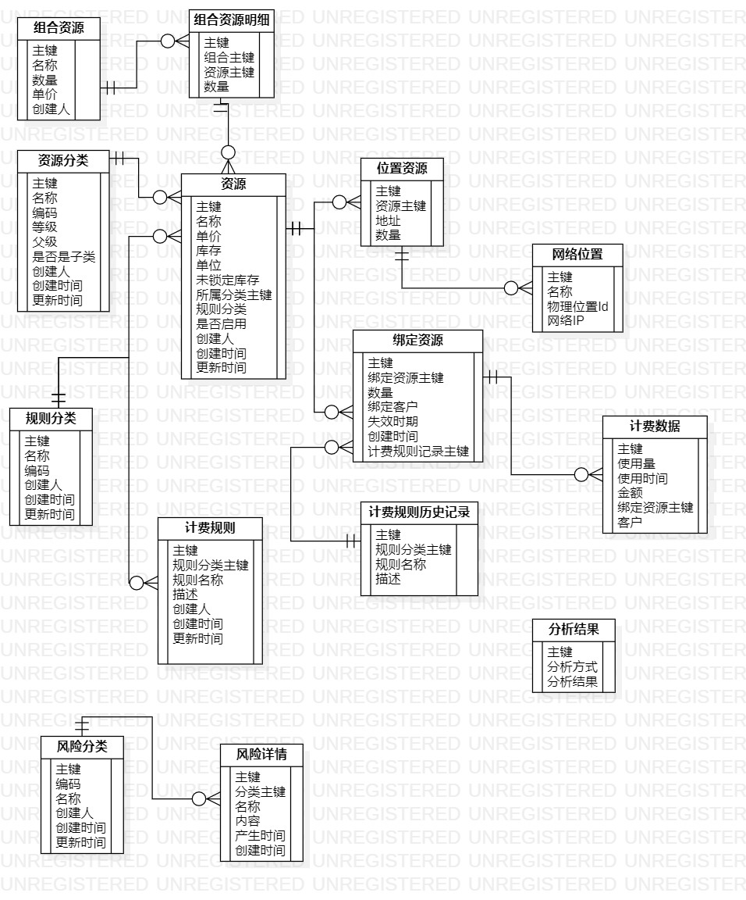
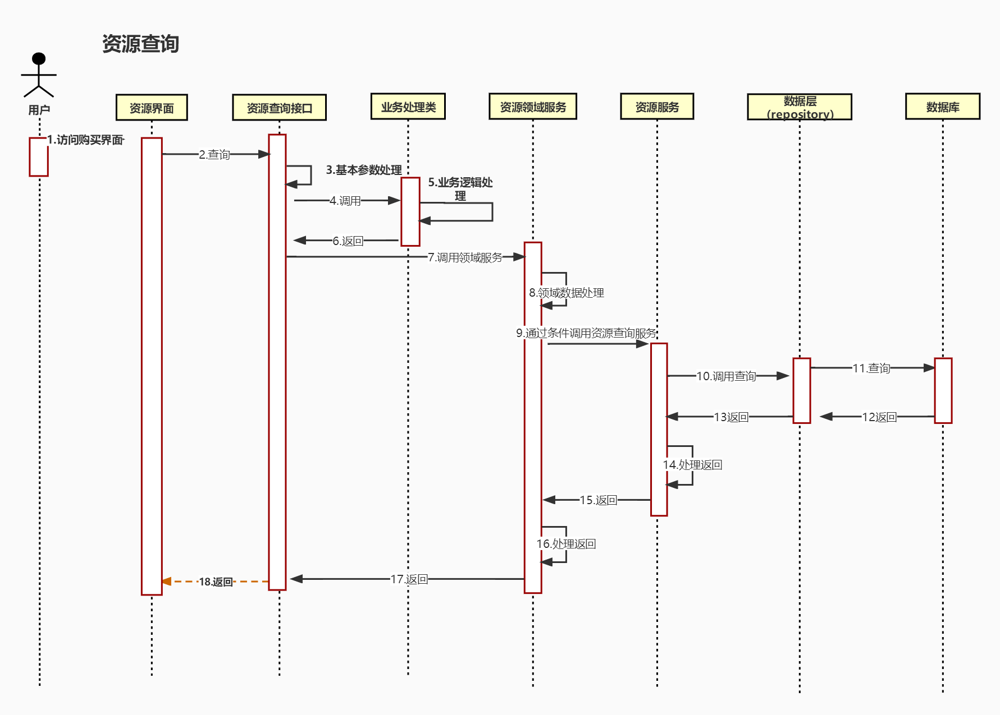
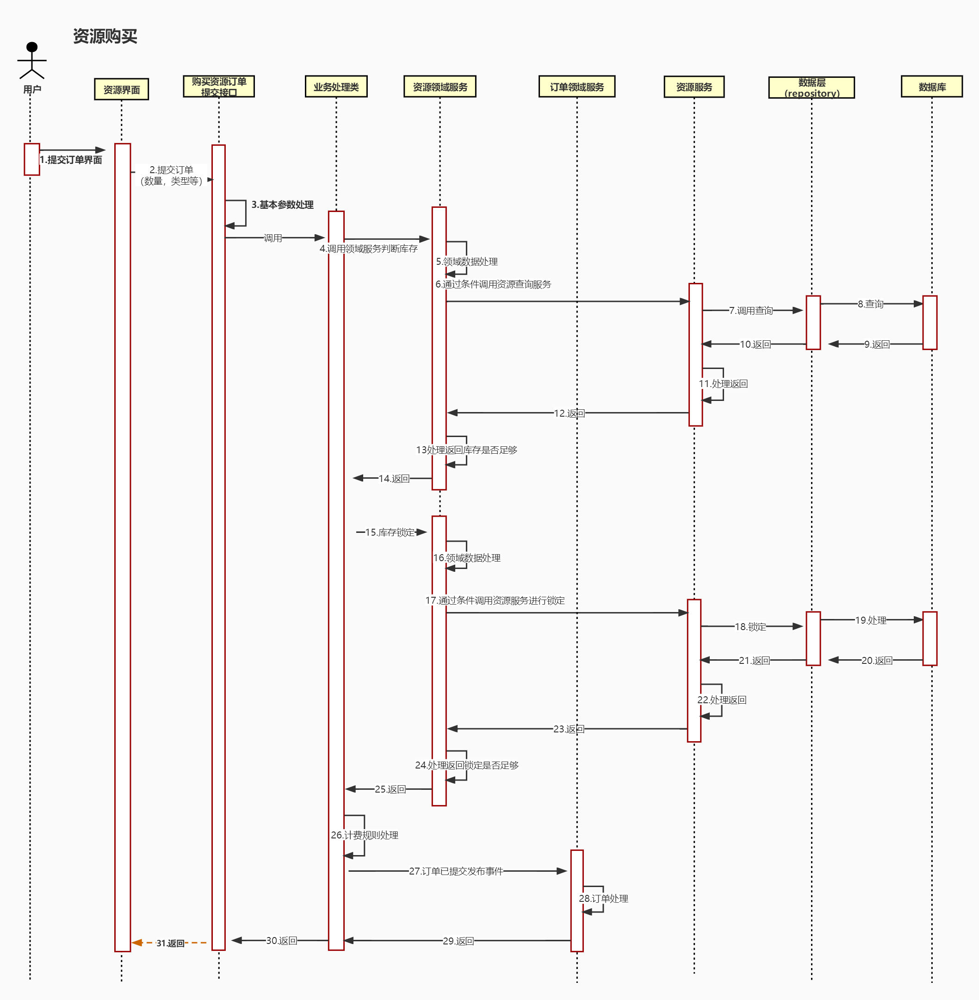

# 详细设计

> 作者: 大厂研究员
>
> 更新: 2022-07-25

## 运营中心

### 领域事件

#### 数据字典

主要功能: 领域事件的归口，管理
>1.事件查询

- 描述：进行对应事件的查询
- 条件内容：名称，编码，创建日期，分页内容
- 返回结果：名称，编码，描述，创建日期

>2.事件的录入

- 描述：录入对应的事件
- 条件内容：名称，编码
- 返回结果：成功/失败

#### 领域事件发布记录
主要功能: 领域事件发布后进行存储记录

>1.事件的发布存储

- 描述：录入对应的事件到历史发布记录中
- 条件内容：名称，编码，创建日期，扩展信息
- 返回结果：成功/失败

>2.事件的查询

- 描述：对存储的历史事件进行查询
- 条件内容：名称，编码，创建日期，扩展信息
- 返回结果：名称，编码，创建日期，扩展信息

### 支付计费

#### 支付计费模块-资源管理，计费规则，计费管控数据模型

#### 支付计费模块-资源管理，计费规则，计费管控时序图

##### 1.资源选择

##### 2.资源购买

##### 说明

资源池管理模块

主要功能：管理员的查询，录入，修改，删除。客户选购查询，锁定，解锁，扣减。

>1.管理员资源查询

- 描述：进行对应资源的查询
- 条件内容：类型，创建日期，分页内容
- 返回结果：资源的创建时间，资源名称，资源，类型，单价，库存，未锁定库存，物理位置

>2.管理员资源的录入

-描述：录入对应的资源到资源池
-条件内容：名称，编码，分类，单价，库存，规则分类，物理位置，生效时间
-返回结果：成功/失败

>3.管理员资源的修改

- 描述：进行资源的修改
- 条件内容：资源主键，名称，分类，单价，规则分类
- 返回结果：成功/失败

>4.管理员资源的删除

- 描述：管理员对于资源的删除
- 条件内容：资源主键
- 返回结果：成功/失败

>5.客户选购查询

- 描述：客户进行资源的查询
- 条件内容：名称，类型，价格
- 返回结果：名称，类型，库存，单价

>6.客户选购资源锁定

- 描述：客户提交订单后，系统进行资源的锁定
- 条件内容：订单号，资源编码，数量
- 返回结果：成功/失败

>7.资源解锁

- 描述：订单取消进行资源的解锁
- 条件内容：订单号，资源主键，数量
- 返回结果：成功/失败

>8.资源扣减

- 描述：合同签订，进行资源的扣减
条件内容: 资源主键，数量
- 返回结果：成功/失败
###### 计费规则管理模块

主要功能：管理员查询，添加，修改，删除。客户进行规则查询与结算

>1.管理员的查询

- 描述：对计费规则进行查询
- 条件内容：名称，类型，描述
- 返回结果：名称，类型，描述

>2.管理员的规则添加

- 描述：对规则进行添加
- 条件内容：名称，类型，描述
- 返回结果：成功/失败

>3.管理员的修改

- 描述：对于规则进行修改
- 条件内容：主键，名称，类型，描述
- 返回结果：成功/失败

>4.管理员的删除

- 描述：对于规则进行删除
- 条件内容：主键
- 返回结果：成功/失败

>5.客户规则查询

- 描述：客户进行选择资源进行付费类型的选择
- 条件内容：规则分类
- 返回结果：规则名称，描述

>6.客户结算

- 描述：利用历史规则进行费用的结算
- 条件内容：历史规则，资源，时间
- 返回结果：成功/失败
###### 计费管控模块

主要功能：计费报表，计费深度学习分析，风险控制中的手动录入，分析录入，修改，删除（舆情/企业信息/资质/资源空闲率）

>1.计费报表

- 描述：对于每次结算的费用进行生成报表
- 条件内容：日，月，年
- 返回结果：对应的报表

>2.计费深度学习分析

- 描述：利用深度学习，对结算费用，日常风险进行分析
- 条件内容：数据，算法，目标
- 返回结果：对应的结果

>3.风险手动录入

- 描述：对于风险，进行手动进行录入
- 条件内容：
- 返回结果：

>4.风险自动分析录入

- 描述：通过系统，自动进行风险的录入，比如通过天眼查，企查查，网络舆情等
- 条件内容：内容，类型
- 返回结果：成功/失败

>5.风险手动修改

- 描述：录入错误，或者有新增内容，进行修改
- 条件内容：主键，内容，类型
- 返回结果：成功/失败

>6.风险手动删除

- 描述：录入错误，或者不需要了
- 条件内容：主键
- 返回结果：成功/失败

 
?> ❤️ 您也可以参与梳理，快来提交 [PR](https://github.com/senlypan/cloudgaming-docs/pulls) 或 [issue](https://github.com/senlypan/cloudgaming-docs/issues) 吧~

