# 领域模型设计

> 作者: 大厂研究员
>
> 更新: 2022-08-28

## 概述

### 📖 定义

基于需求分析之后推导的场景用例（用户故事），进行 **领域建模**，并用领域建模指导 **数据库设计** 与 **程序设计**。

领域建模基本思路：

- **清晰性** ：分析业务场景，高度抽象业务，进行 **领域划分**，确认 **限界上下文**，明确各领域模型的职责与边界；
- **完备性** ：在划分域内，完整 **提取实体**，描述相关 **属性值对象**，构建模型 **关系**；
- **延展性** ：引入相关领域模型，为后续 **适配** 或 **扩展** 提供良好支撑。

### 🌏 使用场景

1. 业务、产品、研发、测试达成共识；
2. 指导整体架构设计；
3. 架构培训；
4. 面试、晋升。

### 🎨 画图技巧

1. 领域模型一般用 **类图** 的设计，其中类的属性可以指导数据库中需要的字段，又可以通过类中的方法指导程序设计。
2. **四色建模**，具体参考：[《领域驱动设计系列：四色建模》](http://apframework.com/2020/03/22/ddd-color/)

### 👉 领域模型示例

#### 图示 01 - 事件风暴

场景需求分析，产生命令、业务流、领域事件

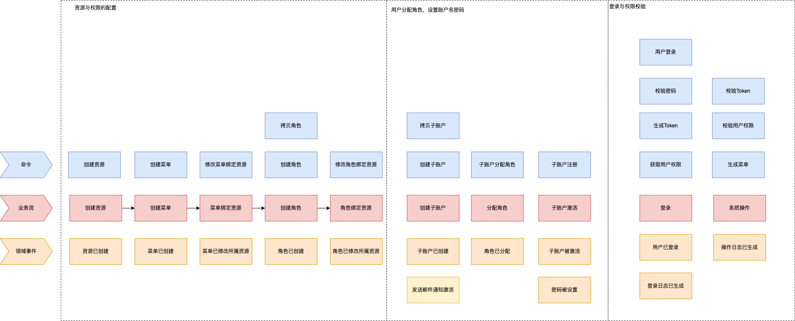

(简书 - DDD实战篇权限域战略建模 [via](https://www.jianshu.com/p/83045970f8ad))

#### 图示 02 - 提取实体

基于命令、业务流、事件，提取产生这些行为的实体

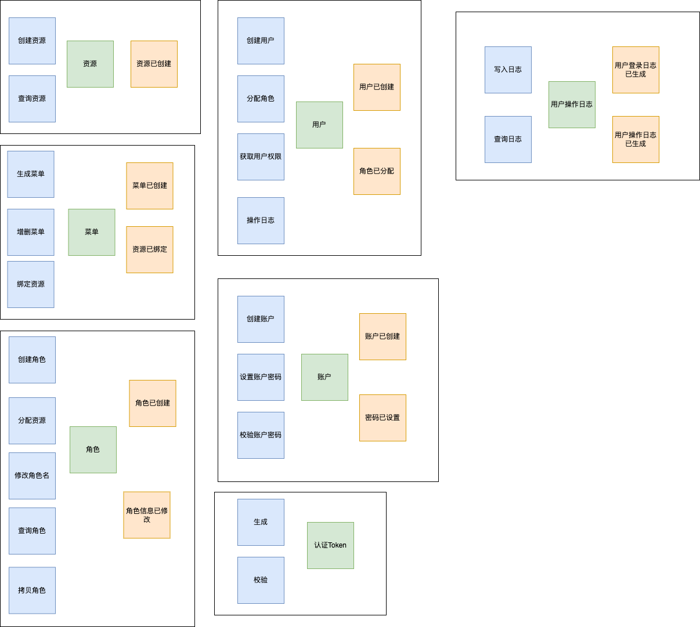

(简书 - DDD实战篇权限域战略建模 [via](https://www.jianshu.com/p/83045970f8ad))

#### 图示 03 - 划分限定上下文

将实体划分成聚合，划定限界上下文

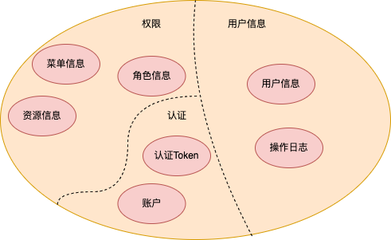

(简书 - DDD实战篇权限域战略建模 [via](https://www.jianshu.com/p/83045970f8ad))

#### 图示 04 - 转化为领域模型图

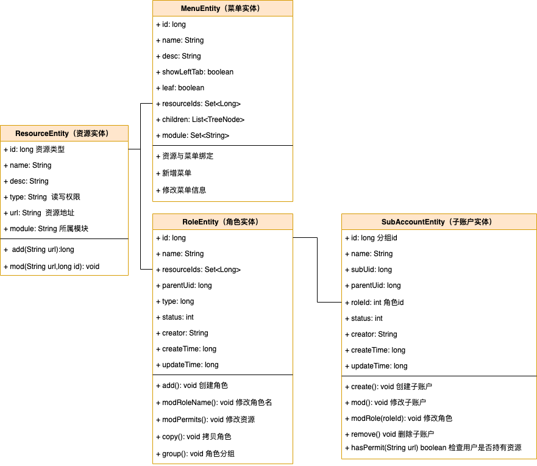

(简书 - DDD实战篇权限域战略建模 [via](https://www.jianshu.com/p/83045970f8ad))

#### 图示 05 - 领域模型图演化一

指导数据建模

(拉勾教育 - DDD 微服务落地实战 [via](https://kaiwu.lagou.com/course/courseInfo.htm?courseId=549#/detail/pc?id=5326))

#### 图示 06 - 领域模型图演化二

指导程序设计（服务划分）

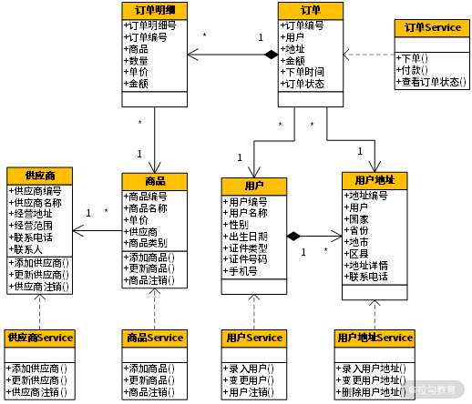

(拉勾教育 - DDD 微服务落地实战 [via](https://kaiwu.lagou.com/course/courseInfo.htm?courseId=549#/detail/pc?id=5326))

#### 图示 07 - 领域模型图演化三

指导程序设计（业务拓展）

(拉勾教育 - DDD 微服务落地实战 [via](https://kaiwu.lagou.com/course/courseInfo.htm?courseId=549#/detail/pc?id=5326))

#### 图示 08 - 领域模型图演化四

指导分层

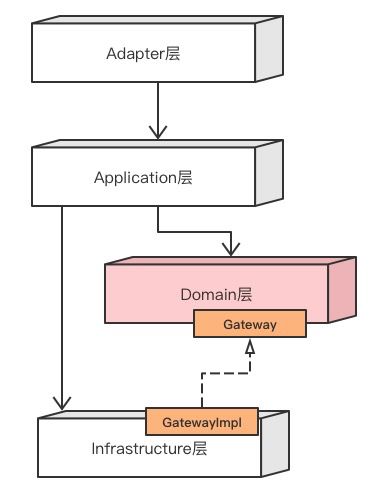

指导分包

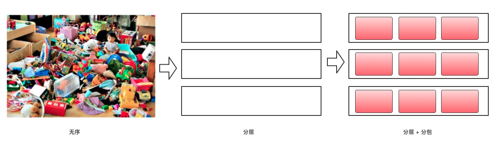
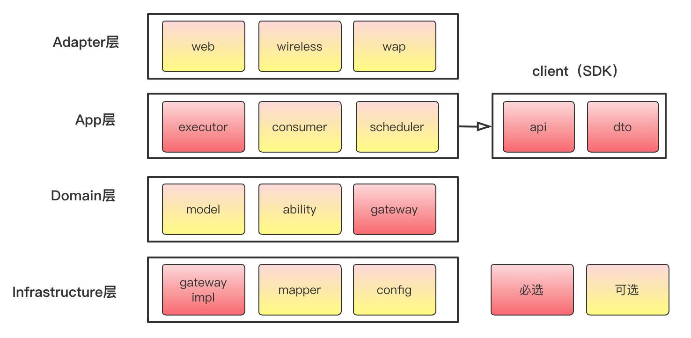

指导功能划分

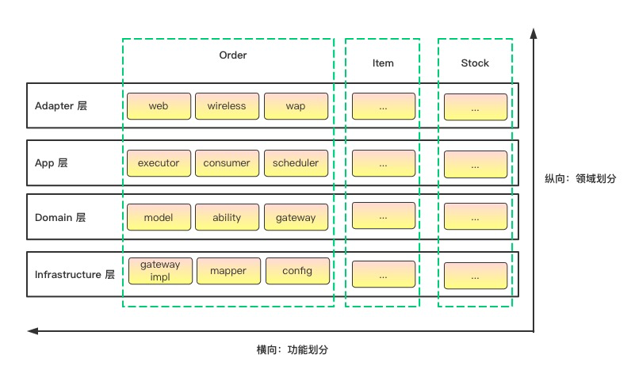

指导分包策略

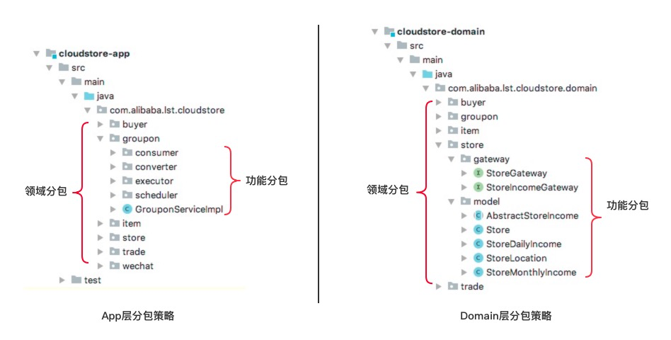

业务领域与外部依赖解耦

内部域解耦

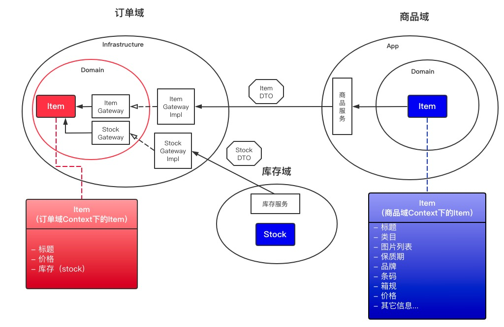

阿里巴巴 COLA 4.0 参考

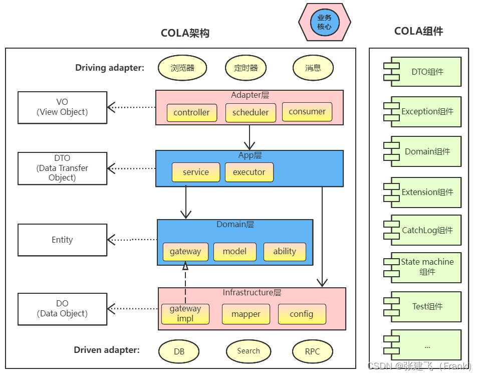

(CSDN - COLA 4.0：应用架构的最佳实践 [via](https://blog.csdn.net/significantfrank/article/details/110934799))

## 运营中心

`待补充`

## 内容中心

`待补充`

## 管控中心

`待补充`

## 参考

- [张逸 - 领域驱动设计](http://zhangyi.xyz/)

- [YouTube - 领域建模：DDD 原理及秒杀系统领域模型](https://www.youtube.com/watch?v=vD1Gy3G6D8U)

- [InfoQ - 基于 DDD 的微服务设计和开发实战](https://www.infoq.cn/article/s_LFUlU6ZQODd030RbH9)

- [领域驱动设计系列：四色建模](http://apframework.com/2020/03/22/ddd-color/)

- [SegmentFault - 架构的“一小步”，业务的一大步](https://segmentfault.com/a/1190000018188985)

- [简书 - DDD 实战篇：权限域战略建模](https://www.jianshu.com/p/83045970f8ad)

- [拉勾教育 - DDD 微服务落地实战](https://kaiwu.lagou.com/course/courseInfo.htm?courseId=549#/detail/pc?id=5326)

- [CSDN - 领域驱动设计之事件风暴电商项目实战](https://blog.csdn.net/blog_zihao/article/details/119926493)

- [微信开放社区 - DDD 在有赞信贷核心系统中的实践](https://developers.weixin.qq.com/community/develop/article/doc/0000a239230d901cbb4d15c0c51c13)

- [微信公众号 - 领域模型设计【实战篇】](https://mp.weixin.qq.com/s/dTjzJiK4YQXHpfKH1eCbkA)

- [CSDN - COLA 4.0：应用架构的最佳实践](https://blog.csdn.net/significantfrank/article/details/110934799)

- [Github - COLA 架构](https://github.com/alibaba/COLA)
