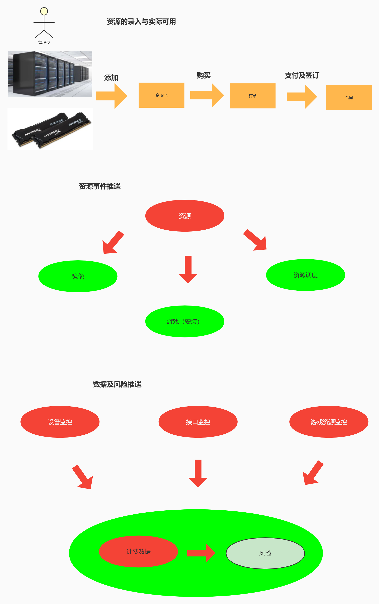

# 概要设计

> 作者: 大厂研究员
>
> 更新: 2022-07-25

## 运营中心

### 账号管理

### 支付计费模块细化

### 支付计费模块拆分出基础服务

### 支付计费技术依赖分层

### 支付计费部分微服务及领域相关

### 资源与计费上下游

### 数据分析

### 接口设计

### 领域事件

>1.事件管理（数据字典）

#### 1.1领域事件查询接口

**接口名称**: 事件查询

**请求地址**：/event/list

**请求方式**：GET

 **请求参数**：

| 编号 | 名称       | 字段       | 类型                 | 是否必填     | 描述                                                    |
| ---- | -------- | ---------- | -------------------- | ------------ | ------------------------------------------------------- |
| 1    | 事件类型   | type       |      Integer         | 否           |                                                         |
| 2    | 事件名称   | name        |      Integer         | 否          |                                                         |
| 3    | 所属领域   | domain       |      String          | 否          |                                                         |
| 4    | 描述      | description |      String         | 否           |                                                         |
| 5    | 创建时间| create_time |      Date            | 否           |   
| 6    | 更新时间| modify_time |      Date            | 否           |   
| 7    | 创建人| create_user |      String            | 否           |   
| 8    | 更新人| modify_user |      String            | 否           |   
| 9    | 页码 | page |      Integer            | 否           |   
| 10    | 页数 | size |      Integer            | 否           |   
 **请求示例**：
 
 **返回示例**：

#### 1.2领域事件查询接口

**接口名称**: 事件录入

**请求地址**：/event/save

**请求方式**：POST

 **请求参数**：

| 编号 | 名称       | 字段       | 类型                 | 是否必填     | 描述                                                    |
| ---- | -------- | ---------- | -------------------- | ------------ | ------------------------------------------------------- |
| 1    | 事件类型   | type       |      Integer         | 否           |                                                         |
| 2    | 事件名称   | name        |      Integer         | 否          |                                                         |
| 3    | 所属领域   | domain       |      String          | 否          |                                                         |
| 4    | 描述      | description |      String         | 否           |     
| 5    | 创建时间| create_time |      Date            | 否           |   
| 6    | 更新时间| modify_time |      Date            | 否           |   
| 7    | 创建人| create_user |      String            | 否           |   
| 8    | 更新人| modify_user |      String            | 否           |     
 **请求示例**：
 
 **返回示例**：

 >2.事件记录

#### 2.1领域事件发布记录
主要功能: 领域事件发布后进行存储记录

**接口名称**: 事件录入

**请求地址**：/event/record/save

**请求方式**：POST

 **请求参数**：

| 编号 | 名称       | 字段       | 类型                 | 是否必填     | 描述                                                    |
| ---- | -------- | ---------- | -------------------- | ------------ | ------------------------------------------------------- |
| 1    | 事件类型   | type       |      Integer         | 否           |                                                         |
| 2    | 事件名称   | name        |      Integer         | 否          |                                                         |
| 3    | 所属领域   | domain       |      String          | 否          |                                                         |
| 4    | 拓展内容     | extend |      String         | 否           |      

 **请求示例**：
 
 **返回示例**：

#### 2.2领域事件发布记录查询接口

- 描述：对存储的历史事件进行查询
- 条件内容：名称，编码，创建日期，扩展信息
- 返回结果：名称，编码，创建日期，扩展信息

**接口名称**: 事件查询

**请求地址**：/event/record/list

**请求方式**：GET

 **请求参数**：

| 编号 | 名称       | 字段       | 类型                 | 是否必填     | 描述                                                    |
| ---- | -------- | ---------- | -------------------- | ------------ | ------------------------------------------------------- |
| 1    | 事件类型   | type       |      Integer         | 否           |                                                         |
| 2    | 事件名称   | num        |      Integer         | 否          |                                                         |
| 3    | 所属领域   | domain       |      String          | 否          |                                                         |
| 4    | 拓展信息      | description |      String         | 否           |  模糊                                                       |
| 5    | 创建时间| create_time |      Date            | 否           |   
| 6    | 页码 | page |      Integer            | 否           |   
| 7    | 页数 | size |      Integer            | 否           |   
 **请求示例**：
 
 **返回示例**：

>3.资源管理

**场景举例**：主要功能：管理员的查询，录入，修改，删除。客户选购查询，锁定，解锁，扣减。

#### 3.1管理员资源查询接口

**接口名称**: 管理员资源查询

**请求地址**：/charge/resource/manger/record

**请求方式**：GET

 **请求参数**：

| 编号 | 名称       | 字段       | 类型                 | 是否必填     | 描述                                                    |
| ---- | -------- | ---------- | -------------------- | ------------ | ------------------------------------------------------- |
| 1    | 资源类型   | type       |      Integer         | 否          |                                                         |
| 2    | 资源数量   | num        |      Integer         | 否          |                                                         |
| 3    | 资源编码   | code       |      String          | 否           |                                                         |
| 4    | 资源生效时间| startTime |      Date            | 否           |  未生效前，资源不起作用                                                       |
| 5    | 资源名称   | name       |      String         | 否           |                                                         |
| 6    | 单价上区间   | priceBegin      |      String         | 否           |                                                         |
| 7    | 单价下区间   | priceEnd       |      String         | 否           |                                                         |
| 8    | 库存上区间   | whNum       |      String         | 否           |                                                         |
| 9    | 库存下区间   | whNum       |      String         | 否           |                                                         |
| 10    | 未锁定库存上区间  |  unlockWhNumBegin      |      String         | 否           |                                                         |
| 11    | 未锁定库存上区间  |  unlockWhNumEnd      |      String         | 否           |                                                         |
| 12    | 规则分类   | rule_id       |      Integer         | 否           |                                                         |
| 13    | 物理位置  |  position      |      String         | 否           |                                                         |

 **返回参数**
 **请求参数**：
 
 | 编号 | 名称       | 字段       | 类型                 | 是否必填     | 描述                                                    |
 | ---- | -------- | ---------- | -------------------- | ------------ | ------------------------------------------------------- |
| 1    | 资源类型   | type       |      Integer         | 否          |                                                         |
| 2    | 资源数量   | num        |      Integer         | 否          |                                                         |
| 3    | 资源编码   | code       |      String          | 否           |                                                         |
| 4    | 资源生效时间| startTime |      Date            | 否           |  未生效前，资源不起作用                                                       |
| 5    | 资源名称   | name       |      String         | 否           |                                                         |
| 6    | 单价   | price      |      String         | 否           |                                                         |
| 7    | 库存   | whNum       |      String         | 否           |                                                         |
| 8    | 未锁定库存  |  unlockWhNum      |      String         | 否           |                                                         |
| 9    | 规则分类   | ruleId       |      Integer         | 否           |                                                         |
| 10    | 物理位置  |  position      |      String         | 否           |                                                         |
| 11    | 资源id  |  id      |      Integer         | 否           |                                                         |

 **请求示例**：
 
 **返回示例**：

#### 3.2资源录入接口

**接口名称**: 资源录入

**请求地址**：/charge/resource/save

**请求方式**：POST

 **请求参数**：

| 编号 | 名称       | 字段       | 类型                 | 是否必填     | 描述                                                    |
| ---- | -------- | ---------- | -------------------- | ------------ | ------------------------------------------------------- |
| 1    | 资源类型   | type       |      Integer         | 否          |                                                         |
| 2    | 资源数量   | num        |      Integer         | 否          |                                                         |
| 3    | 资源编码   | code       |      String          | 否           |                                                         |
| 4    | 资源生效时间| startTime |      Date            | 否           |  未生效前，资源不起作用                                                       |
| 5    | 资源名称   | name       |      String         | 否           |                                                         |
| 6    | 单价   | price      |      String         | 否           |                                                         |
| 7    | 库存   | whNum       |      String         | 否           |                                                         |
| 8    | 未锁定库存  |  unlockWhNum      |      String         | 否           |                                                         |
| 9    | 规则分类   | ruleId       |      Integer         | 否           |                                                         |
| 10    | 物理位置  |  position      |      String         | 否           |                                                         |

 **请求示例**：
 
 **返回示例**：
#### 3.3资源修改接口

**接口名称**: 资源修改

**请求地址**：/charge/resource/update

**请求方式**：POST

 **请求参数**：

| 编号 | 名称       | 字段       | 类型                 | 是否必填     | 描述                                                    |
| ---- | -------- | ---------- | -------------------- | ------------ | ------------------------------------------------------- |
| 1    | 资源类型   | type       |      Integer         | 否          |                                                         |
| 2    | 资源数量   | num        |      Integer         | 否          |                                                         |
| 3    | 资源编码   | code       |      String          | 否           |                                                         |
| 4    | 资源生效时间| startTime |      Date            | 否           |  未生效前，资源不起作用                                                       |
| 5    | 资源名称   | name       |      String         | 否           |                                                         |
| 6    | 单价   | price      |      String         | 否           |                                                         |
| 7    | 库存   | whNum       |      String         | 否           |                                                         |
| 8    | 未锁定库存  |  unlockWhNum      |      String         | 否           |                                                         |
| 9    | 规则分类   | ruleId       |      Integer         | 否           |                                                         |
| 10    | 物理位置  |  position      |      String         | 否           |                                                         |
| 11    | 资源id  |  id      |      Integer         | 是           |                                                         |

 **请求示例**：
 
 **返回示例**：
 
 #### 3.4资源删除接口
 
 **接口名称**: 资源删除
 
 **请求地址**：/charge/resource/delete
 
 **请求方式**：POST
 
  **请求参数**：
 
 | 编号 | 名称       | 字段       | 类型                 | 是否必填     | 描述                                                    |
 | ---- | -------- | ---------- | -------------------- | ------------ | ------------------------------------------------------- |
 | 1    | 资源主键   | id       |      Integer         | 是           |                                                         |
                                                    |
 
  **请求示例**：
  
  **返回示例**：
  

#### 3.5客户资源选购查询接口

**接口名称**: 客户资源选购

**请求地址**：/charge/resource/manger/record

**请求方式**：GET

 **请求参数**：

| 编号 | 名称       | 字段       | 类型                 | 是否必填     | 描述                                                    |
| ---- | -------- | ---------- | -------------------- | ------------ | ------------------------------------------------------- |
| 1    | 资源类型   | type       |      Integer         | 否          |                                                         |
| 2    | 资源数量   | num        |      Integer         | 否          |                                                         |
| 5    | 资源名称   | name       |      String         | 否           |                                                         |
| 6    | 单价上区间   | priceBegin      |      String         | 否           |                                                         |
| 7    | 单价下区间   | priceEnd       |      String         | 否           |                                                         |
| 12    | 规则分类   | rule_id       |      Integer         | 否           |                                                         |
| 13    | 物理位置  |  position      |      String         | 否           |                                                         |

 **返回参数**
 **请求参数**：
 
 | 编号 | 名称       | 字段       | 类型                 | 是否必填     | 描述                                                    |
 | ---- | -------- | ---------- | -------------------- | ------------ | ------------------------------------------------------- |
| 1    | 资源类型   | type       |      Integer         | 否          |                                                         |
| 2    | 资源数量   | num        |      Integer         | 否          |                                                         |
| 5    | 资源名称   | name       |      String         | 否           |                                                         |
| 6    | 单价   | price      |      String         | 否           |                                                         |
| 7    | 库存   | whNum       |      String         | 否           |                                                         |
| 9    | 规则分类   | ruleId       |      Integer         | 否           |                                                         |
| 10    | 物理位置  |  position      |      String         | 否           |                                                         |
| 11    | 资源id  |  id      |      Integer         | 否           |                                                         |

 **请求示例**：
 
 **返回示例**：

#### 3.6客户资源锁定接口

**接口名称**: 资源锁定

**请求地址**：/charge/resource/lock

**请求方式**：POST

 **请求参数**：

| 编号 | 名称       | 字段       | 类型                 | 是否必填     | 描述                                                    |
| ---- | -------- | ---------- | -------------------- | ------------ | ------------------------------------------------------- |
| 1    | 资源id   |  id      |      String          | 是           |                                                         |
| 2    | 订单号     |  order_no  |      String         | 是           |                                                         |
| 3    | 资源数量   |  num       |      Integer          | 是           |                                                         |

 **请求示例**：
 
 **返回示例**：
 
 #### 3.7客户资源解锁接口
 
 **接口名称**: 客户资源解锁
 
 **请求地址**：/charge/resource/change
 
 **请求方式**：POST
 
  **请求参数**：

| 编号 | 名称       | 字段       | 类型                 | 是否必填     | 描述                                                    |
| ---- | -------- | ---------- | -------------------- | ------------ | ------------------------------------------------------- |
| 1    | 资源主键   | id       |      String          | 是           |                                                         |                                                    |
| 2    | 订单号   | order_no        |      Integer         | 是           |                                                         |
| 3    | 数量    | num |      Date            | 是           |  未生效前，资源不起作用                                                       |

  **请求示例**：
  
  **返回示例**：
  
  
  
 #### 3.8资源扣减接口
 
 **接口名称**: 客户资源解锁
 
 **请求地址**：/charge/resource/change
 
 **请求方式**：POST
 
  **请求参数**：

| 编号 | 名称       | 字段       | 类型                 | 是否必填     | 描述                                                    |
| ---- | -------- | ---------- | -------------------- | ------------ | ------------------------------------------------------- |
| 1    | 资源主键   | id       |      String          | 是           |                                                         |                                                    |
| 2    | 订单号   | order_no        |      Integer         | 是           |                                                         |
| 3    | 数量| num |      Date            | 是           |  未生效前，资源不起作用                                                       |

  **请求示例**：
  
  **返回示例**：
 
 
>4.计费规则管理

  
 #### 4.1 计费规则查询接口
 
 **接口名称**: 计费规则查询
 
 **请求地址**：/charge/rule/search
 
 **请求方式**：POST
 
  **请求参数**：

| 编号 | 名称       | 字段       | 类型                 | 是否必填     | 描述                                                    |
| ---- | -------- | ---------- | -------------------- | ------------ | ------------------------------------------------------- |
| 1    | 名称   | name       |      String          | 是           |                                                         |                                                    |
| 2    | 类型   | type        |      Integer         | 是           |                                                         |
| 3    | 描述| description |      String            | 是           |  未生效前，资源不起作用                                                       |
 
 **返回参数**：

| 编号 | 名称       | 字段       | 类型                 | 是否必填     | 描述                                                    |
| ---- | -------- | ---------- | -------------------- | ------------ | ------------------------------------------------------- |
| 1    | 名称   | id       |      String          | 是           |                                                         |                                                    |
| 2    | 类型   | type        |      Integer         | 是           |                                                         |
| 3    | 描述| description |      String            | 是           |  未生效前，资源不起作用                                                       |
| 4    | id   | id        |      Integer         | 是           |                                                         |

  **请求示例**：
  
  **返回示例**：
 
 
  #### 4.2 计费规则添加接口
  
  **接口名称**: 计费规则添加
  
  **请求地址**：/charge/rule/search
  
  **请求方式**：POST
  
   **请求参数**：
 
 
 | 编号 | 名称       | 字段       | 类型                 | 是否必填     | 描述                                                    |
 | ---- | -------- | ---------- | -------------------- | ------------ | ------------------------------------------------------- |
| 1    | 名称   | name       |      String          | 是           |                                                         |                                                    |
| 2    | 类型   | type        |      Integer         | 是           |                                                         |
| 3    | 描述| description |      String            | 是           |  未生效前，资源不起作用                                                       |
 
   **请求示例**：
   
   **返回示例**：
   
   
   
  #### 4.3 计费规则修改接口
  
  **接口名称**: 计费规则修改
  
  **请求地址**：/charge/rule/update
  
  **请求方式**：POST
  
   **请求参数**：
 
 
 | 编号 | 名称       | 字段       | 类型                 | 是否必填     | 描述                                                    |
 | ---- | -------- | ---------- | -------------------- | ------------ | ------------------------------------------------------- |
| 1    | 名称   | id       |      String          | 是           |                                                         |                                                    |
| 2    | 类型   | type        |      Integer         | 是           |                                                         |
| 3    | 描述| description |      String            | 是           |  未生效前，资源不起作用                                                       |
| 4    | id   | id        |      Integer         | 是           |                                                         |

   **请求示例**：
   
   **返回示例**：
   
   
   
  #### 4.4 计费规则删除接口
  
  **接口名称**: 计费规则删除
  
  **请求地址**：/charge/rule/delete
  
  **请求方式**：POST
  
   **请求参数**：
 
 
 | 编号 | 名称       | 字段       | 类型                 | 是否必填     | 描述                                                    |
 | ---- | -------- | ---------- | -------------------- | ------------ | ------------------------------------------------------- |
 | 1    | 主键   | id       |      Integer          | 是           |                                                         |                                                    |

   **请求示例**：
   
   **返回示例**：
 
 
 
  #### 4.5 客户规则查询接口
  
  **接口名称**: 客户规则查询（资源付费类型选择）
  
  **请求地址**：/charge/rule/customer/search
  
  **请求方式**：POST
  
   **请求参数**：
  
  
  | 编号 | 名称       | 字段       | 类型                 | 是否必填     | 描述                                                    |
  | ---- | -------- | ---------- | -------------------- | ------------ | ------------------------------------------------------- |
  | 1    | 规则名称| ruleName |      String            | 是           |                                                        |
  | 2    | 描述| description |      Date            | 是           |          
   
     
   **返回参数**：
 | 编号 | 名称       | 字段       | 类型                 | 是否必填     | 描述                                                    |
 | ---- | -------- | ---------- | -------------------- | ------------ | ------------------------------------------------------- |
  | 1    | 主键   | id       |      Integer          | 是           |                                                         |                                                    |
  | 2    | 规则分类名称   | ruleId        |      Integer         | 是           |                                                         |
  | 3    | 规则名称| ruleName |      String            | 是           |                                                        |
  | 4    | 描述| description |      Date            | 是           |          
                                                     |

   **请求示例**：
   
   **返回示例**：
 
 
 
   #### 4.6 客户历史规则费用结算接口
   
   **接口名称**: 客户历史规则费用结算
   
   **请求地址**：/charge/customer/settlement
   
   **请求方式**：POST
   
   **请求参数**：
  
  
  | 编号 | 名称       | 字段       | 类型                 | 是否必填     | 描述                                                    |
  | ---- | -------- | ---------- | -------------------- | ------------ | ------------------------------------------------------- |
  | 1    | 历史规则id   | id       |      Integer          | 是           |                                                         |                                                    |
  | 2    | 规则分类id   | order_no        |      Integer         | 是           |                                                         |
  | 3    | 持续时间| lastTime |      Integer            | 是           |  未生效前，资源不起作用                                                       |
                                                |

   **请求示例**：
   
   **返回示例**：
 
 >5.计费管控
 
   #### 5.1 计费报表接口
   
   **接口名称**: 结算费用报表查询
   
   **请求地址**：/charge/customer/settlement/record
   
   **请求方式**：GET
   
   **请求参数**：
  
  
  | 编号 | 名称       | 字段       | 类型                 | 是否必填     | 描述                                                    |
  | ---- | -------- | ---------- | -------------------- | ------------ | ------------------------------------------------------- |
  | 1    | 事件跨度   | timeRangeType       |      Integer          | 是           |                                                         |                                                    |
  | 2    | 开始事件   | timeBegin        |      String         | 是           |                                                         |
  | 3    | 结束时间| timeEnd |      String            | 是           |  未生效前，资源不起作用                                                       |
   
       
  **返回参数**：
 
 
 | 编号 | 名称       | 字段       | 类型                 | 是否必填     | 描述                                                    |
 | ---- | -------- | ---------- | -------------------- | ------------ | ------------------------------------------------------- |
 | 1    | 时间   | timeRangeType       |      Integer          | 是           |                                                         |                                                    |
 | 2    | 消费金额   | timeBegin        |      String         | 是           |                                                         |
                                             |

   **请求示例**：
   
   **返回示例**：
 
 
#### 5.2 计费深度学习分析接口
    
   **接口名称**: 计费深度学习分析
    
   **请求地址**：/charge/deep/risk/analysis
    
   **请求方式**：POST
    
   **请求参数**：
   
   
   | 编号 | 名称       | 字段       | 类型                 | 是否必填     | 描述                                                    |
   | ---- | -------- | ---------- | -------------------- | ------------ | ------------------------------------------------------- |
   | 1    | 订单号   | orderNo       |      String          | 否          |                                                         |                                                    |
   | 2    | 时间开始   | timeBegin        |      String         | 是           |                                                         |
   | 3    | 时间结束| timeEnd |      String            | 是           |  是                                                    |
    
                                                |
 
   **请求示例**：
    
   **返回示例**：
  
#### 5.3 风险手动录入接口
    
   **接口名称**: 风险手动录入
    
   **请求地址**：/charge/risk/self/save
    
   **请求方式**：POST
    
   **请求参数**：
   
   
   | 编号 | 名称       | 字段       | 类型                 | 是否必填     | 描述                                                    |
   | ---- | -------- | ---------- | -------------------- | ------------ | ------------------------------------------------------- |
   | 1    | 风险名称   | name       |      String          | 是           |                                                         |                                                    |
   | 2    | 分类id   | riskTypeId        |      Integer         | 是           |                                                         |
   | 3    | 名称|  name |      String            | 是           |                                                 |
    | 4    | 内容| description |      String            | 是           |         
    
                                               |
 
   **请求示例**：
    
   **返回示例**：  
   
  
#### 5.4 风险自动分析录入接口
    
   **接口名称**: 风险自动分析录入
    
   **请求地址**：/charge/risk/auto/save
    
   **请求方式**：POST
    
   **请求参数**：
   
   
   | 编号 | 名称       | 字段       | 类型                 | 是否必填     | 描述                                                    |
   | ---- | -------- | ---------- | -------------------- | ------------ | ------------------------------------------------------- |
   | 1    | 风险分类id   | riskTypeId       |      Integer          | 是           |                                                         |                                                    |
 
 
   **请求示例**：
    
   **返回示例**：    
   
   
   
  
#### 5.5 风险手动修改接口
    
   **接口名称**: 风险手动修改接口
    
   **请求地址**：/charge/risk/auto/save
    
   **请求方式**：POST
    
   **请求参数**：
   
   
   | 编号 | 名称       | 字段       | 类型                 | 是否必填     | 描述                                                    |
   | ---- | -------- | ---------- | -------------------- | ------------ | ------------------------------------------------------- |
   | 1    | 风险名称   | name       |      String          | 是           |                                                         |                                                    |
   | 2    | 分类id   | riskTypeId        |      Integer         | 是           |                                                         |
   | 3    | 名称|  name |      String            | 是           |                                                 |
    | 4    | 内容| description |      String            | 是           |         
    | 5    | 风险id   | id       |      String          | 是           |                                                         |                                                    |
                                  |
 
   **请求示例**：
    
   **返回示例**：  
   

#### 5.6 风险手动删除接口
    
   **接口名称**: 风险手动删除接口
    
   **请求地址**：/charge/risk/self/delete
    
   **请求方式**：POST
    
   **请求参数**：
   
   
   | 编号 | 名称       | 字段       | 类型                 | 是否必填     | 描述                                                    |
   | ---- | -------- | ---------- | -------------------- | ------------ | ------------------------------------------------------- |
   | 1    | 风险id   | id       |      String          | 是           |               
    
                                                      |
 
   **请求示例**：
    
   **返回示例**：         
 

## 内容中心

`待补充`

## 管控中心

`待补充`

