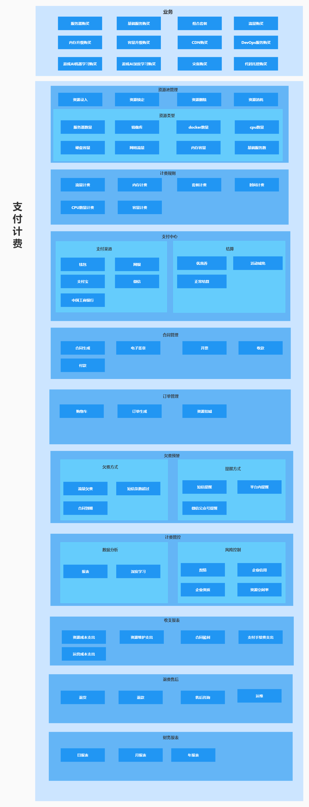
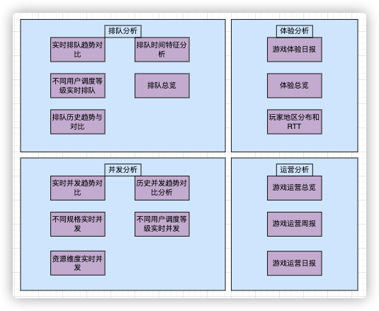

# 概要设计

> 作者: 大厂研究员
>
> 更新: 2022-07-25

## 运营中心

### 账号管理

### 支付计费模块细化

### 支付计费模块拆分出基础服务

### 支付计费技术依赖分层

### 支付计费部分微服务及领域相关

### 数据分析

### 接口设计
#### 1资源管理

**场景举例**：进行新资源的录入，销毁和变更等操作
##### 1.1资源录入接口

**接口名称**: 资源录入

**请求地址**：/charge/resource/save

**请求方式**：POST

 **请求参数**：

| 编号 | 名称       | 字段       | 类型                 | 是否必填     | 描述                                                    |
| ---- | -------- | ---------- | -------------------- | ------------ | ------------------------------------------------------- |
| 1    | 资源类型   | type       |      Integer         | 是           |                                                         |
| 2    | 资源数量   | num        |      Integer         | 是           |                                                         |
| 3    | 资源编码   | code       |      String          | 是           |                                                         |
| 4    | 资源生效时间| start_time |      Date            | 是           |  未生效前，资源不起作用                                                       |

 **请求示例**：
 
 **返回示例**：

##### 1.2资源锁定接口

**接口名称**: 资源锁定

**请求地址**：/charge/resource/lock

**请求方式**：POST

 **请求参数**：

| 编号 | 名称       | 字段       | 类型                 | 是否必填     | 描述                                                    |
| ---- | -------- | ---------- | -------------------- | ------------ | ------------------------------------------------------- |
| 1    | 资源编码   |  code      |      String          | 是           |                                                         |
| 2    | 订单号     |  order_no  |      String         | 是           |                                                         |
| 3    | 资源数量   |  num       |      Integer          | 是           |                                                         |

 **请求示例**：
 
 **返回示例**：
 
 ##### 1.3资源变更接口
 
 **接口名称**: 资源变更
 
 **请求地址**：/charge/resource/change
 
 **请求方式**：POST
 
  **请求参数**：

| 编号 | 名称       | 字段       | 类型                 | 是否必填     | 描述                                                    |
| ---- | -------- | ---------- | -------------------- | ------------ | ------------------------------------------------------- |
| 1    | 资源编码   | code       |      String          | 是           |                                                         |                                                    |
| 2    | 资源数量   | num        |      Integer         | 是           |                                                         |
| 3    | 资源生效时间| start_time |      Date            | 是           |  未生效前，资源不起作用                                                       |

  **请求示例**：
  
  **返回示例**：
 
 
## 内容中心

`待补充`

## 管控中心

`待补充`

