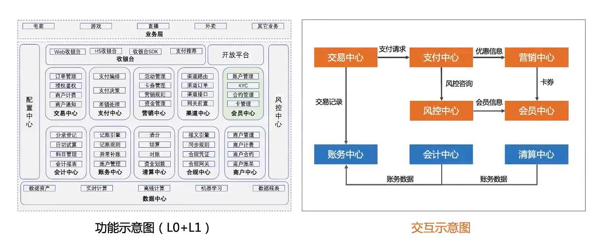
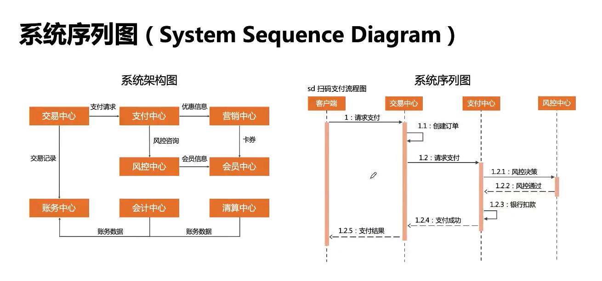
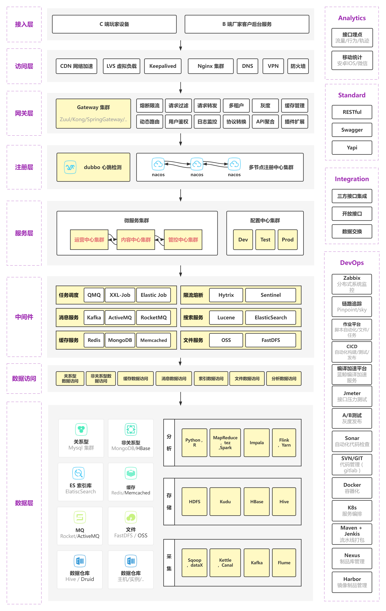
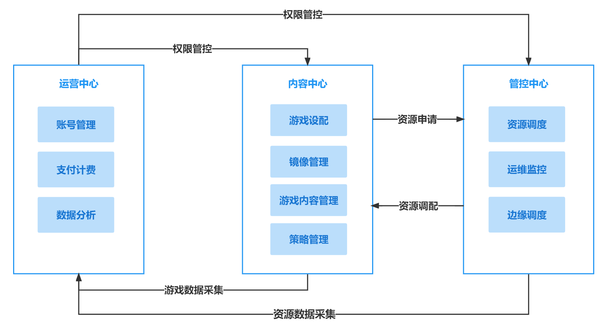

# 系统架构设计

> 作者: 大厂研究员
>
> 更新: 2022-07-31

## 概述

### 📖 定义

系统架构，一般指后端的逻辑架构，又叫 “技术架构” 或 “后端架构”。

### 🌏 使用场景

1. 整体架构设计；
2. 架构培训；
3. 面试、晋升。

### 🎨 画图技巧

1. 通过不同 **颜色** 来标识不同角色；
2. 通过 **连接线** 来表示关系。

### 👉 简单系统架构示例（MongoDB Sharding）

### 👉 复杂系统架构示例（整体功能与交互关系）

### 👉 附带系统序列图说明示例（一般仅需提供核心流程序列图即可）

## 云游戏平台系统架构

详见 [ProcessOn - 云游戏平台技术架构](https://www.processon.com/view/link/62f6046de401fd071516901b)

!> 图片预览效果不佳，具体请打开以上详细链接

## 各中心交互示意图

详见 [ProcessOn - 云游戏平台系统架构之交互关系](https://www.processon.com/view/link/62fe59101efad47d124118d1)

!> 图片预览效果不佳，具体请打开以上详细链接 

## 参考

- [阿里云 - 微服务架构的理论基础 - 康威定律](https://blog.51cto.com/u_14145398/5166844)

- [InfoQ - 用于软件架构的 C4 模型](https://www.infoq.cn/article/C4-architecture-model/)

- [博客园 - C4 模型 - 可视化架构设计 ](https://www.cnblogs.com/lex-wu/p/13305380.html)

- [极客专栏 - 如何画好架构图](https://u.geekbang.org/lesson/381) 📽️📽️📽️

- [阿里云 - 运用RUP 4+1视图方法进行软件架构设计](https://developer.aliyun.com/article/458980)

- [微信 - 如何画好一张架构图？](https://mp.weixin.qq.com/s/2HjvNnfP7bLNQF5xh8PxIQ)

- [ProcessOn - 人口健康信息平台数据流图](https://www.processon.com/view/5b7d2034e4b0bd4db917c661)

- [阿里云 - 技术分享 | 被测系统架构与数据流分析](https://developer.aliyun.com/article/944598)

- [阿里云 - 金融分布式架构 SOFAStack | 单元化快速入门 | 架构规划](https://help.aliyun.com/document_detail/158843.html)

- [阿里云 - 高可用架构部署方案](https://help.aliyun.com/document_detail/137317.html)

- [CSDN - 『软件工程8』软件项目进度安排与跟踪，一招学会计算关键路径](https://blog.csdn.net/weixin_44803753/article/details/115703532)

- [阿里云 - 高可用架构部署方案](https://help.aliyun.com/document_detail/137317.html) 

- [ProcessOn - 架构设计和概要设计](https://www.processon.com/view/link/62e537dff346fb0760d7366c?pw=LGSJ#map)

- [CSDN - COLA 4.0：应用架构的最佳实践](https://blog.csdn.net/significantfrank/article/details/110934799)
