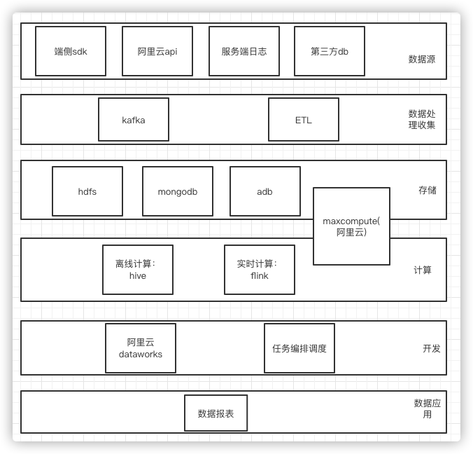
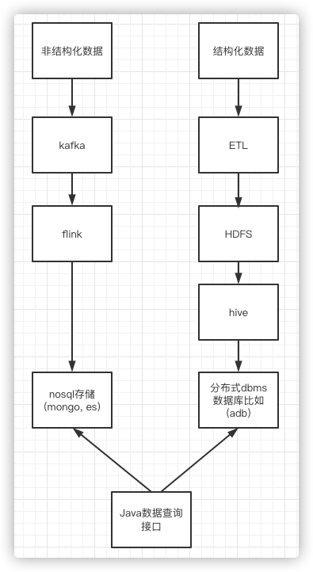

# 技术架构设计

> 作者: 大厂一组
>
> 更新: 2022-07-31

## 云游戏平台技术架构

详见 [ProcessOn - 云游戏平台技术架构](https://www.processon.com/view/link/62f6046de401fd071516901b)

!> 图片预览效果不佳，具体请打开以上详细链接

### 架构参考

- [CSDN - COLA 4.0：应用架构的最佳实践](https://blog.csdn.net/significantfrank/article/details/110934799)

## 运营中心

### 数据分析

#### 数据分析技术架构

#### 数据分析开发流程

## 内容中心

`待补充`

## 管控中心

`待补充`