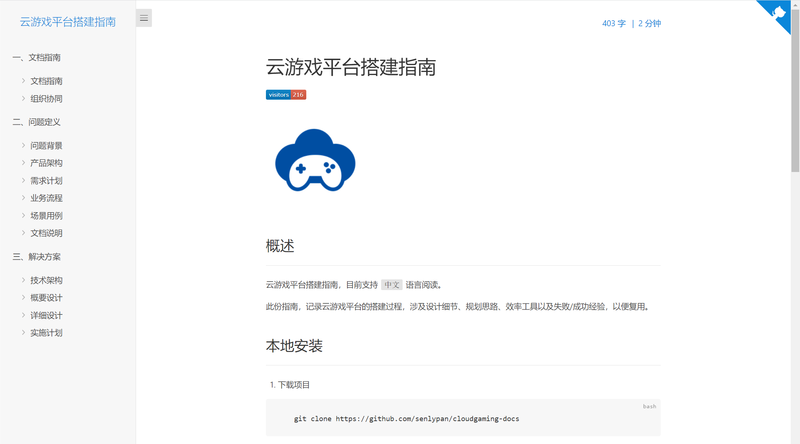

# 云游戏平台搭建指南


## 概述

云游戏平台搭建指南，目前支持 `中文` 语言阅读。

此份指南，记录云游戏平台的搭建过程，涉及设计细节、规划思路、效率工具以及失败/成功经验，以便复用。

## 本地安装

1. 下载项目

```bash
    git clone https://github.com/senlypan/cloudgaming-docs
```

2. 推荐全局安装 `docsify-cli` 工具，可以方便地创建及在本地预览生成的文档。

```bash
    npm i docsify-cli -g
```

3. 启动项目

```bash
    docsify s
```

启动成功！

```bash
    Serving D:\project\GitHub\docs\cloudgaming-docs now.
    Listening at http://localhost:3000
```

4. 浏览器输入 `http://localhost:3000` 




## 官网更新

本文档官网地址为：http://cloudgaming.panshenlian.com 

由于官网文档内容依赖 Jenkins 定时发布 ⏰ ，因此与 Github 仓库会有最多 10 分钟的更新时延。


## 参考资料

除了自身的经验与思考，本指南参考了以下资料，推荐阅读：


- [阿里云 - 云游戏平台架构](https://www.aliyun.com/product/industryengine/cloudgamingplatform)  

- [腾讯云 - 云游戏平台架构](https://cloud.tencent.com/product/gs)  

- [华为云 - 云游戏平台架构](https://www.huaweicloud.com/solution/gamecloud/)  

- [百度智能云 - 云游戏平台架构](https://cloud.baidu.com/solution/game/cloudgame.html)

- [GamingAnywhere - 开源云游戏框架](http://gaminganywhere.org/index.html)

- [阿里云 - 最佳实践 - 轻量级GPU部署云游戏](https://bp.aliyun.com/detail/76)

- [阿里云 - 最佳实践 - 游戏业务分区合服](https://bp.aliyun.com/detail/66)

- [阿里云 - 最佳实践 - 基于函数计算的游戏打包](https://bp.aliyun.com/detail/187)

- [阿里云 - 最佳实践 - S级游戏多地域批量开服](https://bp.aliyun.com/detail/305)

***
Powered by [docsify](https://docsify.js.org/)